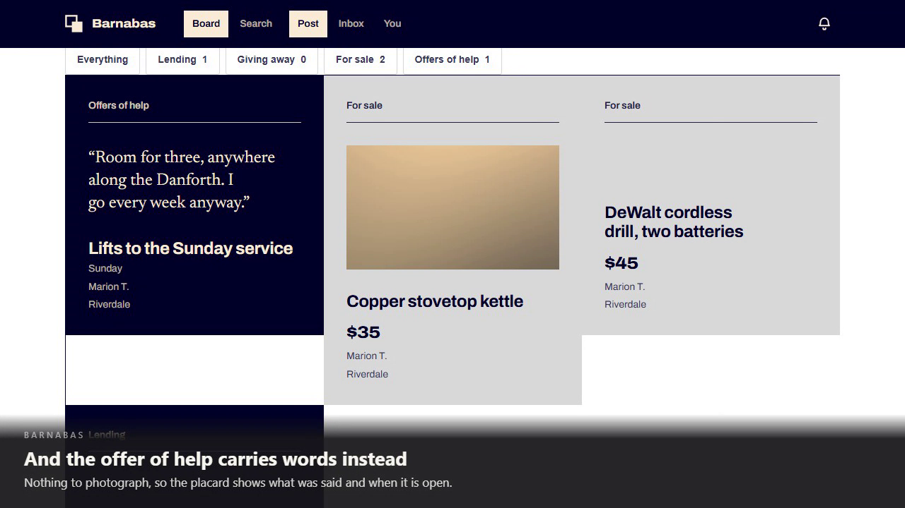

# The demonstration

**[`barnabas-demo.webm`](barnabas-demo.webm)** — 5 minutes 1 second, 1280 × 720, 12 MB.

[](barnabas-demo.webm)

*The board at 2:00. GitHub will not play a video inline, so the link above downloads it; it plays
in Chrome, Edge, Firefox, Safari 16.4+, and in VS Code.*

## What it is

The real application, driving itself, in one continuous take.

There is no compositing, no screen capture of somebody clicking, and no second attempt at a scene
that went wrong. Every screen in the recording was rendered by the Angular client; every rule it
demonstrates was enforced by the ASP.NET Core API; every row it shows came out of SQL Server. The
captions are injected into the page as it runs, which is why they are pinned to the bottom of the
frame rather than floating over it.

It is produced by [`frontend/tests/e2e/demo/demo.spec.ts`](../../frontend/tests/e2e/demo/demo.spec.ts),
which is a Playwright script using the same page objects as the acceptance suite. It asserts as it
goes — thirty-odd `expect` calls — so the recording cannot show something that did not happen. If
the product breaks, the recording fails rather than lying.

## Chapters

| | | |
|---|---|---|
| 0:00 | **Opening** | What Barnabas is for. |
| 0:20 | **One — Signing in** | Passwordless. A link arrives; following it opens a session. There is no password stored, so there is none to steal. |
| 0:40 | **Two — The board** | The parish names itself from the API. Every placard carries its kind in words as well as in colour. Filtering happens on the server, and the chip counts are the API's. |
| 1:10 | **Three — Posting** | The kind is chosen before a single question is asked. Only the Sell form asks a price. One photograph, re-encoded from pixels so no location tag survives. Then a Help listing — time rather than a thing, so it asks when you are free and offers nowhere to attach a picture. |
| 2:15 | **Four — Asking for it** | As a second member. The photograph is on the board at board size, loaded lazily; the offer of help carries words instead. The call to action reads *Request to buy*, and the form has nowhere to pay. |
| 3:00 | **Five — Accepting** | The unread count, the notification, and the owner's decision. Accepting is what opens a thread — nothing else in the product starts a conversation. |
| 3:35 | **Six — Closing out** | *Mark as sold*, because a gift is taken and help is booked. It keeps its outcome rather than becoming some neutral word. |
| 3:55 | **Seven — Moderation** | A member reports a listing and is told the poster will not learn who did. Reporting flags rather than removes. A moderator sees the reason and the reporter, and removal is confirmed. |
| 4:20 | **Eight — Letting somebody in** | A code over an alphabet nobody misreads, redeemed anonymously, a profile, and a moderator's approval. Then that member reaches the board. |
| 4:45 | **Nine — Finding things** | Search, the directory that carries no email addresses, and a member's own record — which they can export or ask to have erased. |

## Re-recording it

```bash
cd frontend
npm run demo
```

It starts the API and the client itself, resets the database, and writes the recording to
`frontend/test-results/demo/`. Copy it over `docs/demo/barnabas-demo.webm` to replace this one.

Roughly five minutes of wall-clock, because that is what it records. The pacing lives in two
places: `playwright.demo.config.ts` sets `slowMo` so a viewer can follow each click, and
[`narrate.ts`](../../frontend/tests/e2e/demo/narrate.ts) decides how long each caption stays up,
from how much there is to read.

It is not part of the acceptance suites — it lives outside `tests/e2e/specs` and gates nothing.

## Why WebM

It is what Playwright records, and the ffmpeg that ships with Playwright builds VP8 into WebM and
nothing else. Converting to MP4 would mean adding an encoder to the toolchain for one file. WebM
plays in every current browser and in most editors, so the conversion buys little.

## One thing this recording found

The first take showed the listing's photograph as alt text on a dark field: the picture never
loaded. The API answers with a path of its own — `/photos/{id}` — and the client, served from its
own root and reaching the API under `/api`, resolved it against the wrong origin.

Two acceptance tests covered that photograph and both passed. They asserted the `src` matched the
right pattern and that `loading="lazy"` was set, which was true while nothing was ever fetched. An
attribute is what the markup says; `naturalWidth` is what the browser got.

The fix is in `ListingService`, which owns the base URL, and the test now asserts the picture
rather than the markup — verified red before the fix and green after. It is the sort of thing a
demonstration is uniquely good at catching: a suite can check every property of an image except
whether anybody can see it.
