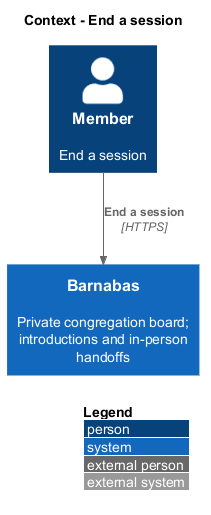
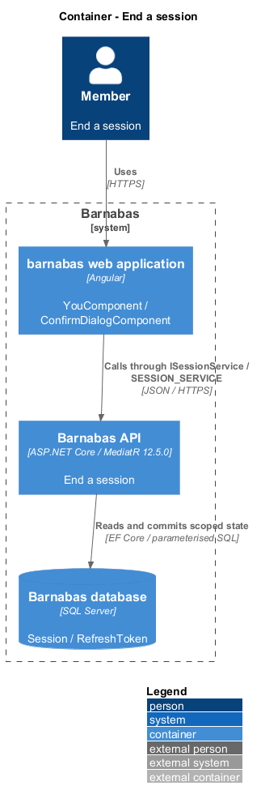
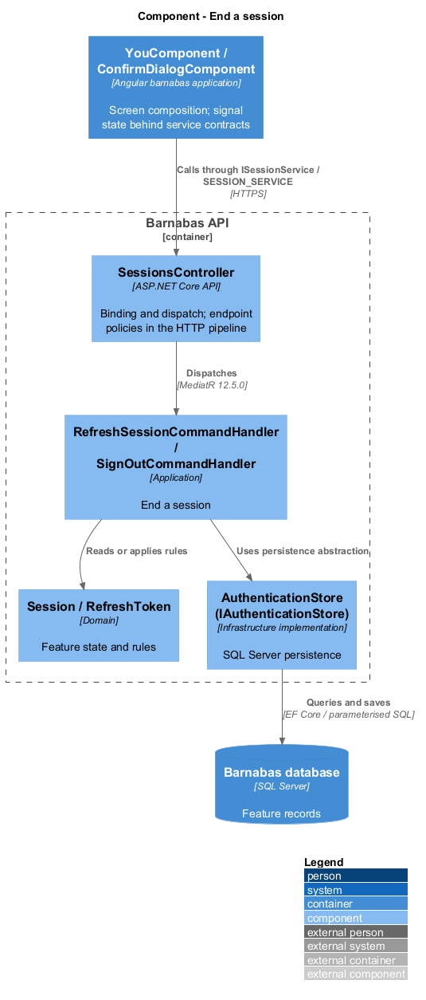
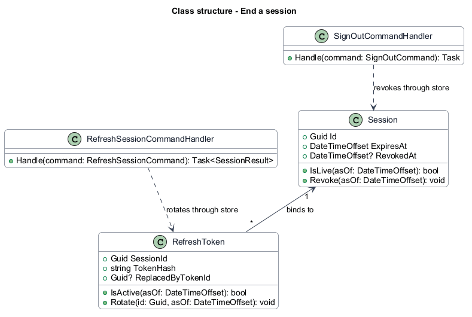
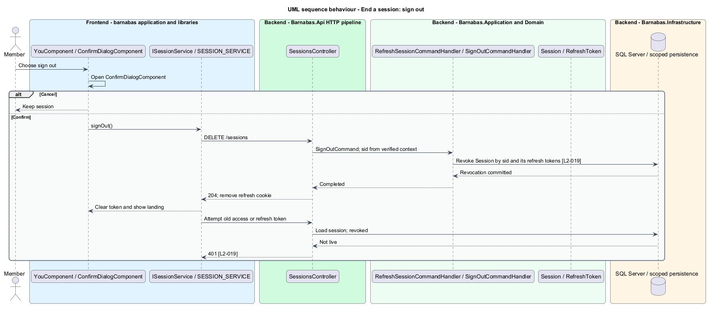
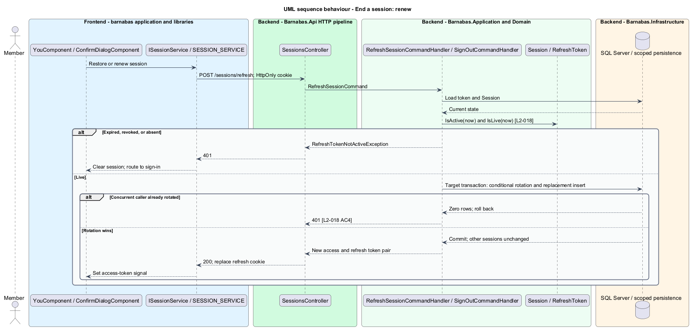

# End a session

## Overview

Barnabas is a private board where church congregation members offer goods or time through listings.

A **session** — one member sign-in with an independently revocable lifetime — belongs to one congregation. A **refresh token** — secret exchanged for a replacement access token — keeps that session usable without another email while it remains live.

Signing out ends the current session after confirmation. A second device retains its own session. Expired sessions return the member to sign-in.

## Description

**Implementation boundary: Existing renewal and revocation; planned atomic rotation and failure presentation.**

`Session` and `RefreshToken` currently have 30-day lifetimes. `JwtOptions.AccessTokenLifetime` defaults to 15 minutes. Renewal does not extend `Session.ExpiresAt`. `SessionStore` keeps access tokens in memory and shares one renewal promise among concurrent callers. `refreshInterceptor` retries through `ITokenService`, bound to `SessionStore` at the application host.

`SessionsController` exposes `POST /sessions/refresh` and `DELETE /sessions`. The refresh cookie is HttpOnly, SameSite Strict, and Secure by default. Refresh accepts the cookie without requiring an unexpired access token. `RefreshSessionCommandHandler` checks the token and its session, conditionally rotates the token, persists its replacement, and issues a new JWT for the same session. A reused, expired, or losing concurrent refresh returns 401.

`SignOutCommandHandler` takes the session identifier from `ICongregationContext` and revokes that session and its refresh tokens through `IAuthenticationStore`. `SessionValidator.ValidateAsync` reads `sid` on every authenticated request and refuses revoked or expired sessions. Signing out therefore invalidates previously issued access tokens immediately.

`YouComponent` composes `ConfirmDialogComponent` from `components`. Cancellation issues no command. Success clears local session state and routes to the public landing screen. A failed network sign-out clears local memory in the existing store but does not prove server revocation; the target screen reports that failure and offers retry. Rotation and replacement currently commit separately. The target store wraps them in one transaction and checks session liveness during rotation, preventing partial renewal after a storage failure.

**Source anchors.** [RefreshSessionCommandHandler.cs](../../../../backend/src/Barnabas.Application/Access/RefreshSession/RefreshSessionCommandHandler.cs), [SessionValidator.cs](../../../../backend/src/Barnabas.Api/Security/SessionValidator.cs), [session.store.ts](../../../../frontend/projects/domain/src/lib/access/session.store.ts).

**Acceptance verification.** [L2-018](../../../specs/L2.md#l2-018-expire-and-renew-a-session): API AC 1, 2, 4, 5; E2E AC 3. [L2-019](../../../specs/L2.md#l2-019-sign-out): API AC 1, 4, 5, 6; E2E AC 2, 3. The linked criteria retain their Given–When–Then wording. API acceptance uses SQL Server; E2E acceptance uses one page object per screen. New behaviour begins with its failing criterion. Design coverage does not assert an acceptance test pass.

## Requirements

The requirement text and identifiers are reproduced from [L2](../../../specs/L2.md). Each row names its [L1 parent](../../../specs/L1.md).

| L2 ID | Refines (L1) | Requirement |
|-------|--------------|-------------|
| `L2-018` | `L1-003` | A session shall expire after a bounded lifetime and shall be renewable without a further email round trip while it remains valid. |
| `L2-019` | `L1-003` | A member shall be able to end their session, after which their tokens shall no longer be accepted. |

## Diagrams

The context identifies the actor and the Barnabas capability. Congregation boundaries also apply to linked resources.

The container view places the Angular client, .NET API, and SQL Server persistence around this capability.

The component view separates screen composition, API dispatch, application behaviour, domain rules, and persistence.

The class view shows the feature types, their data, and typed dependencies. Planned additions are identified in the description.

Confirmation precedes revocation. Subsequent access and refresh attempts fail for this session while another session remains live.

The target rotation commits replacement and consumption together. One session renews independently of every other session.

