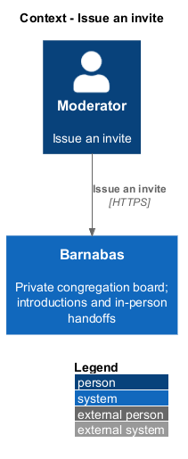
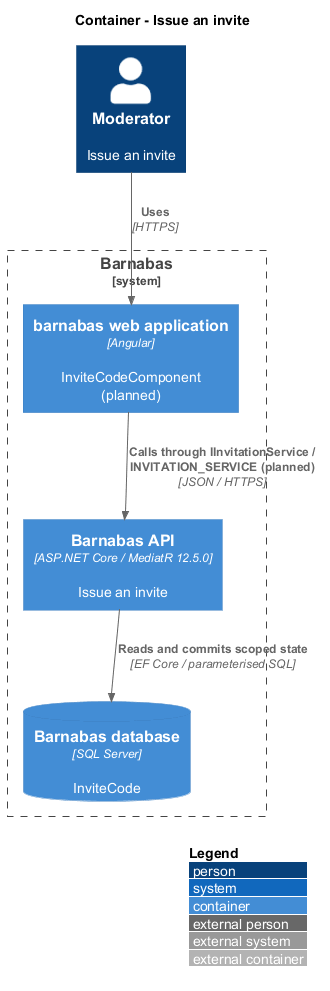
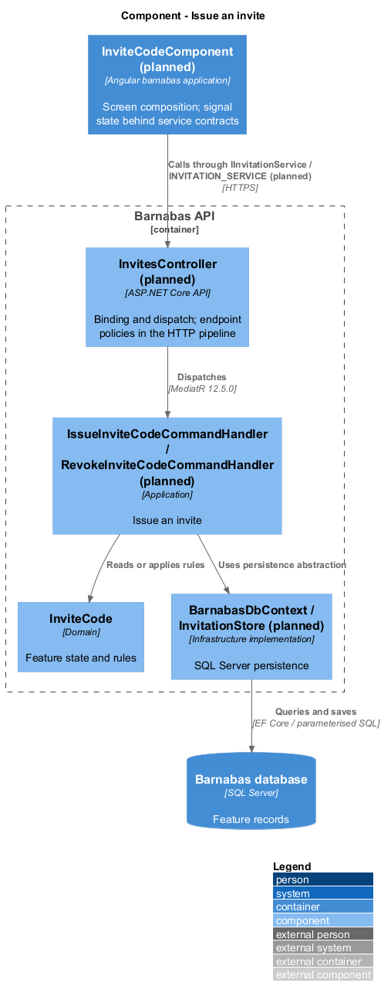
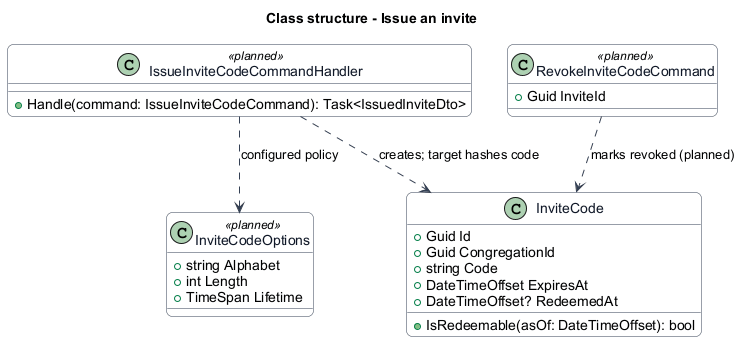
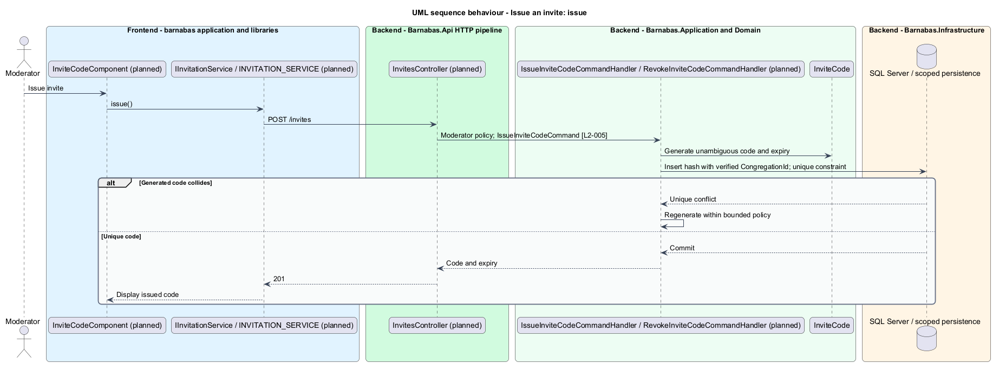
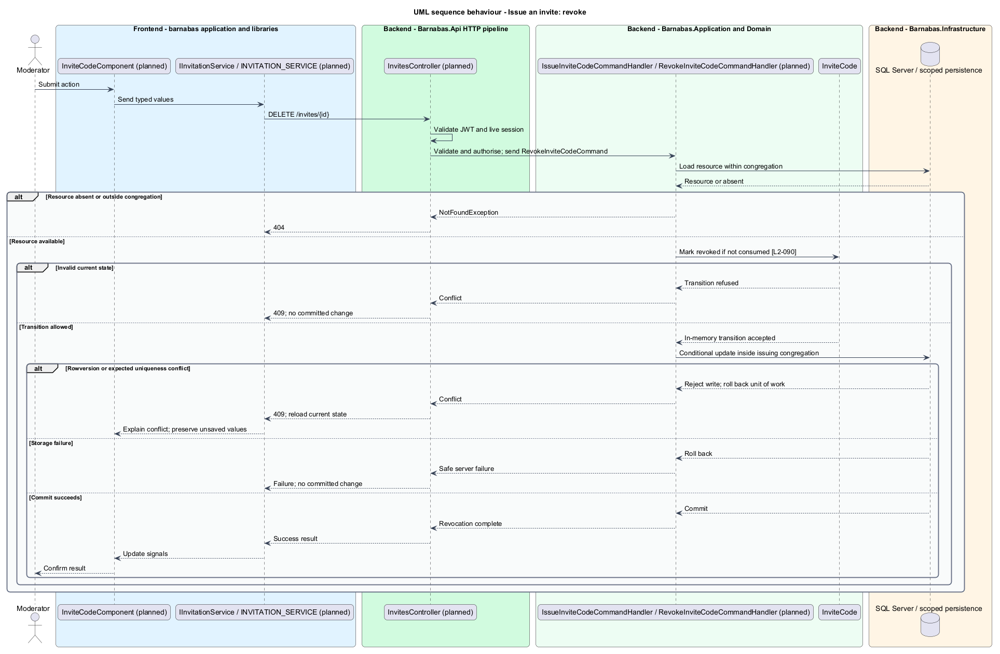

# Issue an invite

## Overview

Barnabas is a private board where church congregation members offer goods or time through listings.

An **invite code** — expiring, single-use entry credential issued by one congregation — lets a prospective member begin joining that congregation. A moderator issues and administers only their congregation's codes.

The code identifies its congregation during redemption. Possession of a code does not grant access to the board before profile submission and approval.

## Description

**Implementation boundary: Existing seeded entity; planned issue and revoke.**

`InviteCode` currently stores a normalised uppercase code, `CongregationId`, `ExpiresAt`, and `RedeemedAt`; it is seeded only. `IsRedeemable(asOf)` checks expiry and use. Planned `InviteCodeComponent` is a `barnabas` moderator page whose state service injects `IInvitationService` through `INVITATION_SERVICE` from a colocated `api` contract.

`InvitesController` exposes planned `POST /invites` and `DELETE /invites/{id}`. `IssueInviteCodeCommandHandler` requires Moderator, takes congregation from the verified context, and generates at least six characters using a cryptographic source and an unambiguous alphabet. The specific alphabet and expiry duration remain `<TO SUPPLY>`. A global normalised-code unique index prevents ambiguity during anonymous redemption; collision handling regenerates within a bounded attempt policy and otherwise fails without returning an unpersisted code.

The issue response returns the code and expiry after commit. `RevokeInviteCodeCommandHandler` uses scoped lookup and a conditional update of planned `RevokedAt`. A moderator of another congregation receives 404. Revoked codes return the same 410 body as other unusable codes during redemption. Revocation and redemption use the same row conditions so their race has one effective outcome; a consumed code never creates another joining capability.

The code lifetime is not silently inferred from the 15-minute sign-in lifetime. `InviteCodeOptions` holds issuance policy through Microsoft.Extensions Options and Configuration. New codes use hashed lookup storage through the narrow invitation store; existing development plaintext seed records require migration or replacement before that change. Neither logs nor moderator list responses expose other congregations' codes.

**Source anchors.** [InviteCode.cs](../../../../backend/src/Barnabas.Domain/Congregations/InviteCode.cs).

**Acceptance verification.** [L2-005](../../../specs/L2.md#l2-005-issue-an-invite-code): API AC 1, 2, 3. [L2-090](../../../specs/L2.md#l2-090-scope-invite-codes-to-one-congregation): API AC 1, 2. The linked criteria retain their Given–When–Then wording. API acceptance uses SQL Server; E2E acceptance uses one page object per screen. New behaviour begins with its failing criterion. Design coverage does not assert an acceptance test pass.

## Requirements

The requirement text and identifiers are reproduced from [L2](../../../specs/L2.md). Each row names its [L1 parent](../../../specs/L1.md).

| L2 ID | Refines (L1) | Requirement |
|-------|--------------|-------------|
| `L2-005` | `L1-002` | A moderator shall be able to issue an invite code for their congregation. A code shall be at least six characters, drawn from an unambiguous alphabet, and carry an expiry date. |
| `L2-090` | `L1-014` | An invite code shall belong to the congregation that issued it, and shall be administrable only from within that congregation. |

## Diagrams

The context identifies the actor and the Barnabas capability. Congregation boundaries also apply to linked resources.

The container view places the Angular client, .NET API, and SQL Server persistence around this capability.

The component view separates screen composition, API dispatch, application behaviour, domain rules, and persistence.

The class view shows the feature types, their data, and typed dependencies. Planned additions are identified in the description.

Moderator authority and code uniqueness are checked before the code is returned.

A scoped lookup conceals codes belonging to another congregation. Revocation prevents future redemption.

