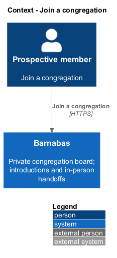
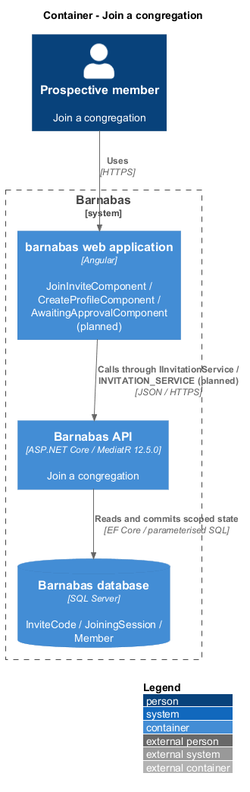
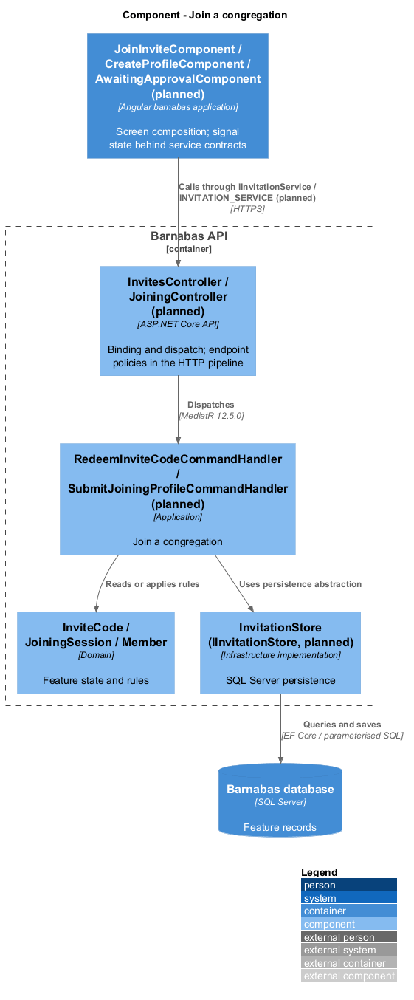
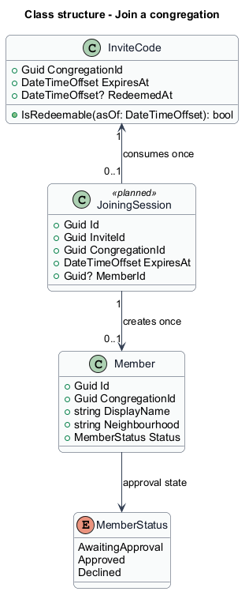
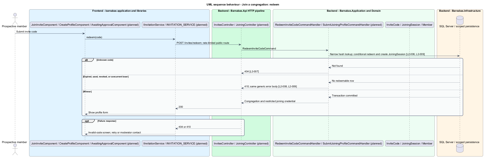
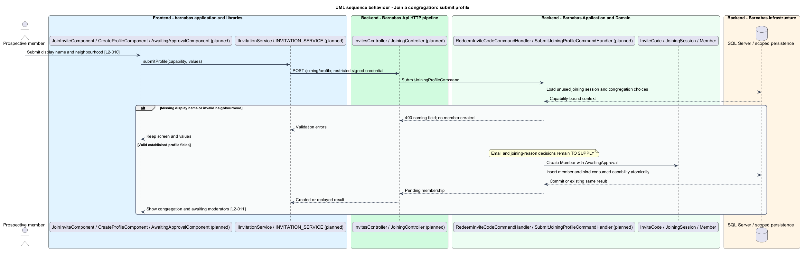
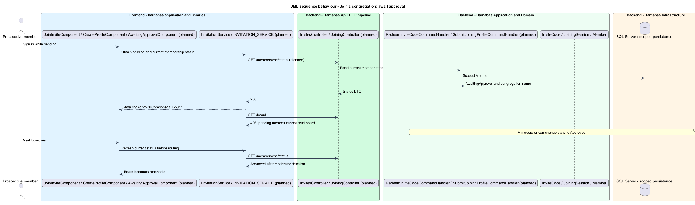

# Join a congregation

## Overview

Barnabas is a private board where church congregation members offer goods or time through listings.

**Joining** — redeeming a congregation's invite and submitting a member profile for approval — is the only route from invitation to board membership. A **joining capability** — restricted server-issued credential bound to one redeemed code — permits that profile submission without granting board access.

The prospective member supplies a display name and a configured neighbourhood. The member then waits for a moderator's decision. Pending members remain outside the board even when signed in.

## Description

**Implementation boundary: Planned joining; existing invite and member entities.**

This slice is planned around existing `InviteCode`, `Member`, and `MemberStatus.AwaitingApproval`. The specs call that state pending; the implementation name remains `AwaitingApproval`. `JoinInviteComponent`, `InvalidInviteComponent`, `CreateProfileComponent`, and `AwaitingApprovalComponent` are separate routed pages in `barnabas`. Joining state lives in a service consuming `IInvitationService` through `INVITATION_SERVICE`.

`POST /invites/redeem` dispatches `RedeemInviteCodeCommand`. A narrow `IInvitationStore` finds the normalised code hash without a congregation context. In one transaction it conditionally sets redemption only when unused, unrevoked, and unexpired, then creates a `JoiningSession` bound to that congregation. Exactly one concurrent redemption returns 200 with the congregation name, neighbourhood choices, and restricted joining credential. Unknown codes return 404; expired, revoked, or used codes return 410. Error bodies disclose no additional reason beyond the status distinction. The invalid-code page provides retry or an expiry/reuse explanation with a moderator contact instruction. The actual contact destination is `<TO SUPPLY>`.

`POST /joining/profile` requires the signed restricted joining credential; it is not a public board session. `SubmitJoiningProfileCommandHandler` verifies capability and congregation, validates display name and neighbourhood, and creates one member in `AwaitingApproval`. Optional description and help tags use profile validation. Capability consumption and member insertion commit together. A valid retry returns the same pending result; a competing different submission returns 409. Invalid fields return 400 without consuming the capability, preserving a correction path. The joining capability cannot read any business collection.

Email collection and verification are not specified by joining L2 requirements, while `Member` requires an email and sign-in uses it. The moderator queue also requires a joining reason that `L2-010` does not collect. These are `<TO SUPPLY>` decisions in [open decisions](../../open-decisions.md); the design does not treat the missing fields as established requirements. Joining capability lifetime and expiry recovery also remain explicit decisions.

The target sign-in lookup allows an existing pending member to authenticate for approval status. An approved-member policy returns 403 for pending or declined board access. A status query supplies congregation name to the awaiting page. `authGuard` refreshes current status before choosing the board, so a moderator approval takes effect on the next visit without another email. A client-side route guard never substitutes for the API policy.

**Source anchors.** [InviteCode.cs](../../../../backend/src/Barnabas.Domain/Congregations/InviteCode.cs), [Member.cs](../../../../backend/src/Barnabas.Domain/Members/Member.cs), [MemberStatus.cs](../../../../backend/src/Barnabas.Domain/Members/MemberStatus.cs).

**Acceptance verification.** [L2-006](../../../specs/L2.md#l2-006-redeem-a-valid-invite-code): API AC 1, 3; E2E AC 2. [L2-007](../../../specs/L2.md#l2-007-reject-an-unrecognised-invite-code): API AC 1, 3; E2E AC 2. [L2-008](../../../specs/L2.md#l2-008-reject-an-expired-invite-code): API AC 1; E2E AC 2. [L2-009](../../../specs/L2.md#l2-009-reject-an-already-redeemed-invite-code): API AC 1, 2. [L2-010](../../../specs/L2.md#l2-010-supply-a-profile-while-joining): API AC 1, 2; E2E AC 3. [L2-011](../../../specs/L2.md#l2-011-await-moderator-approval): API AC 1; E2E AC 2, 3. The linked criteria retain their Given–When–Then wording. API acceptance uses SQL Server; E2E acceptance uses one page object per screen. New behaviour begins with its failing criterion. Design coverage does not assert an acceptance test pass.

## Requirements

The requirement text and identifiers are reproduced from [L2](../../../specs/L2.md). Each row names its [L1 parent](../../../specs/L1.md).

| L2 ID | Refines (L1) | Requirement |
|-------|--------------|-------------|
| `L2-006` | `L1-002` | Redeeming an unexpired, unredeemed code shall begin the joining flow for the congregation that issued it. |
| `L2-007` | `L1-002` | An unrecognised code shall be rejected without revealing whether any similar code exists. |
| `L2-008` | `L1-002` | A code past its expiry date shall not be redeemable. |
| `L2-009` | `L1-002` | A code shall be redeemable once only. |
| `L2-010` | `L1-002` | A prospective member shall supply a display name and neighbourhood before their request to join is submitted. Help tags and a description are optional. |
| `L2-011` | `L1-002` | A member in the pending state shall not see the board, and shall be told their request is with the congregation's moderators. |

## Diagrams

The context identifies the actor and the Barnabas capability. Congregation boundaries also apply to linked resources.

The container view places the Angular client, .NET API, and SQL Server persistence around this capability.

The component view separates screen composition, API dispatch, application behaviour, domain rules, and persistence.

The class view shows the feature types, their data, and typed dependencies. Planned additions are identified in the description.

Code consumption creates one congregation-bound joining capability. Every unusable code follows a non-disclosing recovery path.

The restricted capability creates at most one pending member. Profile validation leaves the correction path available.

Pending sign-in leads to approval status. The API protects the board independently of client routing.

