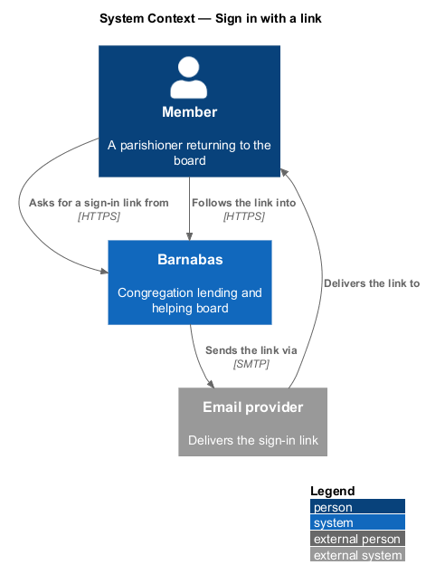
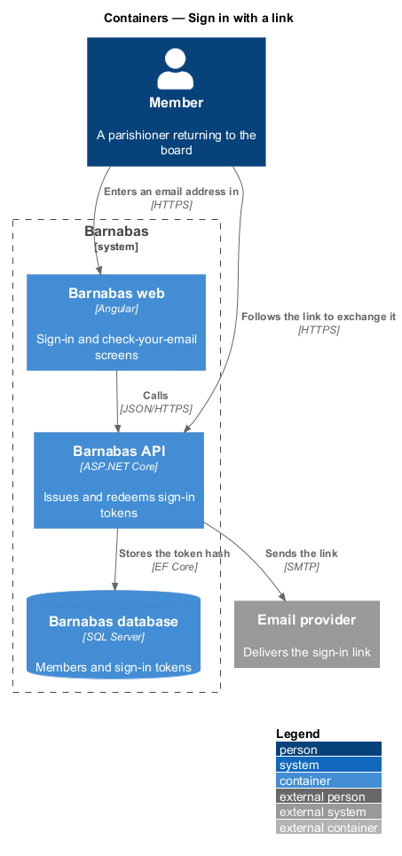
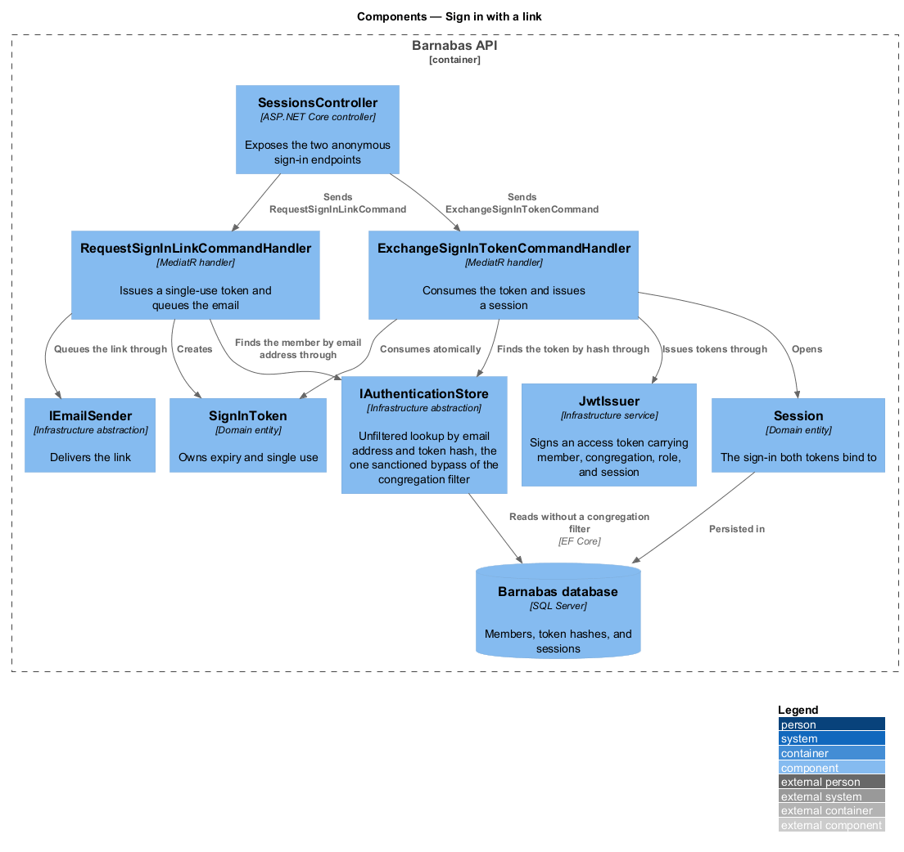
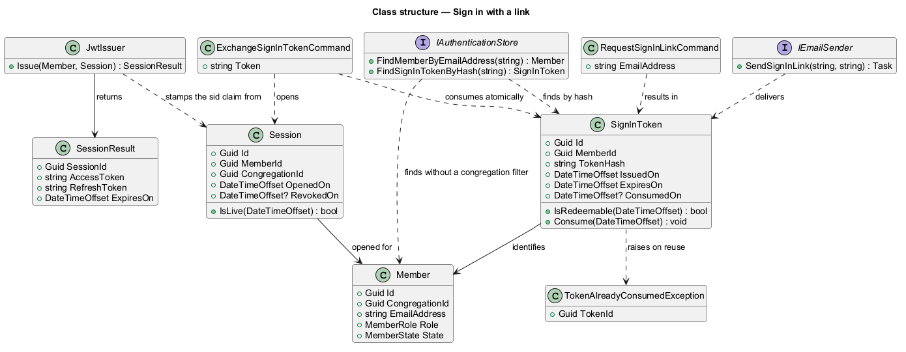
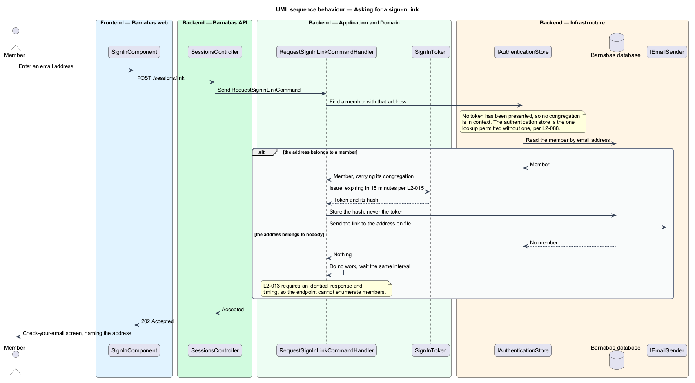
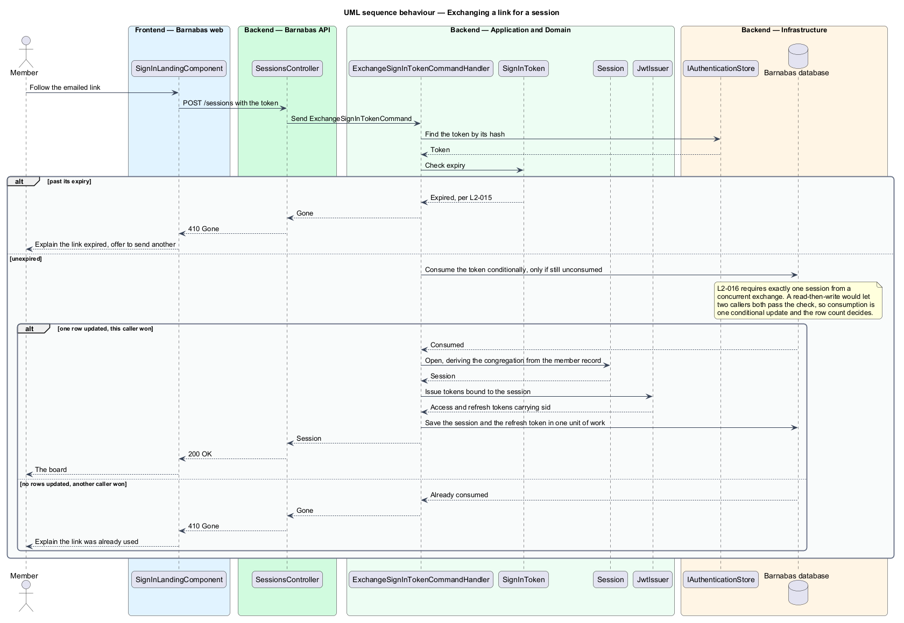

# Sign in with a link

## Overview

Barnabas holds no passwords. A member signs in by asking for a link, which arrives at the
email address the parish office has for them and can be followed once.

**sign-in token** — a single-use secret, valid for a short interval, that a member exchanges
for a session

The choice is made for the congregation rather than for the engineering. The membership
runs to eighty, and the help tags members themselves offer include tech support for phones,
email, and printers. A password is one more thing to lose, and a reset flow is one more
place to lose it. Possession of the mailbox is sufficient identity for an invite-only parish
board that holds no payment details.

Removing passwords also removes what would otherwise need protecting: there is no hash to
store, no strength rule to enforce, no reset token to expire, and no credential to breach.
What replaces it is narrower — a token that expires quickly and works once.

The endpoint that issues links responds identically whether or not the address belongs to a
member, so it cannot be used to discover who is in the congregation.

## Description

Two anonymous endpoints, one entity, and one signing service.

- **`SignInComponent`** and **`SignInLandingComponent`** — Angular screens. The first
  collects an address; the second is what the emailed link opens.
- **`SessionsController`** — exposes `POST /sessions/link` and `POST /sessions`. Both are
  among the few endpoints exempt from authentication.
- **`RequestSignInLinkCommand`** and its handler — find the member, issue a token, store its
  hash, and queue the email. When no member matches, the handler performs equivalent work
  and returns the same response.
- **`SignInToken`** — domain entity owning expiry and single use. `IsRedeemable` and
  `Consume` hold both rules, so neither handler restates them.
- **`ExchangeSignInTokenCommand`** and its handler — find the token by hash, consume it,
  open a `Session`, and issue the pair of tokens bound to it.
- **`Session`** — the sign-in itself, described in `access/end-a-session`. It is created
  here, and it is what makes the issued tokens revocable.
- **`IAuthenticationStore`** — the narrow, unfiltered lookup by email address and token
  hash. Sign-in is anonymous, so there is no congregation to filter by yet; this store is
  the one sanctioned way to read before one is known, and it is described in
  `platform/scope-queries-to-a-congregation`.
- **`JwtIssuer`** — signs an access token carrying the member, the congregation, the role,
  and the session. Those claims are what `platform/scope-queries-to-a-congregation` and
  `platform/authorise-a-request` read; this feature is where they originate.
- **`IEmailSender`** — the abstraction the handler depends on, so delivery is swappable and
  tests need no mail server.

Only the token's hash is stored. A database disclosure therefore yields nothing usable, and
the token itself exists only in the email and the URL the member follows.

**Consumption is one conditional update, not a check followed by a save.** `L2-016` requires
exactly one session from a concurrent exchange, and a read-then-write cannot promise that:
two callers can both read an unconsumed token and both proceed. The handler instead updates
the row on the condition that it is still unconsumed, and the number of rows affected decides
the winner. The loser receives 410, the same answer a genuinely reused link gets.

The congregation is taken from the member record the store returned, never from anything the
caller supplied.

Expiry is checked on the entity, and both expiry and reuse return 410 rather than 404 — the
token was real, and saying so lets the screen offer to send another rather than implying the
member mistyped something.

## Requirements

The feature realizes the following level-2 (L2) requirements. Each L2
requirement refines a level-1 (L1) requirement, cited by identifier. The
**Slice** column marks the requirements implemented by feature slice 1; the
remainder are designed here and implemented in a later slice.

| L2 ID | Refines (L1) | Slice | Requirement |
|-------|--------------|-------|-------------|
| `L2-012` | `L1-003` | 1 | A member shall be able to request a single-use sign-in link sent to their registered email address. The system shall never store a password. |
| `L2-013` | `L1-003` | &mdash; | The sign-in response shall be identical whether or not the address belongs to a member, so the endpoint cannot be used to enumerate members. |
| `L2-014` | `L1-003` | 1 | Following a valid sign-in link shall issue a JWT bound to the member and their congregation. |
| `L2-015` | `L1-003` | 1 | A sign-in token shall expire no more than 15 minutes after issue. |
| `L2-016` | `L1-003` | 1 | A sign-in token shall be consumed on first exchange. |
| `L2-017` | `L1-003` | &mdash; | Requests for sign-in links shall be limited per address and per source to prevent mailbox flooding. |

## Diagrams

### System context

Signing in is the one flow that leaves the system and comes back: Barnabas sends a link
through an external email provider, and the member returns by following it.

### Containers

The web client collects an address; the API issues the token, stores only its hash, and
hands the link to the email provider.

### Components

Two handlers either side of one entity, both reaching the database through
`IAuthenticationStore` because no congregation is in context yet. The exchange additionally
opens the `Session` the issued tokens bind to.

### Class structure

The token references the member it identifies and raises on reuse. `Session` is what
`JwtIssuer` stamps into the `sid` claim, and what makes the issued tokens revocable later.

### Behaviour — asking for a sign-in link

The two branches converge deliberately. `L2-013` requires the response and its timing be
identical whether or not the address belongs to a member, so the endpoint cannot be used to
enumerate the congregation.

### Behaviour — exchanging a link for a session

Expiry is a question the entity answers; single use is a question only the database can
answer, so consumption is a conditional update whose row count decides the winner. That is
what `L2-016` needs from a concurrent exchange, and a check followed by a save could not
provide it. Both failures return 410, which lets the screen offer to send another link.

