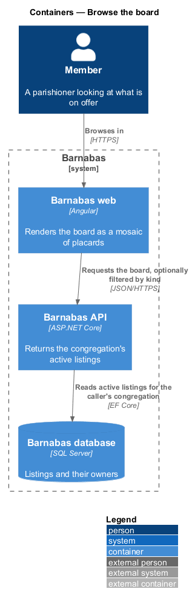
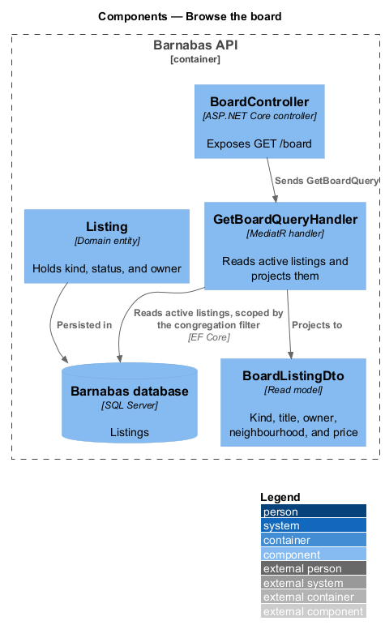
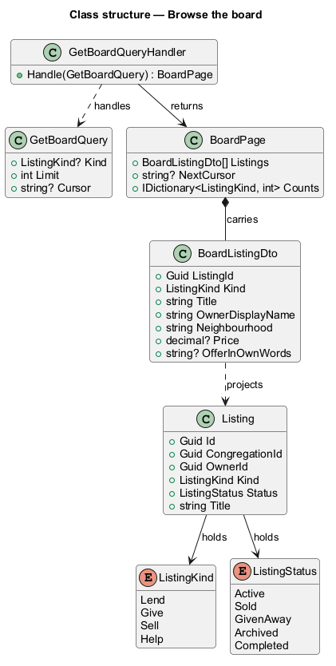
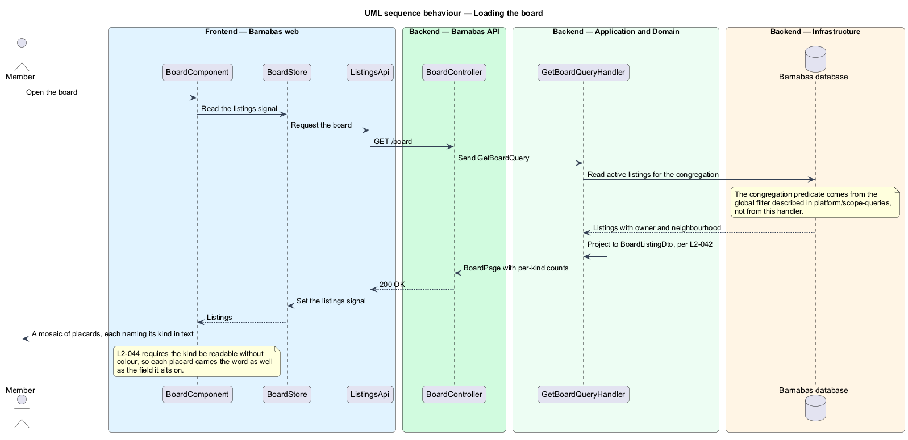
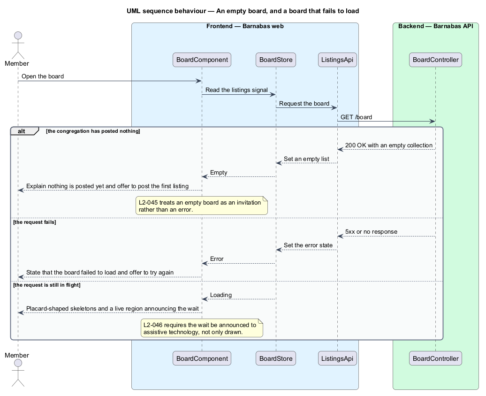

# Browse the board

## Overview

The board is the product's front page: every listing the congregation currently has on
offer, in one place.

**placard** — one listing rendered as a solid field of colour carrying its drawing and its
type, butted against its neighbours into a mosaic

A listing's kind is carried by the colour of the field it sits on — Lend indigo, Give cream,
Sell stone, Help indigo with no drawing, because help is time rather than a thing. Colour
alone cannot carry that meaning, so every placard also names its kind in text. The
requirement is not decorative: a member with a colour vision deficiency, or reading in
sunlight, gets the same information.

The board is filterable to one kind, which is the clearest view of the colour system: a
board filtered to Lend is a wall of one colour.

Three states beyond the ordinary one matter enough to design. A congregation that has posted
nothing sees an invitation rather than an error. A board still loading holds its geometry so
the page does not jump, and announces the wait. A board that fails says so and offers a
retry.

## Description

A read-only vertical slice with one query.

- **`BoardComponent`** — Angular screen rendering the mosaic and the filter chips. Template,
  styles, and class in separate files.
- **`BoardStore`** — signal-backed store holding the listings, the per-kind counts, and the
  loading or error state. The component reads signals rather than subscribing.
- **`IListingsApi`** and **`ListingsApi`** — the interface the store depends on and its typed
  HTTP client.
- **`BoardController`** — exposes `GET /board`, accepting an optional kind and a cursor.
- **`GetBoardQuery`** and **`GetBoardQueryHandler`** — read active listings and project them.
  The handler names no congregation: the global query filter supplies that predicate, as
  described in `platform/scope-queries-to-a-congregation`.
- **`BoardListingDto`** — read model carrying kind, title, owner display name,
  neighbourhood, price where the kind has one, and the offer in the member's own words where
  the kind is Help.
- **`BoardPage`** — the DTO collection plus a cursor and the per-kind counts the filter chips
  display.
- **`Listing`**, **`ListingKind`**, **`ListingStatus`** — the domain types projected from.

The handler returns a read model rather than entities. The board needs the owner's display
name and neighbourhood, which live on the member aggregate, and projecting once in the
handler avoids the client assembling a screen from several calls.

Results are paginated with a cursor from the first request. A parish board holds dozens of
listings rather than thousands, so the first page is almost always the only one — but the
shape is established here rather than retrofitted when a large congregation joins.

## Requirements

The feature realizes the following level-2 (L2) requirements. Each L2
requirement refines a level-1 (L1) requirement, cited by identifier. The
**Slice** column marks the requirements implemented by feature slice 1; the
remainder are designed here and implemented in a later slice.

| L2 ID | Refines (L1) | Slice | Requirement |
|-------|--------------|-------|-------------|
| `L2-042` | `L1-007` | 1 | The board shall show the active listings of the member's congregation, each carrying its kind, title, owner, and neighbourhood, and each opening its listing. |
| `L2-043` | `L1-007` | &mdash; | The board shall be filterable to a single kind, and the active filter shall be evident. |
| `L2-044` | `L1-007` | 1 | The board distinguishes kinds by colour. Colour shall never be the only carrier of that information. |
| `L2-045` | `L1-007` | &mdash; | A congregation with no active listings shall be shown an explanation and an invitation to post the first one. |
| `L2-046` | `L1-007` | &mdash; | While the board is loading, its pending state shall be conveyed to assistive technology as well as visually. |
| `L2-047` | `L1-007` | &mdash; | If the board cannot be loaded, the member shall be told plainly and offered a retry. |

## Diagrams

### Containers

The board is the one screen whose whole purpose is a read, so the container view carries the
shape of the feature: client, API, database, nothing else.

### Components

One controller, one query, one handler, one read model. The congregation predicate is absent
from all of them by design.

### Class structure

`BoardListingDto` flattens the listing and its owner into what a placard renders, carrying
the kind that decides which field colour and which treatment it takes.

### Behaviour — loading the board

The handler reads without naming a congregation and projects to the read model `L2-042`
describes. The screen renders each placard's kind as text as well as colour, which is what
`L2-044` requires.

### Behaviour — an empty board, and a board that fails

Three outcomes from one request. The empty case is an invitation rather than an error, and
the loading case announces itself to assistive technology rather than only drawing
skeletons.

