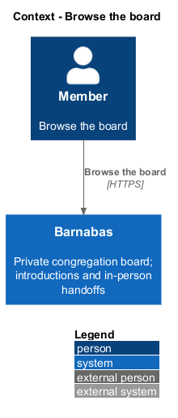

# Browse the board

## Overview

Barnabas is a private board where church congregation members offer goods or time through listings.

The **board** — collection of current listings visible to one congregation — lets members discover goods and offers of time. A **placard** — region presenting one listing and its destination — carries the kind, title, owner, and neighbourhood.

Kinds remain identifiable through text when colour is unavailable. Filtering selects Lend, Give, Sell, or Help. Empty, loading, and failed states each explain what the member can do next.

## Description

**Implementation boundary: Existing board; planned continuation and remaining kind presentation.**

`BoardComponent` is a routed `barnabas` page. `PlacardComponent` belongs to `domain` because it names listing DTOs; its destination is supplied by the page. `BoardStore` holds listings, counts, kind, loading, and failure signals. It injects `LISTING_SERVICE`, whose `IListingService` contract and token share `listing.service.contract.ts`. `ListingService` implements the contract and is bound at `app.config.ts`.

`BoardController` dispatches `GetBoardQuery(Kind, Limit, Cursor)`. `GetBoardQueryHandler` applies `Active`, the optional kind, and the congregation filter before ordering by descending `PostedAt` and identifier. `BoardPage` returns listing DTOs, `NextCursor`, and per-kind counts. The neighbourhood comes from the listing; the owner display name comes from `Member`. An empty query returns 200.

The current page size defaults to 24 and the validator permits up to 100. The current client does not consume `NextCursor`; complete continuation and clamping are specified in [serve collections under load](../../platform/serve-collections-under-load/README.md). No performance target is claimed from this implementation alone.

The loading template exposes a live region and clears it after completion. Failure offers retry through `BoardStore.load`. The target store discards a superseded load result when the member changes kind before an earlier request finishes. The empty state offers the kind chooser; each populated placard opens `/listings/:listingId`. Help availability and goods images extend `BoardListingDto` through their owning listing designs. Congregation heading data comes from [configuration](../../congregations/configure-a-congregation/README.md).

**Source anchors.** [GetBoardQueryHandler.cs](../../../../backend/src/Barnabas.Application/Board/GetBoard/GetBoardQueryHandler.cs), [board.store.ts](../../../../frontend/projects/domain/src/lib/board/board.store.ts), [placard.component.ts](../../../../frontend/projects/domain/src/lib/board/placard/placard.component.ts).

**Acceptance verification.** [L2-042](../../../specs/L2.md#l2-042-display-the-board): API AC 1, 2; E2E AC 3. [L2-043](../../../specs/L2.md#l2-043-filter-the-board-by-kind): API AC 1; E2E AC 2, 3. [L2-044](../../../specs/L2.md#l2-044-convey-a-listings-kind-without-relying-on-colour): E2E AC 1, 2. [L2-045](../../../specs/L2.md#l2-045-show-an-empty-board): API AC 1; E2E AC 2. [L2-046](../../../specs/L2.md#l2-046-show-the-board-loading): E2E AC 1, 2. [L2-047](../../../specs/L2.md#l2-047-show-the-board-failing-to-load): E2E AC 1, 2. The linked criteria retain their Given–When–Then wording. API acceptance uses SQL Server; E2E acceptance uses one page object per screen. New behaviour begins with its failing criterion. Design coverage does not assert an acceptance test pass.

## Requirements

The requirement text and identifiers are reproduced from [L2](../../../specs/L2.md). Each row names its [L1 parent](../../../specs/L1.md).

| L2 ID | Refines (L1) | Requirement |
|-------|--------------|-------------|
| `L2-042` | `L1-007` | The board shall show the active listings of the member's congregation, each carrying its kind, title, owner, and neighbourhood, and each opening its listing. |
| `L2-043` | `L1-007` | The board shall be filterable to a single kind, and the active filter shall be evident. |
| `L2-044` | `L1-007` | The board distinguishes kinds by colour. Colour shall never be the only carrier of that information. |
| `L2-045` | `L1-007` | A congregation with no active listings shall be shown an explanation and an invitation to post the first one. |
| `L2-046` | `L1-007` | While the board is loading, its pending state shall be conveyed to assistive technology as well as visually. |
| `L2-047` | `L1-007` | If the board cannot be loaded, the member shall be told plainly and offered a retry. |

## Diagrams

The context identifies the actor and the Barnabas capability. Congregation boundaries also apply to linked resources.

The container view places the Angular client, .NET API, and SQL Server persistence around this capability.

The component view separates screen composition, API dispatch, application behaviour, domain rules, and persistence.

The class view shows the feature types, their data, and typed dependencies. Planned additions are identified in the description.

The board query scopes before filtering and projects the listing fields needed by each placard.

Loading is announced until success or failure. An empty 200 and a failed request lead to distinct visible states.

