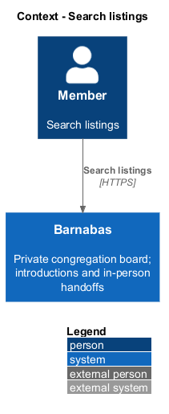
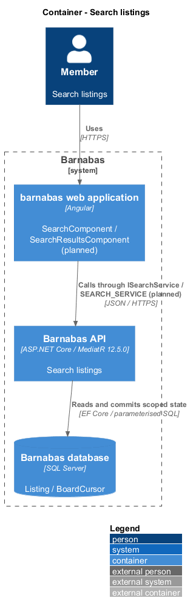
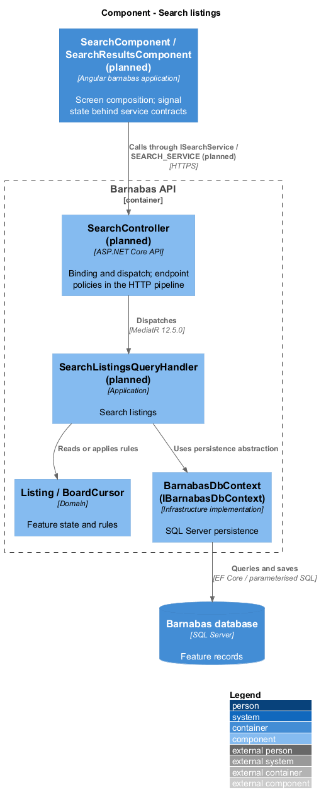
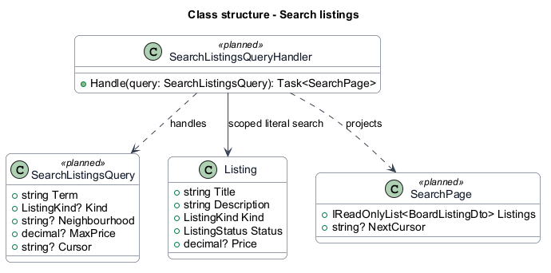
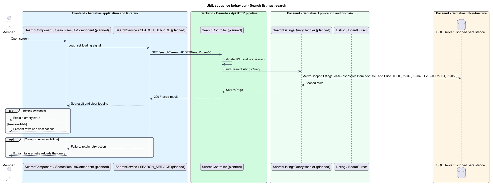
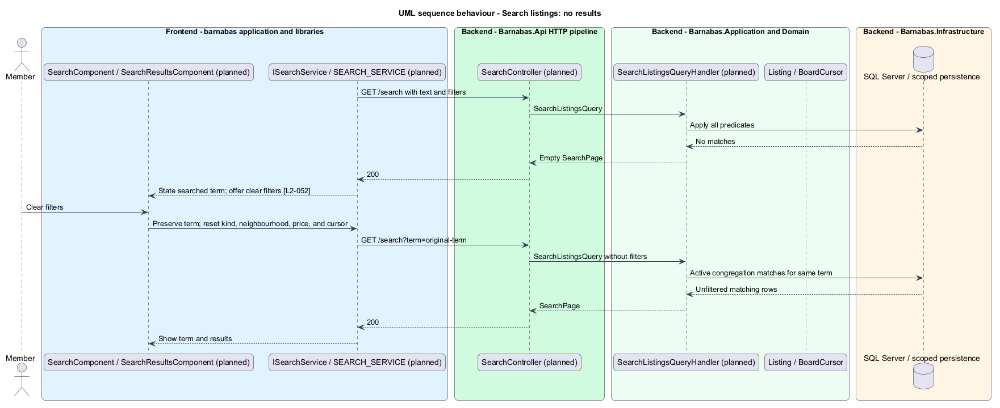

# Search listings

## Overview

Barnabas is a private board where church congregation members offer goods or time through listings.

**Search** — matching words against active listing titles and descriptions — helps a member find goods or time within their congregation. Kind, neighbourhood, and maximum price narrow the result.

A maximum price applies only to Sell listings. Lend, Give, and Help have no price and are excluded when that filter is present. A search with no results states its term and offers to clear filters.

## Description

**Implementation boundary: Planned; current search route is a placeholder.**

The current `/search` route is a placeholder. Planned `SearchComponent` and `SearchResultsComponent` remain routed pages in `barnabas`; both compose `PlacardComponent` from `domain`. A search state service owns query parameters and result signals, consumes `ISearchService` through `SEARCH_SERVICE`, and resets continuation when any filter changes. Clearing filters preserves the text term.

`SearchController` dispatches `SearchListingsQuery` from `GET /search?term=...&kind=...&neighbourhood=...&maxPrice=...&cursor=...`. Its validator bounds the term, validates kind and the current congregation's neighbourhood, and rejects a negative maximum. The term length bound remains `<TO SUPPLY>`. The handler applies congregation and Active predicates before all search and paging work.

The target uses SQL Server case-insensitive comparison for literal title/description substring matching. The migration declares the relevant collation instead of depending on a deployment default. SQL parameters carry the term; wildcard characters are escaped if LIKE is used so input remains literal. A maximum-price predicate requires `Kind == Sell` and `Price <= maximum`. Combining a maximum with a different kind returns an empty collection, without silently changing the selected filters. The final projection reuses listing presentation data and contains no member emails.

Results use the board's stable descending posted-time and identifier order. Empty results return 200 and expose the searched term; clearing filters reruns the same term. Closed-out, archived, and moderator-removed listings remain absent. Query generations prevent a slower old response overwriting newer filters. A failed search retains term and filters and offers retry. Case-insensitive search and latency are tested against SQL Server, including punctuation that resembles SQL control syntax.

**Source anchors.** [app.routes.ts](../../../../frontend/projects/barnabas/src/app/app.routes.ts), [BoardCursor.cs](../../../../backend/src/Barnabas.Application/Board/GetBoard/BoardCursor.cs).

**Acceptance verification.** [L2-048](../../../specs/L2.md#l2-048-search-listings-by-text): API AC 1, 2, 3; E2E AC 4. [L2-049](../../../specs/L2.md#l2-049-filter-search-results-by-kind): API AC 1; E2E AC 2. [L2-050](../../../specs/L2.md#l2-050-filter-search-results-by-neighbourhood): API AC 1; E2E AC 2. [L2-051](../../../specs/L2.md#l2-051-filter-search-results-by-price): API AC 1, 2. [L2-052](../../../specs/L2.md#l2-052-show-a-search-with-no-results): E2E AC 1, 2. [L2-053](../../../specs/L2.md#l2-053-exclude-closed-listings-from-search): API AC 1, 2. The linked criteria retain their Given–When–Then wording. API acceptance uses SQL Server; E2E acceptance uses one page object per screen. New behaviour begins with its failing criterion. Design coverage does not assert an acceptance test pass.

## Requirements

The requirement text and identifiers are reproduced from [L2](../../../specs/L2.md). Each row names its [L1 parent](../../../specs/L1.md).

| L2 ID | Refines (L1) | Requirement |
|-------|--------------|-------------|
| `L2-048` | `L1-008` | A member shall be able to search the titles and descriptions of active listings in their congregation. |
| `L2-049` | `L1-008` | Search results shall be narrowable to a single listing kind, and the applied filter shall be evident. |
| `L2-050` | `L1-008` | Search results shall be narrowable to one of the congregation's neighbourhoods. |
| `L2-051` | `L1-008` | Search results shall be narrowable by maximum price. A price filter excludes Lend, Give, and Help listings, because they carry no price. |
| `L2-052` | `L1-008` | A search matching nothing shall state the term searched and offer to clear the filters. |
| `L2-053` | `L1-008` | A listing that has been closed out or archived shall not appear in search results. |

## Diagrams

The context identifies the actor and the Barnabas capability. Congregation boundaries also apply to linked resources.

The container view places the Angular client, .NET API, and SQL Server persistence around this capability.

The component view separates screen composition, API dispatch, application behaviour, domain rules, and persistence.

The class view shows the feature types, their data, and typed dependencies. Planned additions are identified in the description.

Search filters are combined inside the congregation boundary. Price narrows the query to Sell listings.

Clearing filters preserves the searched term and requests new results.

