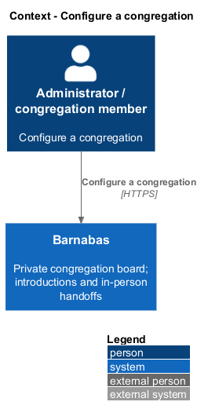
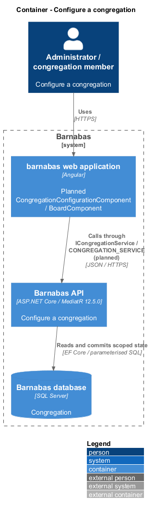
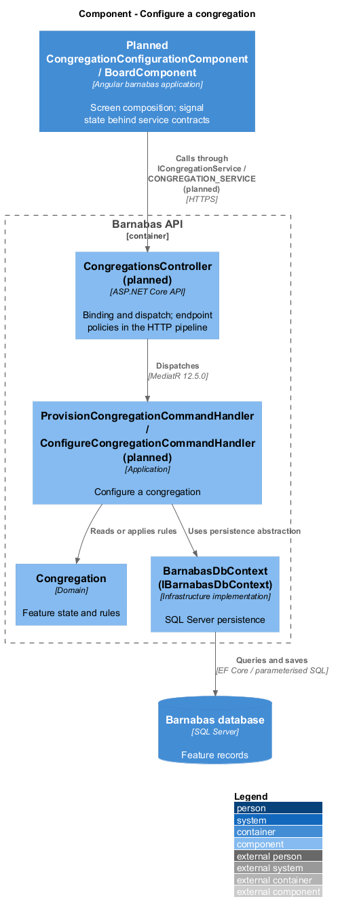
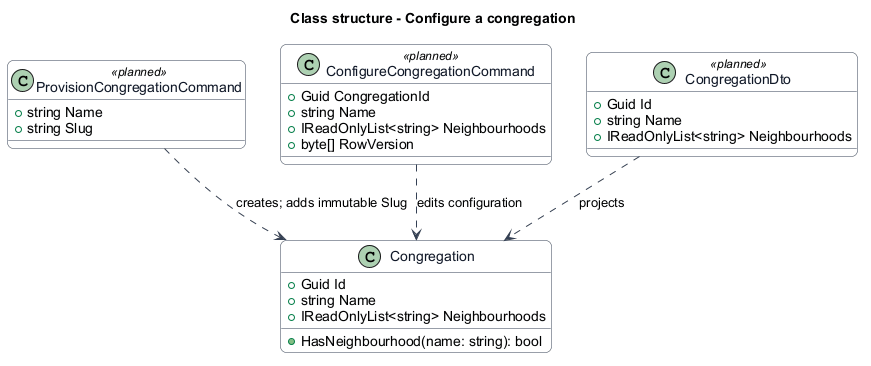
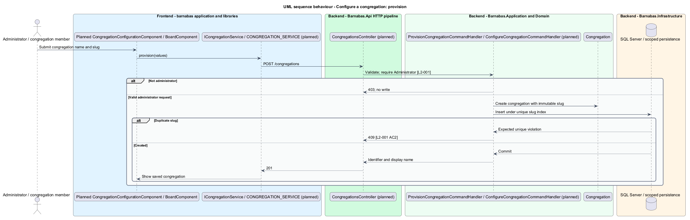
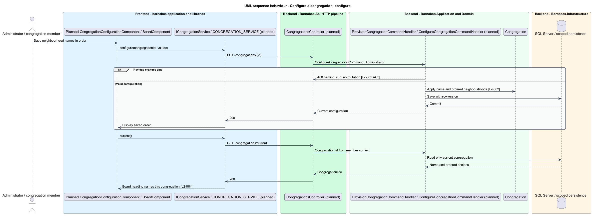

# Configure a congregation

## Overview

Barnabas is a private board where church congregation members offer goods or time through listings.

A **congregation** — church community with its own members, neighbourhoods, and board — is provisioned by a deployment administrator. A **slug** — immutable URL-safe name unique across the deployment — identifies the congregation in public entry links.

The display name identifies the board in the interface. The ordered neighbourhood set supplies choices for member profiles and listings, keeping congregation-specific locations consistent.

## Description

**Implementation boundary: Existing congregation entity and seeding; planned configuration slice.**

`Congregation` currently stores `Id`, `Name`, and ordered `Neighbourhoods`, with `HasNeighbourhood` performing a case-insensitive membership check. `CongregationSeeder` creates development data. Slug storage and administrative endpoints are planned; no provisioning UI currently exists.

The target adds `CongregationConfigurationComponent` in `barnabas`, consuming `ICongregationService` through `CONGREGATION_SERVICE` declared in `api/congregations/congregation.service.contract.ts`. `CongregationService` implements the HTTP calls and is bound only in the host. A configuration state service holds signals and save behaviour. `CongregationsController` dispatches `ProvisionCongregationCommand` from `POST /congregations`, and `ConfigureCongregationCommand` from `PUT /congregations/{id}`. Both declare Administrator authority.

`ProvisionCongregationCommandHandler` creates the congregation with an immutable normalised slug and a SQL unique index. It returns 201 with the identifier. A concurrent duplicate-slug insert maps the expected uniqueness violation to 409. The validator rejects unsafe slug characters and blank names; maximum lengths and slug-normalisation policy remain `<TO SUPPLY>`. A supplied slug change returns 400 without changing the record.

`ConfigureCongregationCommandHandler` updates display name and neighbourhood order atomically. The target rejects duplicate or blank neighbourhood entries and uses rowversion for concurrent administrative edits. Removing or renaming a neighbourhood already used by a member or listing needs a migration policy, recorded as `<TO SUPPLY>` in [open decisions](../../open-decisions.md).

`GET /congregations/current` is a planned authenticated query whose identifier comes exclusively from the verified context. It projects name and neighbourhoods without enumerating other congregations. A `CongregationStore` in `domain` consumes the service contract; `BoardComponent` and the shell read its name. The board heading is never hard-coded to seeded data. Profile and listing selectors use the returned ordered set; the server also verifies membership on save.

**Source anchors.** [Congregation.cs](../../../../backend/src/Barnabas.Domain/Congregations/Congregation.cs), [CongregationSeeder.cs](../../../../backend/src/Barnabas.Infrastructure/Persistence/Seeding/CongregationSeeder.cs).

**Acceptance verification.** [L2-001](../../../specs/L2.md#l2-001-provision-a-congregation): API AC 1, 2, 3, 4. [L2-002](../../../specs/L2.md#l2-002-configure-the-neighbourhoods-of-a-congregation): API AC 1, 2; E2E AC 3. [L2-004](../../../specs/L2.md#l2-004-present-the-congregations-name-throughout-the-interface): E2E AC 1, 2. The linked criteria retain their Given–When–Then wording. API acceptance uses SQL Server; E2E acceptance uses one page object per screen. New behaviour begins with its failing criterion. Design coverage does not assert an acceptance test pass.

## Requirements

The requirement text and identifiers are reproduced from [L2](../../../specs/L2.md). Each row names its [L1 parent](../../../specs/L1.md).

| L2 ID | Refines (L1) | Requirement |
|-------|--------------|-------------|
| `L2-001` | `L1-001` | An administrator shall be able to create a congregation with a display name and a URL-safe slug. The slug shall be unique across the deployment and immutable once set. |
| `L2-002` | `L1-001` | Each congregation shall carry its own ordered set of neighbourhood names. Members select their neighbourhood from this set; free text shall not be accepted. |
| `L2-004` | `L1-001` | The congregation's display name shall appear wherever the board is identified, so a member always knows which congregation they are looking at. |

## Diagrams

The context identifies the actor and the Barnabas capability. Congregation boundaries also apply to linked resources.

The container view places the Angular client, .NET API, and SQL Server persistence around this capability.

The component view separates screen composition, API dispatch, application behaviour, domain rules, and persistence.

The class view shows the feature types, their data, and typed dependencies. Planned additions are identified in the description.

A unique SQL index settles concurrent slug creation. The response identifies the created congregation.

Configuration preserves neighbourhood order and rejects slug changes. The current-congregation query supplies the board heading.

