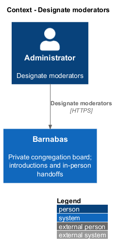
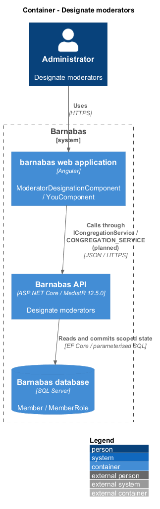
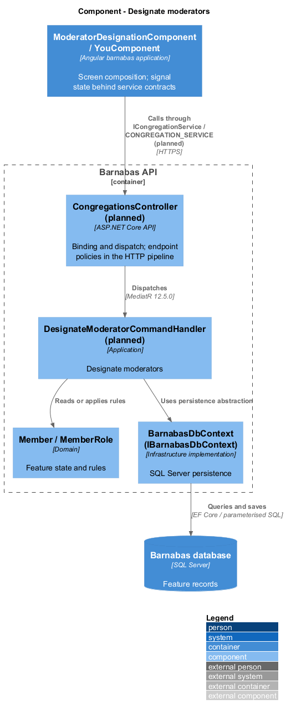
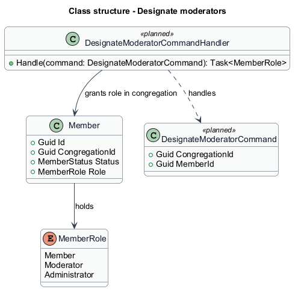
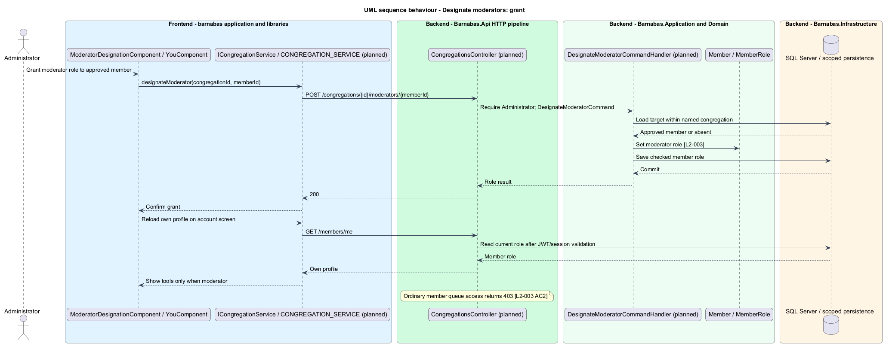

# Designate moderators

## Overview

Barnabas is a private board where church congregation members offer goods or time through listings.

A **moderator** — approved member authorised to review listings and membership within their congregation — receives that role from a deployment administrator. The role adds moderation destinations to the member's account screen.

Moderator authority never transfers across congregations. Ordinary ownership checks continue to apply outside the dedicated moderation actions.

## Description

**Implementation boundary: Existing role model; planned grant and current-role presentation.**

`MemberRole` already defines Member, Moderator, and Administrator. `Member` stores a single role and congregation. Granting through the product is planned. `ModeratorDesignationComponent` is an administrator page in `barnabas`; its state service consumes `ICongregationService` through `CONGREGATION_SERVICE`.

`POST /congregations/{id}/moderators/{memberId}` dispatches planned `DesignateModeratorCommand` through `CongregationsController`. `DesignateModeratorCommandHandler` requires Administrator, verifies that the target is approved and belongs to the named congregation, and updates its role with a rowversion check. A foreign or absent member returns 404; an ineligible pending member returns a field-named 400. Granting an already-held role returns the unchanged role. Unrelated administrator authority is not overwritten.

The target authentication policy reads current role from the member record after validating the JWT session. This makes the next moderation request reflect the grant without requiring a new sign-in. JWT issuance still records the role, and a forged role claim fails signature validation. `YouComponent` reads the current own-profile response and displays moderator tools only for an authorised moderator. Hiding a route is presentation; the backend also returns 403 to ordinary members requesting the queue.

The initial deployment administrator's provisioning mechanism is `<TO SUPPLY>`. Development seed roles do not establish a production bootstrap procedure. No role revocation requirement is inferred by this grant design.

**Source anchors.** [MemberRole.cs](../../../../backend/src/Barnabas.Domain/Members/MemberRole.cs), [Member.cs](../../../../backend/src/Barnabas.Domain/Members/Member.cs).

**Acceptance verification.** [L2-003](../../../specs/L2.md#l2-003-designate-moderators): API AC 1, 2; E2E AC 3, 4. The linked criteria retain their Given–When–Then wording. API acceptance uses SQL Server; E2E acceptance uses one page object per screen. New behaviour begins with its failing criterion. Design coverage does not assert an acceptance test pass.

## Requirements

The requirement text and identifiers are reproduced from [L2](../../../specs/L2.md). Each row names its [L1 parent](../../../specs/L1.md).

| L2 ID | Refines (L1) | Requirement |
|-------|--------------|-------------|
| `L2-003` | `L1-001` | A member of a congregation shall be able to hold the moderator role. Moderator authority applies only within the congregation that granted it. |

## Diagrams

The context identifies the actor and the Barnabas capability. Congregation boundaries also apply to linked resources.

The container view places the Angular client, .NET API, and SQL Server persistence around this capability.

The component view separates screen composition, API dispatch, application behaviour, domain rules, and persistence.

The class view shows the feature types, their data, and typed dependencies. Planned additions are identified in the description.

The administrator grants a role to an approved member. The next request reads the current authority and the account screen exposes moderator tools.

