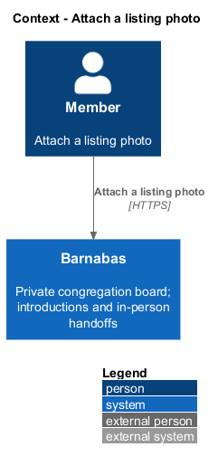
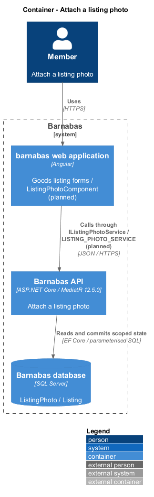
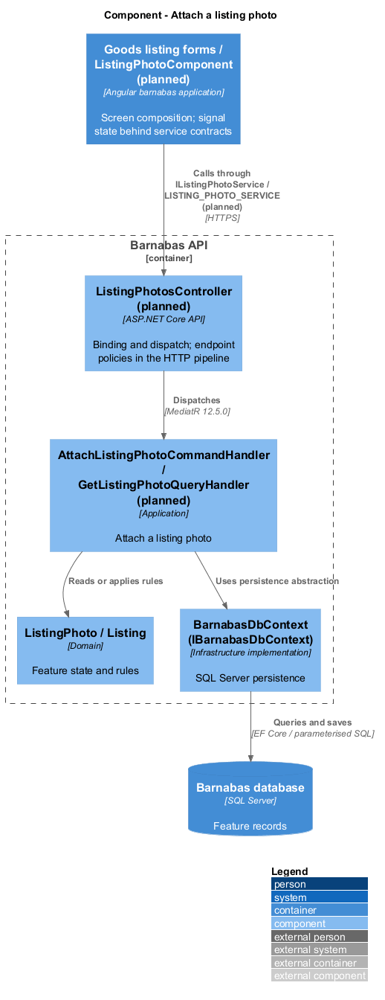
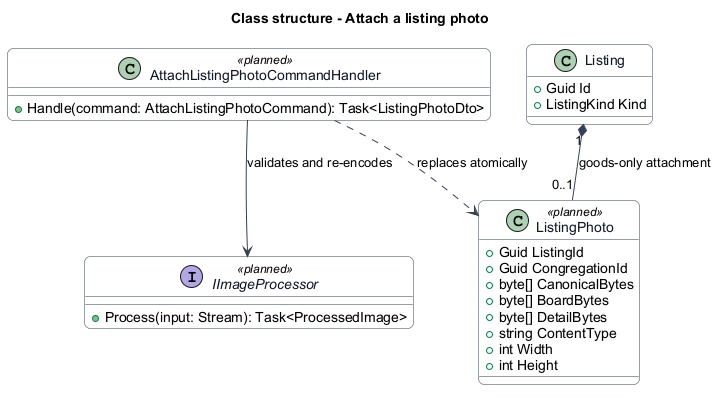
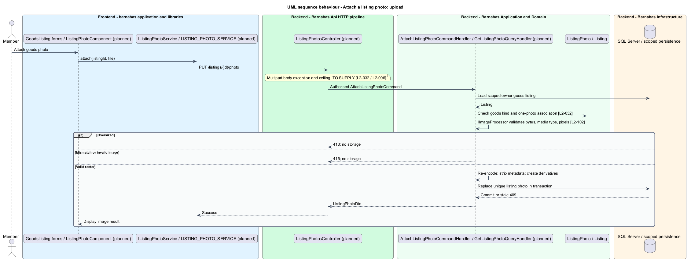
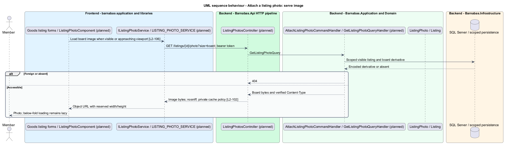

# Attach a listing photo

## Overview

Barnabas is a private board where church congregation members offer goods or time through listings.

A **listing photo** — single image attached to a Lend, Give, or Sell listing — helps members recognise goods. A **derivative** — resized, re-encoded copy made for a display size — avoids serving the original image for a board placard.

Help offers time and accepts no photo. Uploaded content is validated, re-encoded, and stripped of metadata before storage.

## Description

**Implementation boundary: Planned.**

Photo upload and serving are planned. The per-kind goods form composes `ListingPhotoComponent` in `domain`. Its state service consumes `IListingPhotoService` through `LISTING_PHOTO_SERVICE` in an `api` contract. The application host binds `ListingPhotoService`; the component handles no HTTP calls directly.

`ListingPhotosController` dispatches `AttachListingPhotoCommand` from proposed `PUT /listings/{id}/photo` and `GetListingPhotoQuery` from `GET /listings/{id}/photo?size=board`. The command carries a bounded stream and declared media type, with ownership resolved from the scoped listing. Help rejects the photo field. The handler checks the existing kind, content signature, decoder success, dimensions, and actual byte count. Declared/content mismatch or unsupported content returns 415; excessive size returns 413, with no committed image.

Infrastructure implements an `IImageProcessor` contract that decodes a raster image, discards embedded metadata, and re-encodes its pixels. It generates a board derivative and a detail derivative before persistence. Accepted formats include JPEG because the criterion requires it; the complete allowlist, byte and pixel ceilings, dimensions, and processor library remain `<TO SUPPLY>`. Decoder failure cleans temporary buffers and leaves an existing photo intact.

The target stores canonical bytes and derivatives in SQL Server through `ListingPhoto`, keyed uniquely by listing. This is an explicit design choice keeping listing and image replacement in one database transaction with the sole persistence provider. A checked listing rowversion rejects simultaneous replacement or deletion with 409. Storage capacity and serving latency are measured under the collection workload before deployment. No uploaded filename becomes an executable path.

Image reads authenticate and repeat congregation and listing-visibility checks, returning 404 for foreign or unavailable listings. The response Content-Type comes from encoded output, with `nosniff` and private caching. Board DTOs expose authorised image identifiers and width/height; the client obtains images through the token-bearing service into revocable object URLs because access tokens live in memory. Below-fold images load lazily; visible primary imagery is not delayed by that rule. Lifecycle deletion removes photo bytes and derivatives.

`L2-032` accepts a 2 MB JPEG and rejects a 12 MB file, while `L2-096` rejects any request body over 1 MB. The multipart exception and exact limit remain `<TO SUPPLY>` in [open decisions](../../open-decisions.md). Upload implementation begins after those contradictory bounds are reconciled; this design does not claim both are simultaneously enforceable.

An object URL is revoked when its image leaves the screen or the session ends. The client starts the first meaningful image request promptly, and the page-weight tests measure this authenticated delivery path rather than assuming native image authentication. The single SQL provider stores all photo variants, so replacement and dependent deletion have no external-object rollback gap.

**Acceptance verification.** [L2-032](../../../specs/L2.md#l2-032-attach-a-photo-to-a-goods-listing): API AC 1, 2, 3. [L2-102](../../../specs/L2.md#l2-102-handle-uploaded-files-safely): API AC 1, 2, 3. [L2-106](../../../specs/L2.md#l2-106-serve-images-efficiently): API AC 1; E2E AC 2. The linked criteria retain their Given–When–Then wording. API acceptance uses SQL Server; E2E acceptance uses one page object per screen. New behaviour begins with its failing criterion. Design coverage does not assert an acceptance test pass.

## Requirements

The requirement text and identifiers are reproduced from [L2](../../../specs/L2.md). Each row names its [L1 parent](../../../specs/L1.md).

| L2 ID | Refines (L1) | Requirement |
|-------|--------------|-------------|
| `L2-032` | `L1-005` | A Lend, Give, or Sell listing shall accept at most one image, of a permitted type and bounded size. See L2-102 for upload safety. |
| `L2-102` | `L1-015` | An uploaded file shall be accepted only when its content matches a permitted image type, and shall be re-encoded and stripped of embedded metadata before storage. |
| `L2-106` | `L1-016` | A listing image shall be served at a size appropriate to its use, and images below the fold shall load lazily. |

## Diagrams

The context identifies the actor and the Barnabas capability. Congregation boundaries also apply to linked resources.

The container view places the Angular client, .NET API, and SQL Server persistence around this capability.

The component view separates screen composition, API dispatch, application behaviour, domain rules, and persistence.

The class view shows the feature types, their data, and typed dependencies. Planned additions are identified in the description.

The planned upload validates actual content and re-encodes before replacing the single photo. The request-size conflict remains unresolved.

Authenticated board-size requests return derivatives and below-fold requests are lazy.

