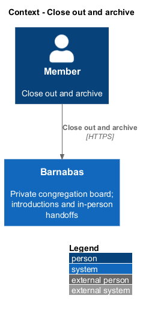
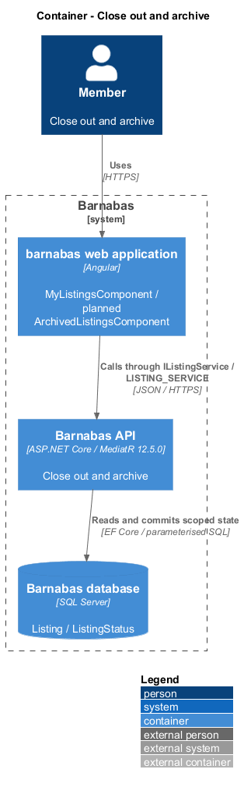
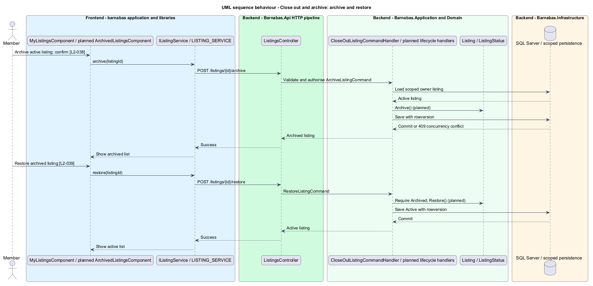

# Close out and archive

## Overview

Barnabas is a private board where church congregation members offer goods or time through listings.

**Close out** — record the outcome of a listing in the vocabulary of its kind — removes that listing from the board. Sell becomes Sold, Give becomes Given away, Lend becomes Archived, and Help becomes Completed.

Archiving withdraws an active listing without recording a handoff. Restoration returns an archived listing to the board. Permanent deletion requires confirmation and cannot be undone. Lend close-out does not track a return or prove that an item was returned.

## Description

**Implementation boundary: Existing close-out; planned archive, restore, and deletion.**

`CloseOutListingCommandHandler` and `Listing.CloseOut(asOf)` exist. `POST /listings/{listingId}/close-out` carries no caller-selected status. The domain maps the stored kind to `Sold`, `GivenAway`, `Archived`, or `Completed`. `MyListingsStore.closeOut` refreshes the active list after success. `ConfirmDialogComponent` provides the confirmation primitive, with labels supplied by the page.

Planned `ArchiveListingCommand`, `RestoreListingCommand`, and `DeleteListingCommand` use `POST /listings/{id}/archive`, `POST /listings/{id}/restore`, and `DELETE /listings/{id}`. Each declares `IRequireOwnership<Listing>` and loads within the congregation. Archive requires Active; restore requires Archived. State conflicts return 409. A planned listing row version serialises competing edits and transitions. The archived page loads the existing inclusive query and selects archived rows; a planned explicit status filter avoids loading all historical rows.

The target deletion handler explicitly removes the listing, its photos, requests, threads, messages, read marks, and subject notifications in one unit of work. This retains the prior design's cascade decision without claiming it is implemented or mandated by `L2-040`. The current schema only cascades messages and read marks from a thread. `L2-064` and `L2-074` make retained conversations and notifications without subjects unsuitable. Confirmation explains the affected conversations before sending; cancellation leaves all records unchanged. Physical image deletion follows the photo-storage contract. A repeat read returns 404. Close-out and ordinary archive retain requests and conversations; acceptance never closes a listing automatically.

**Source anchors.** [CloseOutListingCommandHandler.cs](../../../../backend/src/Barnabas.Application/Listings/CloseOutListing/CloseOutListingCommandHandler.cs), [Listing.cs](../../../../backend/src/Barnabas.Domain/Listings/Listing.cs), [MessageThreadConfiguration.cs](../../../../backend/src/Barnabas.Infrastructure/Persistence/Configurations/MessageThreadConfiguration.cs).

**Acceptance verification.** [L2-037](../../../specs/L2.md#l2-037-close-out-a-listing-in-the-vocabulary-of-its-kind): API AC 1, 2, 3, 4; E2E AC 5. [L2-038](../../../specs/L2.md#l2-038-archive-a-listing): API AC 1; E2E AC 2. [L2-039](../../../specs/L2.md#l2-039-restore-or-repost-an-archived-listing): API AC 1; E2E AC 2. [L2-040](../../../specs/L2.md#l2-040-permanently-delete-a-listing): API AC 1; E2E AC 2, 3. The linked criteria retain their Given–When–Then wording. API acceptance uses SQL Server; E2E acceptance uses one page object per screen. New behaviour begins with its failing criterion. Design coverage does not assert an acceptance test pass.

## Requirements

The requirement text and identifiers are reproduced from [L2](../../../specs/L2.md). Each row names its [L1 parent](../../../specs/L1.md).

| L2 ID | Refines (L1) | Requirement |
|-------|--------------|-------------|
| `L2-037` | `L1-006` | Closing out shall use the wording and resulting status belonging to the listing's kind: Sell closes as sold, Give as given away, Lend as archived, Help as completed. |
| `L2-038` | `L1-006` | A member shall be able to archive an active listing without closing it out, removing it from the board while keeping it recoverable. |
| `L2-039` | `L1-006` | A member shall be able to return an archived listing to the board. |
| `L2-040` | `L1-006` | A member shall be able to delete a listing permanently. Deletion shall require confirmation and shall be irreversible. |

## Diagrams

The context identifies the actor and the Barnabas capability. Congregation boundaries also apply to linked resources.

The container view places the Angular client, .NET API, and SQL Server persistence around this capability.

The component view separates screen composition, API dispatch, application behaviour, domain rules, and persistence.

The class view shows the feature types, their data, and typed dependencies. Planned additions are identified in the description.

The entity derives the outcome from the stored kind. The owner cannot supply a status belonging to another kind.

Archive and restore are planned owner transitions. A concurrent or invalid transition returns 409.

The planned deletion explicitly removes dependent conversations and notifications. Cancellation never reaches the API.

