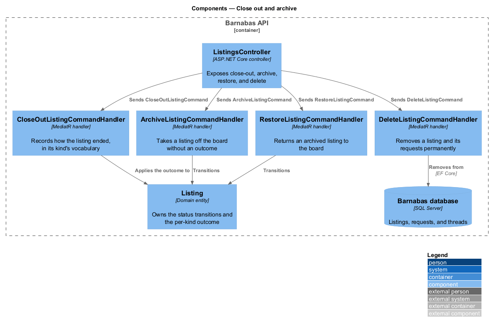
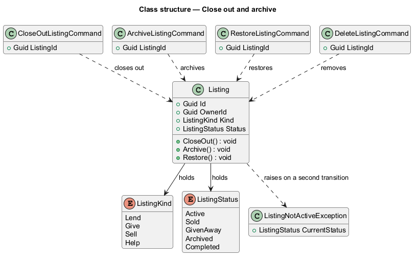
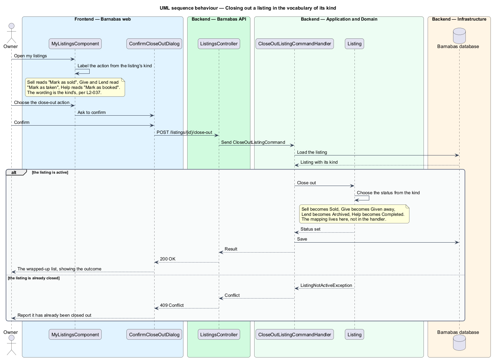
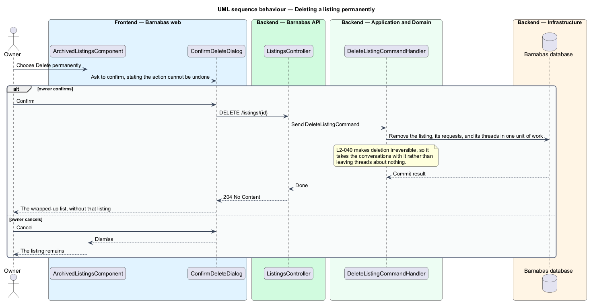

# Close out and archive

## Overview

A listing does not stay on the board forever. It ends, and how it ended is worth recording.

**close out** — to record that a listing has served its purpose, in the wording belonging to
its kind

The wording is not cosmetic. A Sell listing is *sold*; a Give listing is *given away*; a
Lend listing comes back and is *archived*; a Help offer is *completed*. Using one neutral
word for all four would lose the distinction the whole product rests on, and a member
looking at last spring's listings should be able to see which things were sold and which
were given.

Archiving is the quieter alternative: a listing comes off the board without recording an
outcome, because the member changed their mind or the thing is temporarily unavailable. It
can be restored.

Deletion is the only irreversible act in the product. It removes the listing, the requests
made against it, and the threads those requests opened — leaving conversations about a
listing that no longer exists would be worse than removing them. It is confirmed, and the
confirmation says plainly that it cannot be undone.

## Description

Four commands over one entity, with the transitions on the entity rather than in the
handlers.

- **`MyListingsComponent`** and **`ArchivedListingsComponent`** — the two Angular screens,
  paired by a chip row.
- **`ConfirmCloseOutDialog`** and **`ConfirmDeleteDialog`** — native `dialog` elements, so
  they stay closed and harmless without scripting.
- **`CloseOutListingCommand`** and its handler — record the outcome. The command carries no
  status: the entity derives it from the kind, so a client cannot mark a Give listing sold.
- **`ArchiveListingCommand`**, **`RestoreListingCommand`** — move a listing off and back on
  the board without an outcome.
- **`DeleteListingCommand`** and its handler — remove the listing, its requests, and its
  threads in one unit of work.
- **`Listing.CloseOut`**, **`Archive`**, **`Restore`** — the transitions. `CloseOut` holds
  the kind-to-status mapping: Sell to `Sold`, Give to `GivenAway`, Lend to `Archived`, Help
  to `Completed`.
- **`ListingNotActiveException`** — raised when a transition is applied to a listing that
  has already had one, and mapped to 409.

The kind-to-outcome mapping lives on the entity because it is a domain rule rather than a
presentation choice. The screen labels its button from the same kind — *Mark as sold*, *Mark
as taken*, *Mark as booked* — but the two derive from the rule independently rather than the
server trusting the client's word for it.

All four commands implement `IRequireOwnership`, so only the member who posted a listing can
end it.

## Requirements

The feature realizes the following level-2 (L2) requirements. Each L2
requirement refines a level-1 (L1) requirement, cited by identifier. The
**Slice** column marks the requirements implemented by feature slice 1; the
remainder are designed here and implemented in a later slice.

| L2 ID | Refines (L1) | Slice | Requirement |
|-------|--------------|-------|-------------|
| `L2-037` | `L1-006` | 1 | Closing out shall use the wording and resulting status belonging to the listing's kind: Sell closes as sold, Give as given away, Lend as archived, Help as completed. |
| `L2-038` | `L1-006` | &mdash; | A member shall be able to archive an active listing without closing it out, removing it from the board while keeping it recoverable. |
| `L2-039` | `L1-006` | &mdash; | A member shall be able to return an archived listing to the board. |
| `L2-040` | `L1-006` | &mdash; | A member shall be able to delete a listing permanently. Deletion shall require confirmation and shall be irreversible. |

## Diagrams

### Components

Four handlers over one entity. Three ask the entity to transition; the fourth removes it and
what depends on it.

### Class structure

`Listing.CloseOut` takes no status argument. It reads the kind and chooses the outcome
itself, so the mapping cannot be circumvented by a client.

### Behaviour — closing out in the vocabulary of the kind

The screen labels the action from the kind and the entity derives the resulting status from
the same kind. `L2-037` requires the four kinds end in four different words.

### Behaviour — deleting permanently

Deletion takes the requests and threads with it, in one unit of work. Leaving a thread about
a listing that no longer exists would be a worse outcome than removing the conversation.

