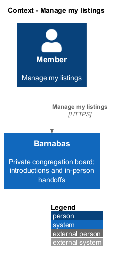
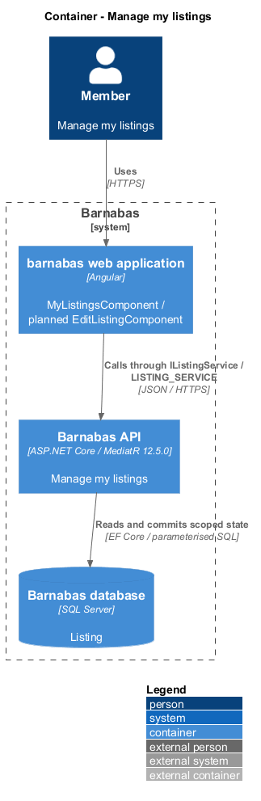
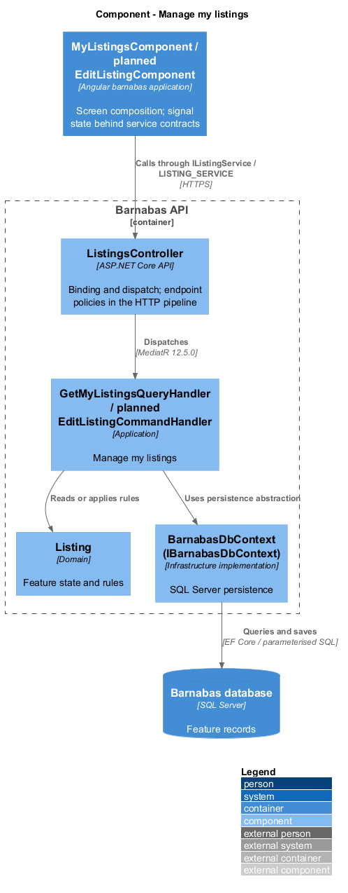
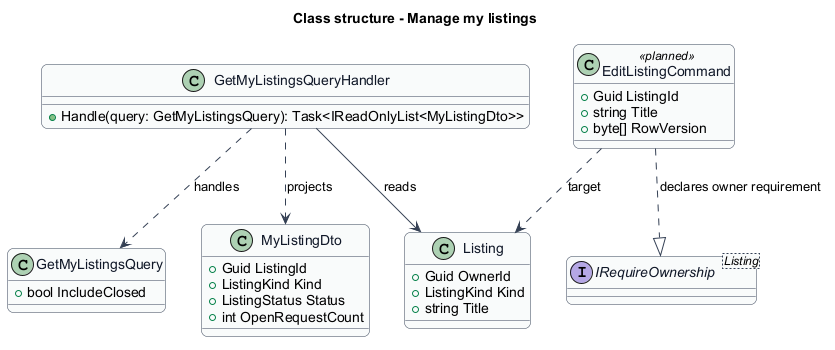
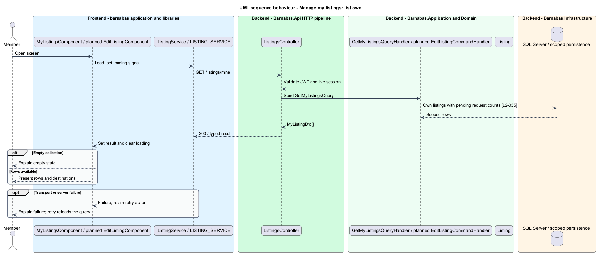
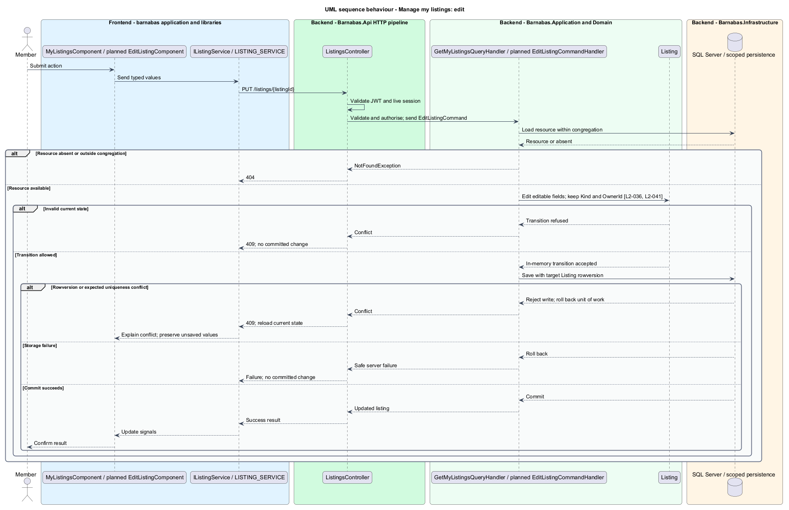

# Manage my listings

## Overview

Barnabas is a private board where church congregation members offer goods or time through listings.

A member manages the listings they created from an ownership view. An **open request count** — number of pending asks against one listing — identifies decisions awaiting that owner.

The member can reach those requests or edit listing details. Editing preserves kind, owner, and congregation. A moderator's separate removal capability does not grant general editing authority.

## Description

**Implementation boundary: Existing own-list query; planned editing.**

`MyListingsComponent` reads `MyListingsStore`, which consumes `IListingService` through `LISTING_SERVICE`. `GET /listings/mine?includeClosed=true` is implemented by `GetMyListingsQueryHandler`. It scopes by owner and congregation, projects `MyListingDto`, and counts pending requests inside the query. The existing service exposes the active view; archived navigation is a planned extension.

`EditListingComponent`, `EditListingCommand`, `EditListingCommandHandler`, and `Listing.Edit` are planned. `PUT /listings/{listingId}` binds editable fields and dispatches through MediatR 12.5.0. The command implements `IRequireOwnership<Listing>`. A same-congregation non-owner receives 403; a missing or foreign listing receives 404. A supplied kind change returns 400 before any mutation. The form has an edit heading, populated fields, and a save action.

The target reuses each kind's creation bounds and preserves Help window references already used by requests. The policy for removing a referenced window remains `<TO SUPPLY>`. A row version protects concurrent edits and lifecycle transitions; a stale save returns 409 and retains the member's form for review. `MyListingRowComponent` is a planned `domain` region receiving route destinations from the page. Its open-request link leads to incoming requests filtered to that listing. Loading, retry, and empty states remain page state, with behaviour in services. Owner actions are absent from another member's detail view.

**Source anchors.** [GetMyListingsQueryHandler.cs](../../../../backend/src/Barnabas.Application/Listings/GetMyListings/GetMyListingsQueryHandler.cs), [my-listings.store.ts](../../../../frontend/projects/domain/src/lib/listings/my-listings.store.ts).

**Acceptance verification.** [L2-035](../../../specs/L2.md#l2-035-list-own-active-listings): API AC 1; E2E AC 2. [L2-036](../../../specs/L2.md#l2-036-edit-a-listing): API AC 1, 2; E2E AC 3. [L2-041](../../../specs/L2.md#l2-041-restrict-listing-modification-to-its-owner): API AC 1, 2; E2E AC 3. The linked criteria retain their Given–When–Then wording. API acceptance uses SQL Server; E2E acceptance uses one page object per screen. New behaviour begins with its failing criterion. Design coverage does not assert an acceptance test pass.

## Requirements

The requirement text and identifiers are reproduced from [L2](../../../specs/L2.md). Each row names its [L1 parent](../../../specs/L1.md).

| L2 ID | Refines (L1) | Requirement |
|-------|--------------|-------------|
| `L2-035` | `L1-006` | A member shall be able to see their own active listings, each showing its kind, status, and the number of open requests against it. |
| `L2-036` | `L1-006` | A member shall be able to change the details of their own listing. The edit screen shall be distinct from the create screen in its heading and its action. |
| `L2-041` | `L1-006` | A listing shall be modifiable only by the member who created it, or by a moderator acting under L2-084. |

## Diagrams

The context identifies the actor and the Barnabas capability. Congregation boundaries also apply to linked resources.

The container view places the Angular client, .NET API, and SQL Server persistence around this capability.

The component view separates screen composition, API dispatch, application behaviour, domain rules, and persistence.

The class view shows the feature types, their data, and typed dependencies. Planned additions are identified in the description.

The owner predicate and pending-request count are evaluated in SQL Server before the response is projected.

The planned edit rejects kind changes and stale saves. Successful editing changes the details while preserving ownership.

