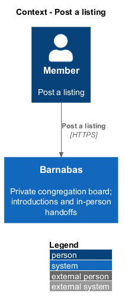
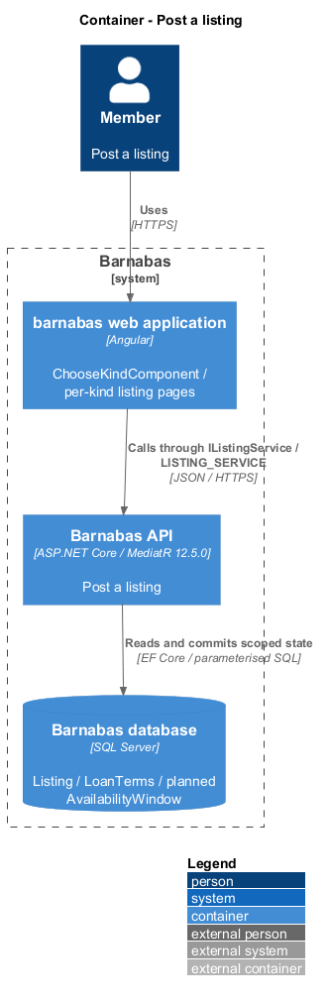
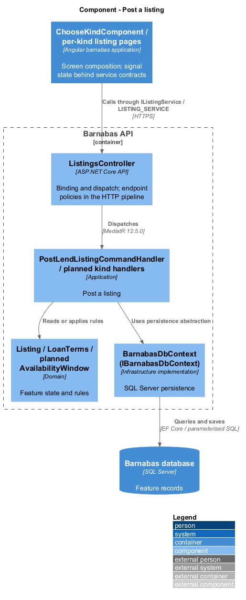
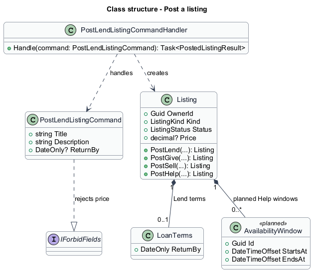
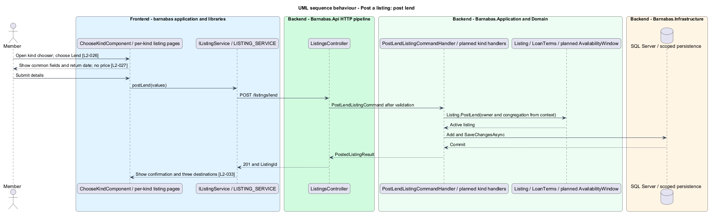
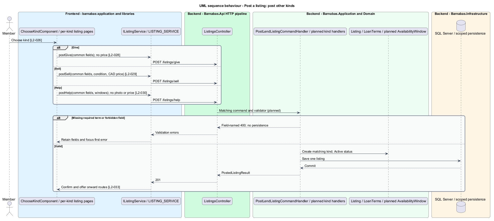
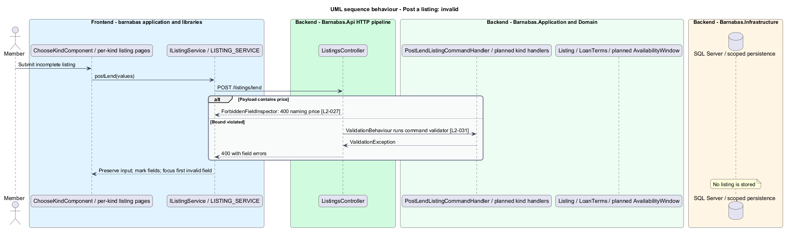

# Post a listing

## Overview

A **listing** — congregation-scoped offer of goods or time — begins with its member choosing a kind. Lend keeps ownership and states when the item returns. Give offers goods free of charge. Sell states an asking price in Canadian dollars. Help offers time in declared availability windows.

The selected kind determines the detail form. Successful posting confirms that the listing is on the board and offers its detail screen, another listing, or the board. Barnabas does not collect payment.

## Description

**Implementation boundary: Existing Lend slice; planned Give, Sell, Help, and photos.**

`ChooseKindComponent`, `PostLendComponent`, and `ListingPostedComponent` exist in `barnabas`. `IListingService.postLend` calls `POST /listings/lend`; `ListingsController` dispatches `PostLendListingCommand` to its validator and handler. The handler takes owner and congregation from `ICongregationContext`, calls `Listing.PostLend`, and commits through `IBarnabasDbContext`. `SaveChangesAsync` stamps the congregation, while the handler supplies the owner.

`PostLendListingCommand` is an independent record, with no shared `PostListingCommand` base. Its validator bounds titles to 120 and descriptions to 4000 characters, requires the common fields and return date, and checks neighbourhood membership. `IForbidFields` rejects `price` before binding. The first invalid field receives focus without discarding the form.

The target adds `PostGiveComponent`, `PostSellComponent`, and `PostHelpComponent`, plus matching commands, handlers, validators, and `IListingService` methods. Their routes are `POST /listings/give`, `/listings/sell`, and `/listings/help`. Each component delegates behaviour to a form service consumed through its contract; reusable listing form regions belong in `domain`, and plain controls belong in `components`.

`Listing` already has four factories, `Price`, and owned `LoanTerms`. Sell condition and Help availability are planned additions; the existing Help factory does not collect windows. Planned `AvailabilityWindow` carries an identifier and a bounded start/end interval so requests can reference a declared window. Give forbids price and returns a free/pickup statement. Sell validates a nonnegative decimal price and requires condition. Help requires at least one window and forbids price and photo. All listing creation paths identify kind explicitly through the selected route; a missing-kind create request returns a field-named 400 through a planned root create endpoint.

The [photo design](../attach-a-listing-photo/README.md) handles at most one goods image and the unresolved upload-limit conflict. Confirmation links use the returned `ListingId`. No command accepts payment instruments. Sell detail and request copy state that payment is arranged directly between members. Window time-zone interpretation, condition vocabulary, and bounds absent from the specs remain `<TO SUPPLY>` in [open decisions](../../open-decisions.md).

**Source anchors.** [Listing.cs](../../../../backend/src/Barnabas.Domain/Listings/Listing.cs), [PostLendListingCommand.cs](../../../../backend/src/Barnabas.Application/Listings/PostLendListing/PostLendListingCommand.cs), [listing.service.contract.ts](../../../../frontend/projects/api/src/lib/listings/listing.service.contract.ts).

**Acceptance verification.** [L2-026](../../../specs/L2.md#l2-026-choose-a-listing-kind-before-entering-details): API AC 4; E2E AC 1, 2, 3. [L2-027](../../../specs/L2.md#l2-027-create-a-lend-listing): API AC 1, 2; E2E AC 3. [L2-028](../../../specs/L2.md#l2-028-create-a-give-listing): API AC 1, 2; E2E AC 3. [L2-029](../../../specs/L2.md#l2-029-create-a-sell-listing): API AC 1, 2, 3; E2E AC 4. [L2-030](../../../specs/L2.md#l2-030-create-a-help-listing): API AC 1, 2, 3; E2E AC 4. [L2-031](../../../specs/L2.md#l2-031-validate-listing-input): API AC 1, 2, 3; E2E AC 4. [L2-032](../../../specs/L2.md#l2-032-attach-a-photo-to-a-goods-listing): API AC 1, 2, 3. [L2-033](../../../specs/L2.md#l2-033-confirm-that-a-listing-is-published): E2E AC 1, 2, 3. [L2-034](../../../specs/L2.md#l2-034-do-not-collect-payment-when-posting): API AC 1; E2E AC 2. The linked criteria retain their Given–When–Then wording. API acceptance uses SQL Server; E2E acceptance uses one page object per screen. New behaviour begins with its failing criterion. Design coverage does not assert an acceptance test pass.

## Requirements

The requirement text and identifiers are reproduced from [L2](../../../specs/L2.md). Each row names its [L1 parent](../../../specs/L1.md).

| L2 ID | Refines (L1) | Requirement |
|-------|--------------|-------------|
| `L2-026` | `L1-005` | Posting shall begin by choosing Lend, Give, Sell, or Help, and the chosen kind shall determine which detail form is presented. The kind shall not be silently defaulted. |
| `L2-027` | `L1-005` | A Lend listing shall carry a title, description, category, neighbourhood, and the period within which the owner expects the item back. It shall not carry a price. |
| `L2-028` | `L1-005` | A Give listing shall carry a title, description, category, and neighbourhood, and shall be marked as free with pickup arranged by the members. It shall not carry a price. |
| `L2-029` | `L1-005` | A Sell listing shall carry a title, description, category, neighbourhood, condition, and a price in Canadian dollars. The price is a stated asking figure only; see L2-034. |
| `L2-030` | `L1-005` | A Help listing shall carry a title, description, category, neighbourhood, and one or more availability windows. It shall not carry a price or a photo, because it offers time rather than an object. |
| `L2-031` | `L1-005` | Listing fields shall be bounded and validated, and errors shall name the field at fault. |
| `L2-032` | `L1-005` | A Lend, Give, or Sell listing shall accept at most one image, of a permitted type and bounded size. See L2-102 for upload safety. |
| `L2-033` | `L1-005` | After posting, the member shall be shown that the listing is live and offered the ways onward: view it, post another, or return to the board. |
| `L2-034` | `L1-005` | A price on a Sell listing is a stated asking figure. The system shall not collect, hold, or transmit payment at any point. |

## Diagrams

The context identifies the actor and the Barnabas capability. Congregation boundaries also apply to linked resources.

The container view places the Angular client, .NET API, and SQL Server persistence around this capability.

The component view separates screen composition, API dispatch, application behaviour, domain rules, and persistence.

The class view shows the feature types, their data, and typed dependencies. Planned additions are identified in the description.

The selected Lend route collects a return date and rejects a price. Ownership comes from the authenticated context.

The planned Give, Sell, and Help paths have distinct fields and validators. Every success returns the same listing confirmation destinations.

Validation names fields without echoing values. Forbidden fields remain distinguishable from unknown fields.

