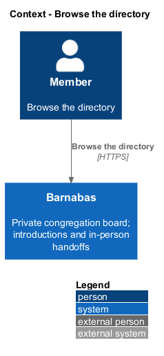
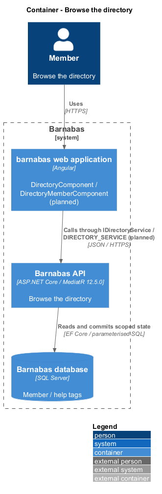
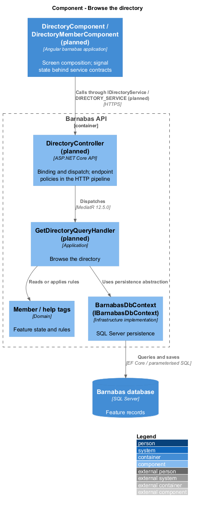
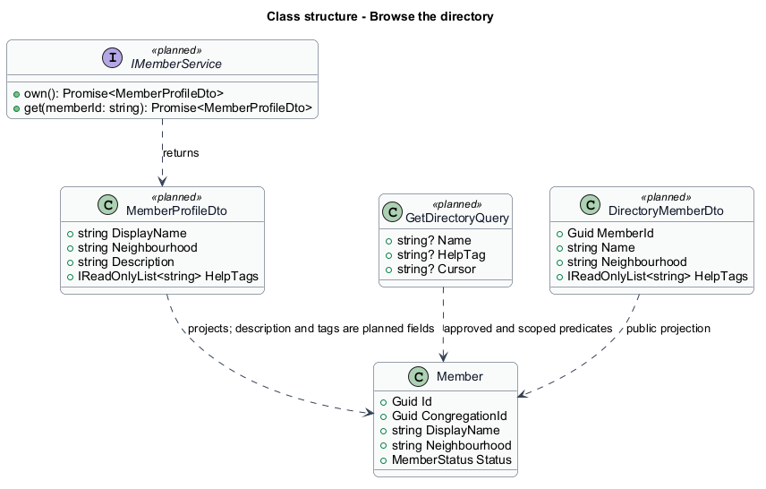
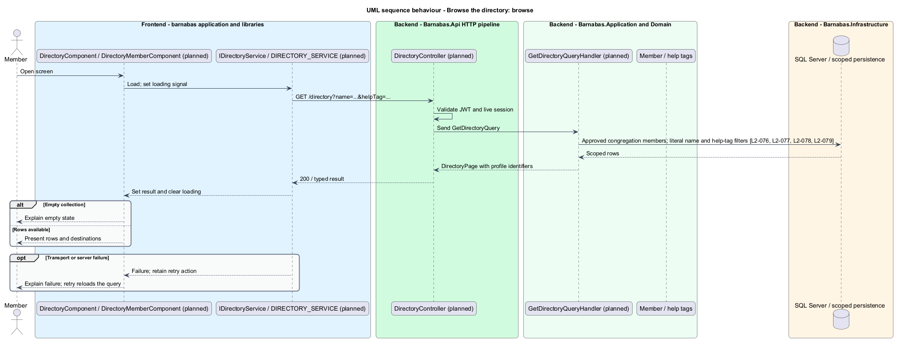

# Browse the directory

## Overview

Barnabas is a private board where church congregation members offer goods or time through listings.

The **directory** — list of approved congregation members with neighbourhoods and help tags — makes offered assistance discoverable. A member can search by name or help tag and open any listed public profile.

The directory contains only the reader's congregation. Pending and departed members are excluded, and email addresses never appear.

## Description

**Implementation boundary: Planned.**

`DirectoryComponent` is a planned routed page in `barnabas`. It composes `DirectoryMemberComponent` in `domain`, with profile destinations supplied by the page. A directory state service owns search, results, loading, and failure signals and consumes `IDirectoryService` through `DIRECTORY_SERVICE` in `directory.service.contract.ts`.

`DirectoryController` dispatches `GetDirectoryQuery` for `GET /directory?name=...&helpTag=...&cursor=...`. The handler scopes to the current congregation and `MemberStatus.Approved`, applies literal name matching and configured help-tag filtering, then projects `DirectoryMemberDto`. Every row carries member identifier, name, neighbourhood, and help tags; the DTO has no email field. Search predicates are parameterised and reset the cursor when changed.

The target orders by display name with an identifier tie-breaker and returns bounded cursor pages. All approved members remain reachable across those pages. A zero-result response returns 200 with an explanation and a filter-clear action. Failed loads provide retry and do not replace a valid collection with fabricated rows. Each row opens `/members/:memberId`, and profile loading repeats the congregation and approval check because status can change after directory loading.

Help tags depend on the profile extension and congregation configuration described in [edit own profile](../edit-own-profile/README.md). No direct-message action is added to directory rows. A request and its later acceptance remain the route to a message thread.

**Acceptance verification.** [L2-076](../../../specs/L2.md#l2-076-browse-the-congregation-directory): API AC 1; E2E AC 2. [L2-077](../../../specs/L2.md#l2-077-search-the-directory): API AC 1, 2. [L2-078](../../../specs/L2.md#l2-078-open-a-member-from-the-directory): E2E AC 1, 2. [L2-079](../../../specs/L2.md#l2-079-limit-the-directory-to-approved-members-of-the-same-congregation): API AC 1, 2, 3. The linked criteria retain their Given–When–Then wording. API acceptance uses SQL Server; E2E acceptance uses one page object per screen. New behaviour begins with its failing criterion. Design coverage does not assert an acceptance test pass.

## Requirements

The requirement text and identifiers are reproduced from [L2](../../../specs/L2.md). Each row names its [L1 parent](../../../specs/L1.md).

| L2 ID | Refines (L1) | Requirement |
|-------|--------------|-------------|
| `L2-076` | `L1-012` | A member shall be able to see every approved member of their congregation, with each member's neighbourhood and help tags. |
| `L2-077` | `L1-012` | The directory shall be searchable by a member's name and by help tag. |
| `L2-078` | `L1-012` | Every directory row shall lead to that member's public profile. |
| `L2-079` | `L1-012` | The directory shall contain only approved members of the reader's own congregation, and shall carry no email addresses. |

## Diagrams

The context identifies the actor and the Barnabas capability. Congregation boundaries also apply to linked resources.

The container view places the Angular client, .NET API, and SQL Server persistence around this capability.

The component view separates screen composition, API dispatch, application behaviour, domain rules, and persistence.

The class view shows the feature types, their data, and typed dependencies. Planned additions are identified in the description.

Approval and congregation predicates precede name/tag filtering and paging. Each result carries a profile destination.

