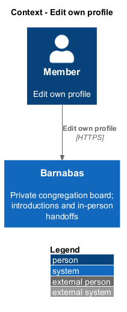
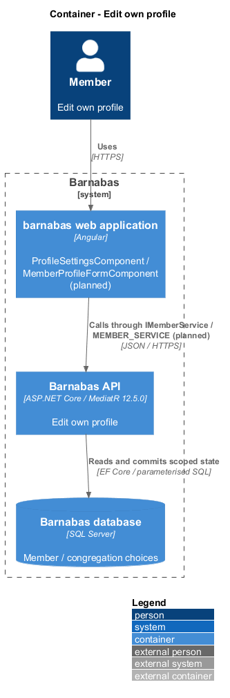
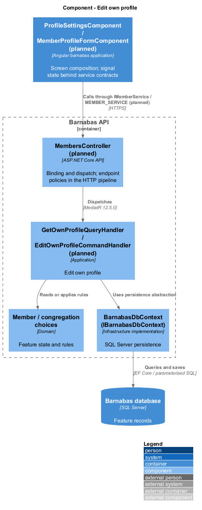
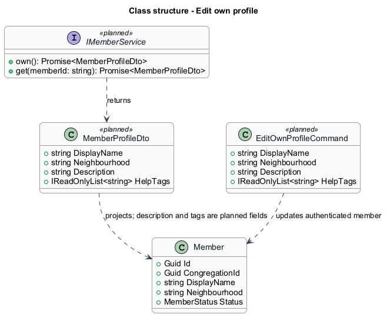
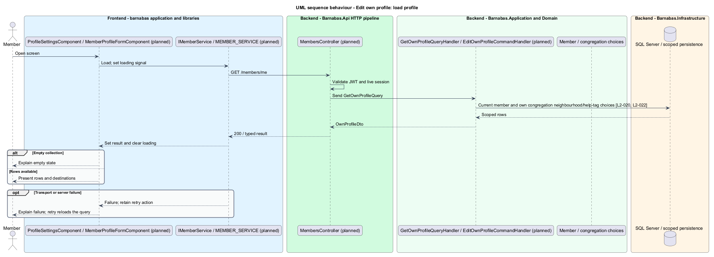
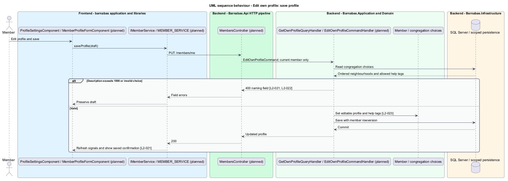

# Edit own profile

## Overview

Barnabas is a private board where church congregation members offer goods or time through listings.

A **profile** — member description containing display name, neighbourhood, personal description, and offered help — introduces a person within the congregation. A **help tag** — congregation-configured category of assistance a member offers — makes that help discoverable.

The member edits their own profile and settings on one screen. Neighbourhoods and help tags come from their congregation's configured choices.

## Description

**Implementation boundary: Planned profile slice; existing name and neighbourhood fields.**

`Member` currently contains display name and neighbourhood but no description or help tags. The target adds those fields and an entity method that updates editable profile values together. The existing display-name and neighbourhood storage limits are 200 characters. Description has a 1000-character maximum from `L2-021`; help-tag count and configuration policy remain `<TO SUPPLY>`.

`ProfileSettingsComponent` is a planned routed page in `barnabas`. It composes a `MemberProfileFormComponent` in `domain` and plain labelled controls from `components`. A profile state service owns signals, draft changes, and save behaviour, consuming `IMemberService` through `MEMBER_SERVICE` in `member.service.contract.ts`. Host providers bind `MemberService`; the page never names the implementation.

`MembersController` dispatches `GetOwnProfileQuery` for `GET /members/me` and `EditOwnProfileCommand` for `PUT /members/me`. Both take identity from `ICongregationContext`; no caller-supplied target member changes ownership. `EditOwnProfileCommandValidator` bounds values and checks neighbourhood and help-tag membership against the current congregation. An invalid field returns 400 and saves nothing. Planned rowversion checking returns 409 for a stale edit and preserves the draft for review.

The own-profile DTO populates current values. A successful save updates profile state and displays confirmation without navigation. Notification preferences compose the same settings page through their separate service contract. The public profile and directory project saved help tags without email. Loading or failed reads do not present an empty editable profile; a retry restores the load path. Congregation help-tag administration and behaviour after removing a configured choice remain explicit [open decisions](../../open-decisions.md).

**Source anchors.** [Member.cs](../../../../backend/src/Barnabas.Domain/Members/Member.cs), [MemberConfiguration.cs](../../../../backend/src/Barnabas.Infrastructure/Persistence/Configurations/MemberConfiguration.cs).

**Acceptance verification.** [L2-020](../../../specs/L2.md#l2-020-view-own-profile-and-settings): API AC 1; E2E AC 2. [L2-021](../../../specs/L2.md#l2-021-edit-own-profile): API AC 1, 2; E2E AC 3. [L2-022](../../../specs/L2.md#l2-022-restrict-neighbourhood-to-the-congregations-set): API AC 1; E2E AC 2. [L2-023](../../../specs/L2.md#l2-023-declare-help-tags): API AC 1; E2E AC 2. The linked criteria retain their Given–When–Then wording. API acceptance uses SQL Server; E2E acceptance uses one page object per screen. New behaviour begins with its failing criterion. Design coverage does not assert an acceptance test pass.

## Requirements

The requirement text and identifiers are reproduced from [L2](../../../specs/L2.md). Each row names its [L1 parent](../../../specs/L1.md).

| L2 ID | Refines (L1) | Requirement |
|-------|--------------|-------------|
| `L2-020` | `L1-004` | A member shall be able to see their own profile and settings on one screen. |
| `L2-021` | `L1-004` | A member shall be able to change their display name, neighbourhood, description, and help tags, and shall be told the change was saved. |
| `L2-022` | `L1-004` | See also L2-002. A member's neighbourhood shall be one of their own congregation's configured names. |
| `L2-023` | `L1-004` | A member shall be able to declare the kinds of help they are willing to offer, chosen from the congregation's set, and these shall appear on their public profile and in the directory. |

## Diagrams

The context identifies the actor and the Barnabas capability. Congregation boundaries also apply to linked resources.

The container view places the Angular client, .NET API, and SQL Server persistence around this capability.

The component view separates screen composition, API dispatch, application behaviour, domain rules, and persistence.

The class view shows the feature types, their data, and typed dependencies. Planned additions are identified in the description.

The current member identifier supplies the profile and congregation-specific choices.

Saving validates all fields together and confirms in place. No invalid partial change reaches persistence.

