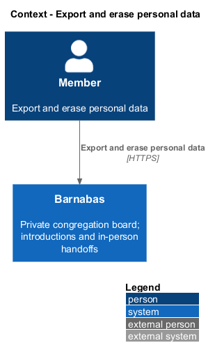
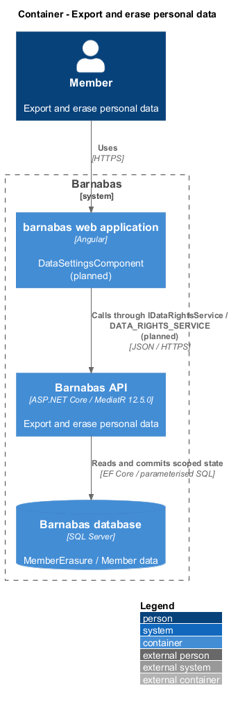
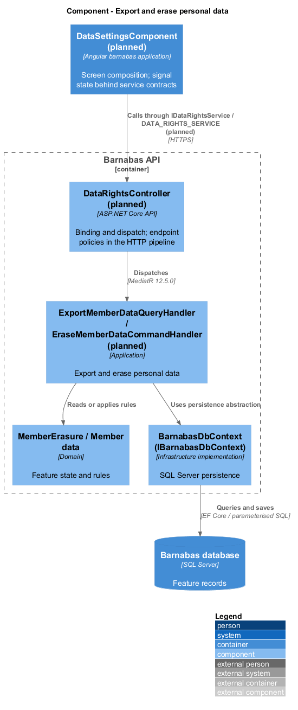
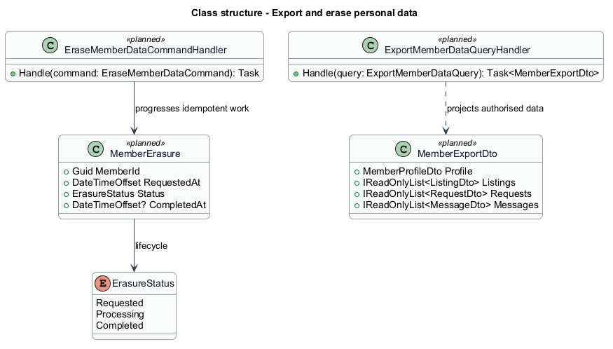
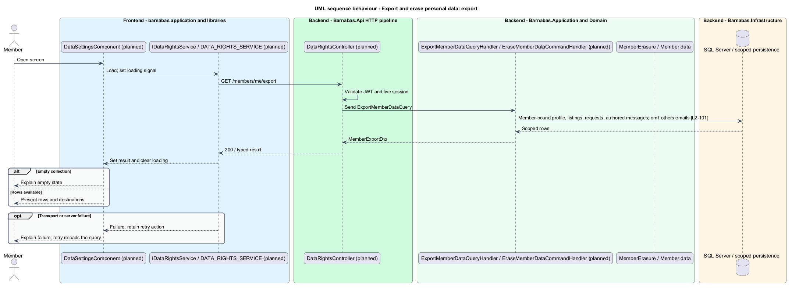
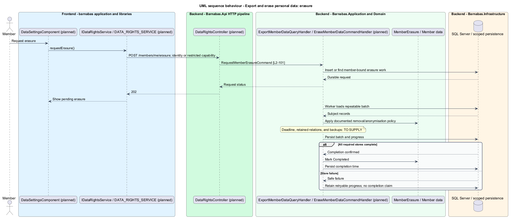

# Export and erase personal data

## Overview

Barnabas is a private board where church congregation members offer goods or time through listings.

A **data export** — member-readable collection of that member's stored profile, listings, requests, and messages — supports access to personal data. **Erasure** — removal or irreversible anonymisation of personal data — removes identifying content after a member requests it.

Data returned about other congregation members excludes email addresses. Leaving withdraws membership immediately; erasure follows its documented completion period.

## Description

**Implementation boundary: Planned.**

The target adds `DataSettingsComponent` in `barnabas` and `IDataRightsService` with `DATA_RIGHTS_SERVICE` in an `api` contract. A state service owns export and erasure progress. `DataRightsController` dispatches `ExportMemberDataQuery` for `GET /members/me/export` and `RequestMemberErasureCommand` for `POST /members/me/erasure`.

The export handler projects the authenticated member's profile, owned listings, made requests, and authored messages within their congregation. Counterparty data is limited to context already visible through authorised requests or threads; counterparty emails, tokens, report identities, and unrelated conversations are excluded. Whether incoming request content and full conversations belong in the export is `<TO SUPPLY>`. The format, maximum size, and packaging remain `<TO SUPPLY>`; the design does not label an unspecified archive format as established. Export delivery uses an authenticated response or a short-lived member-bound download capability, never a public object URL.

Erasure requests persist a `MemberErasure` record with an idempotent member key and state. A hosted worker in Infrastructure, using Microsoft.Extensions hosting and scoped application handlers, performs repeatable batches. It removes or anonymises profile content, listing content and photos, authored messages, request text, notifications, and report notes that contain the subject's personal data. Session and sign-in records are revoked or removed. Referenced identifiers remain only when the record is irreversibly de-identified and the retention policy permits it. The chosen deletion/anonymisation treatment, completion period, backups, and bounded retry policy remain `<TO SUPPLY>` in [open decisions](../../open-decisions.md).

Because a departed member has no live session, the target provides a narrow data-rights credential delivered through the verified mailbox. Its scope grants only export or erasure status, with no board access; the credential issuance and retention of that mailbox association require the same open policy decision. Failed batches record non-personal operational state and retry without reporting completion. No API claims erasure has completed until every required store has acknowledged it.

**Acceptance verification.** [L2-101](../../../specs/L2.md#l2-101-minimise-and-erase-personal-data): API AC 1, 2, 3. The linked criteria retain their Given–When–Then wording. API acceptance uses SQL Server; E2E acceptance uses one page object per screen. New behaviour begins with its failing criterion. Design coverage does not assert an acceptance test pass.

## Requirements

The requirement text and identifiers are reproduced from [L2](../../../specs/L2.md). Each row names its [L1 parent](../../../specs/L1.md).

| L2 ID | Refines (L1) | Requirement |
|-------|--------------|-------------|
| `L2-101` | `L1-015` | Personal data shall be limited to what a feature needs, withheld from responses describing other members, exportable on request, and erasable. |

## Diagrams

The context identifies the actor and the Barnabas capability. Congregation boundaries also apply to linked resources.

The container view places the Angular client, .NET API, and SQL Server persistence around this capability.

The component view separates screen composition, API dispatch, application behaviour, domain rules, and persistence.

The class view shows the feature types, their data, and typed dependencies. Planned additions are identified in the description.

Export scope follows the requesting identity, including after departure through a restricted data-rights credential.

Erasure completion follows all required stores. Policy-dependent deadlines remain explicit open decisions.

