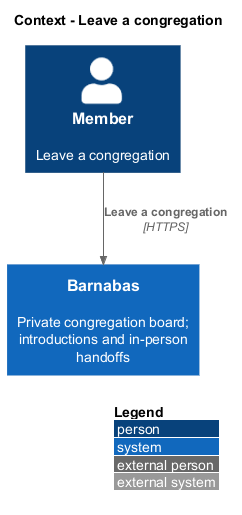
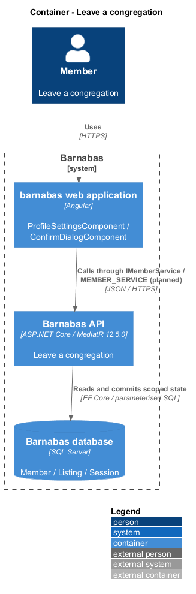
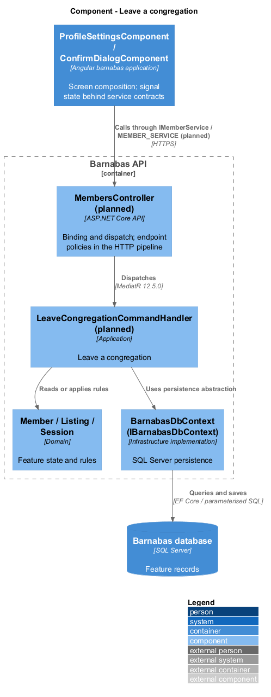
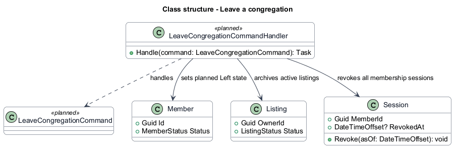
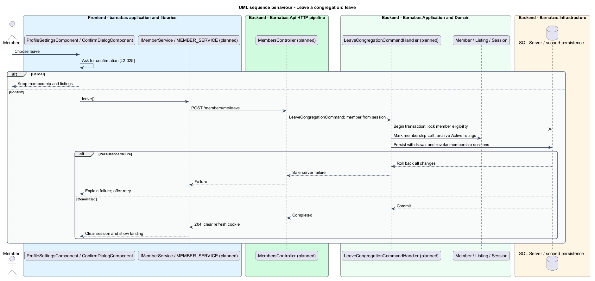

# Leave a congregation

## Overview

Barnabas is a private board where church congregation members offer goods or time through listings.

**Leaving** — ending membership and withdrawing its active listings — removes a member's participation in the congregation board. It requires an explicit confirmation.

Cancellation leaves membership, sessions, and listings unchanged. Leaving is distinct from requesting export or erasure of personal data.

## Description

**Implementation boundary: Planned.**

`ProfileSettingsComponent` composes the existing `ConfirmDialogComponent` with leave-specific copy. Its state service consumes planned `IMemberService.leave` through `MEMBER_SERVICE`. Confirm sends `POST /members/me/leave`; cancel sends no request.

`LeaveCongregationCommandHandler` takes the member and congregation from the session. In one SQL Server transaction it moves the member to a planned `Left` state, archives active listings, and revokes all sessions and refresh tokens belonging to that membership. `MemberStatus` currently has only `AwaitingApproval`, `Approved`, and `Declined`; `Left` is a proposed explicit extension. Revoking all membership sessions prevents a second device from continuing to act after departure.

The approved-member policy reads current member state and blocks new board access. Creation and leave operations serialise on membership eligibility so a concurrent create cannot commit an active listing after withdrawal. The update does not falsely label Sell as sold or Help as completed. Existing requests and threads follow the separate erasure policy; leaving alone does not invent a deletion deadline.

After commit the API returns 204 and removes the refresh cookie. The client clears session and congregation caches and routes to the landing page. A storage failure rolls back membership, listings, and revocation; the screen preserves the confirmation context and offers retry. A lost response is resolved through authenticated current status or a sign-in failure, not a local success assumption. Rejoining policy remains `<TO SUPPLY>`.

**Source anchors.** [MemberStatus.cs](../../../../backend/src/Barnabas.Domain/Members/MemberStatus.cs), [Session.cs](../../../../backend/src/Barnabas.Domain/Access/Session.cs).

**Acceptance verification.** [L2-025](../../../specs/L2.md#l2-025-leave-the-congregation): API AC 1; E2E AC 2, 3. The linked criteria retain their Given–When–Then wording. API acceptance uses SQL Server; E2E acceptance uses one page object per screen. New behaviour begins with its failing criterion. Design coverage does not assert an acceptance test pass.

## Requirements

The requirement text and identifiers are reproduced from [L2](../../../specs/L2.md). Each row names its [L1 parent](../../../specs/L1.md).

| L2 ID | Refines (L1) | Requirement |
|-------|--------------|-------------|
| `L2-025` | `L1-004` | A member shall be able to leave, which shall require confirmation, end their session, and withdraw their active listings from the board. |

## Diagrams

The context identifies the actor and the Barnabas capability. Congregation boundaries also apply to linked resources.

The container view places the Angular client, .NET API, and SQL Server persistence around this capability.

The component view separates screen composition, API dispatch, application behaviour, domain rules, and persistence.

The class view shows the feature types, their data, and typed dependencies. Planned additions are identified in the description.

Confirmed departure withdraws active listings and ends membership sessions atomically.

