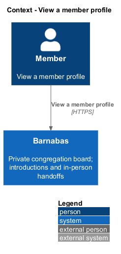
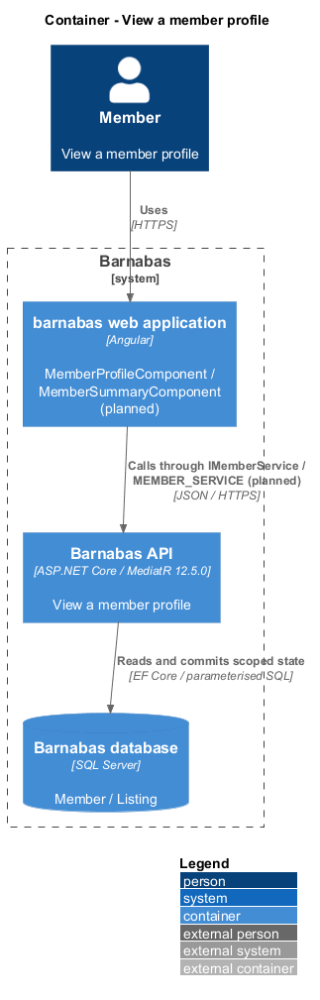
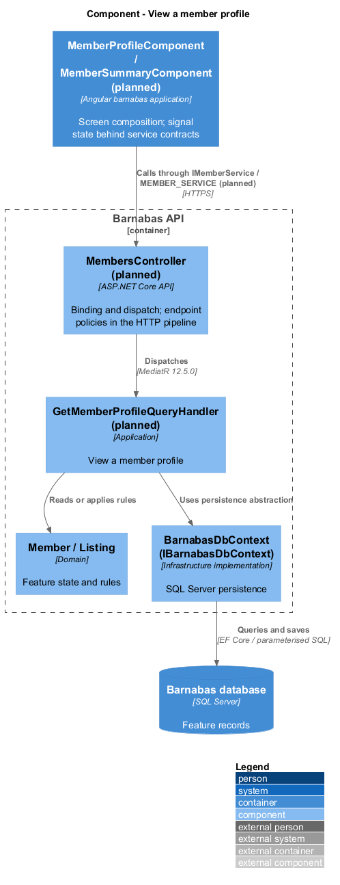
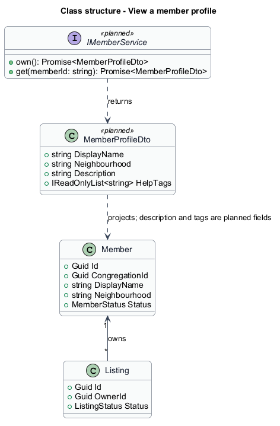
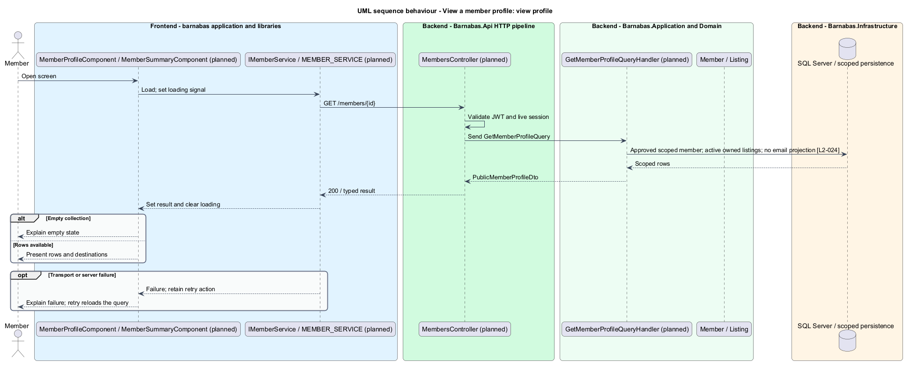

# View a member profile

## Overview

Barnabas is a private board where church congregation members offer goods or time through listings.

A **public profile** — member description visible to approved members of the same congregation — presents name, neighbourhood, description, help tags, and active listings. Public here means visible inside the congregation; it is not anonymous internet access.

The profile helps a member understand who offers a listing. It contains no email address and offers no direct conversation without an accepted listing request.

## Description

**Implementation boundary: Planned; current member route is a placeholder.**

`/members/:memberId` currently routes to `ComingSoonComponent`. The target replaces that route with `MemberProfileComponent` in `barnabas`, composing `MemberSummaryComponent` and listing placards from `domain`. Its state service calls `IMemberService.get` through `MEMBER_SERVICE` and holds loading, result, and failure signals.

`GET /members/{memberId}` dispatches `GetMemberProfileQuery` through planned `MembersController`. The handler loads an approved member within the caller's congregation and projects an explicit `PublicMemberProfileDto`. It selects only name, neighbourhood, description, help tags, and current listings. The DTO has no email property, including nested listing-owner data. Missing, foreign, or unavailable profiles return the same 404.

Active listings carry identifiers and destinations supplied by the routed page. A member with no listings still has a profile and a clear empty listing region. Text is rendered through Angular text binding. Failed loads offer retry without showing another member's previously cached data. Moderator access to pending-member profiles uses a separate moderator endpoint in the approval design; it does not widen this public projection. The accepted-request route remains the only way to create a message thread.

**Source anchors.** [app.routes.ts](../../../../frontend/projects/barnabas/src/app/app.routes.ts).

**Acceptance verification.** [L2-024](../../../specs/L2.md#l2-024-view-another-members-public-profile): API AC 1, 2; E2E AC 3. The linked criteria retain their Given–When–Then wording. API acceptance uses SQL Server; E2E acceptance uses one page object per screen. New behaviour begins with its failing criterion. Design coverage does not assert an acceptance test pass.

## Requirements

The requirement text and identifiers are reproduced from [L2](../../../specs/L2.md). Each row names its [L1 parent](../../../specs/L1.md).

| L2 ID | Refines (L1) | Requirement |
|-------|--------------|-------------|
| `L2-024` | `L1-004` | A member shall be able to view another member's profile, showing their name, neighbourhood, description, help tags, and current listings. Email addresses shall never appear. |

## Diagrams

The context identifies the actor and the Barnabas capability. Congregation boundaries also apply to linked resources.

The container view places the Angular client, .NET API, and SQL Server persistence around this capability.

The component view separates screen composition, API dispatch, application behaviour, domain rules, and persistence.

The class view shows the feature types, their data, and typed dependencies. Planned additions are identified in the description.

An explicit DTO contains only congregation-visible profile fields and active listings.

