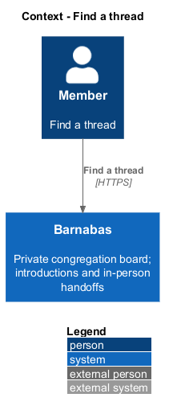
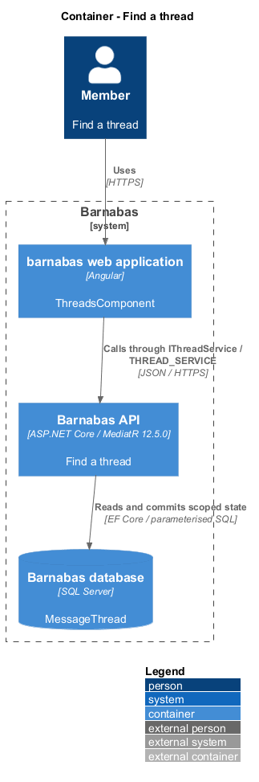
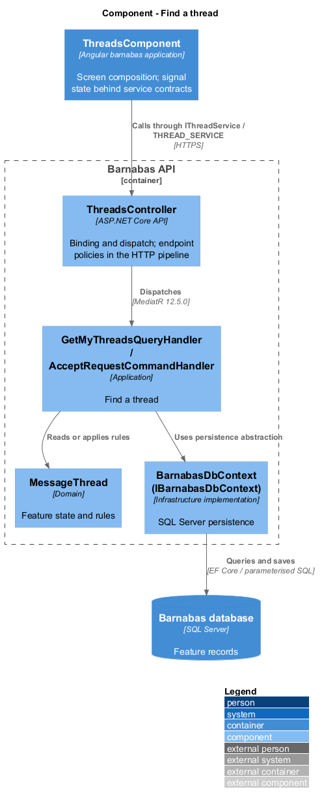
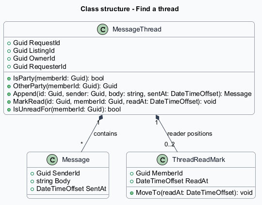
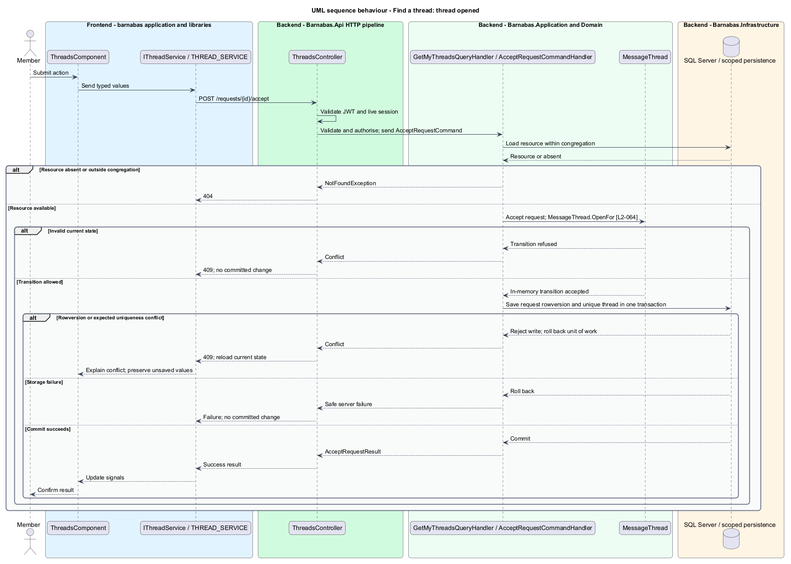
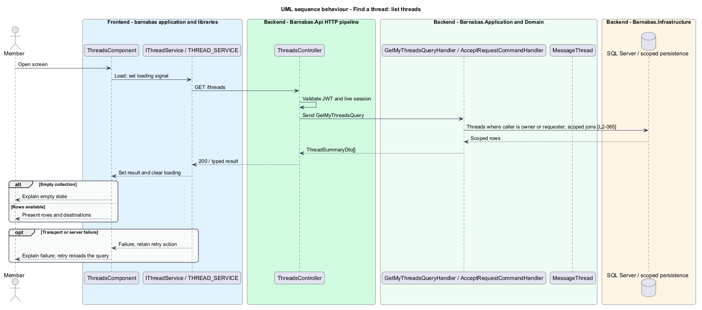

# Find a thread

## Overview

Barnabas is a private board where church congregation members offer goods or time through listings.

A **message thread** — conversation between the two members of an accepted request about its listing — provides a place to arrange the handoff. A member sees only threads to which they are a party.

Each thread summary names the other member and listing, shows the latest message, and indicates unread content for the reader. A pending or declined request does not create a thread.

## Description

**Implementation boundary: Existing list and thread creation; planned bounded projections.**

`ThreadsComponent` is the routed screen in `barnabas`; no `MessagesComponent` exists. `ThreadStore.load` consumes `IThreadService.mine` through `THREAD_SERVICE`. `ThreadsController` dispatches `GetMyThreadsQuery` for `GET /threads`. The handler filters by owner or requester within the congregation and projects `ThreadSummaryDto` with the other member, listing, latest message, and unread flag.

`MessageThread.OpenFor` is called by `AcceptRequestCommandHandler`, which commits thread creation with acceptance. The unique `MessageThread.RequestId` index prevents a duplicate thread. It does not independently prove that the referenced request is accepted; that rule is enforced by the accepting application path. No controller or service contract offers free-form thread creation.

`MessageThread.IsUnreadFor` compares the latest message from the other party with the reader's `ThreadReadMark`. A new empty thread has no unread message. The current handler loads complete message collections before projection. The target selects only the latest message and relevant read mark, and pages thread summaries as described in [collections](../../platform/serve-collections-under-load/README.md). A planned `ThreadSummaryComponent` in `domain` accepts destinations from the page. Empty and failure states remain distinct and provide retry where appropriate.

**Source anchors.** [GetMyThreadsQueryHandler.cs](../../../../backend/src/Barnabas.Application/Messaging/GetMyThreads/GetMyThreadsQueryHandler.cs), [thread.service.contract.ts](../../../../frontend/projects/api/src/lib/threads/thread.service.contract.ts).

**Acceptance verification.** [L2-064](../../../specs/L2.md#l2-064-create-a-message-thread-when-a-request-is-accepted): API AC 1, 2, 3. [L2-065](../../../specs/L2.md#l2-065-list-a-members-message-threads): API AC 1, 2; E2E AC 3. The linked criteria retain their Given–When–Then wording. API acceptance uses SQL Server; E2E acceptance uses one page object per screen. New behaviour begins with its failing criterion. Design coverage does not assert an acceptance test pass.

## Requirements

The requirement text and identifiers are reproduced from [L2](../../../specs/L2.md). Each row names its [L1 parent](../../../specs/L1.md).

| L2 ID | Refines (L1) | Requirement |
|-------|--------------|-------------|
| `L2-064` | `L1-010` | A thread shall exist only as the consequence of an accepted request, and shall always carry the listing it concerns. |
| `L2-065` | `L1-010` | A member shall be able to see all their threads, each showing the other member, the listing, the latest message, and whether it is unread. |

## Diagrams

The context identifies the actor and the Barnabas capability. Congregation boundaries also apply to linked resources.

The container view places the Angular client, .NET API, and SQL Server persistence around this capability.

The component view separates screen composition, API dispatch, application behaviour, domain rules, and persistence.

The class view shows the feature types, their data, and typed dependencies. Planned additions are identified in the description.

An accepted request creates its thread within the same transaction. No separate create-thread endpoint exists.

The query restricts the thread list to parties before projecting the latest message and reader-specific unread flag.

