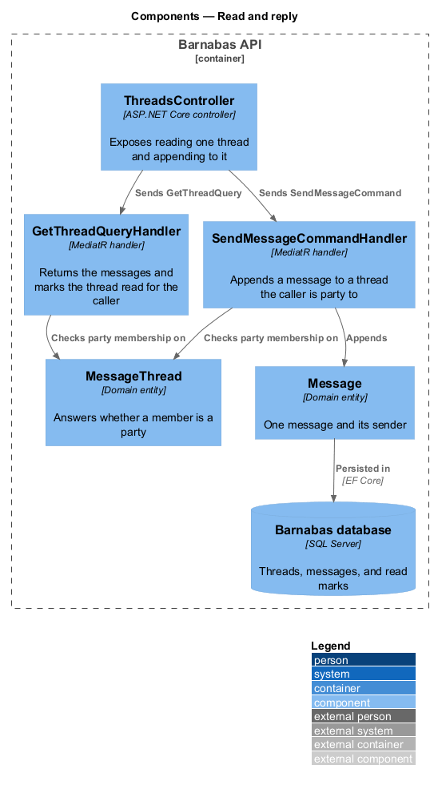
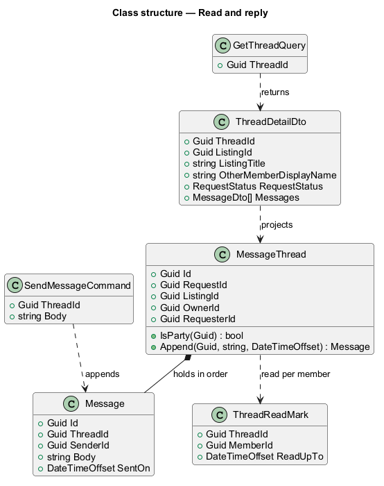
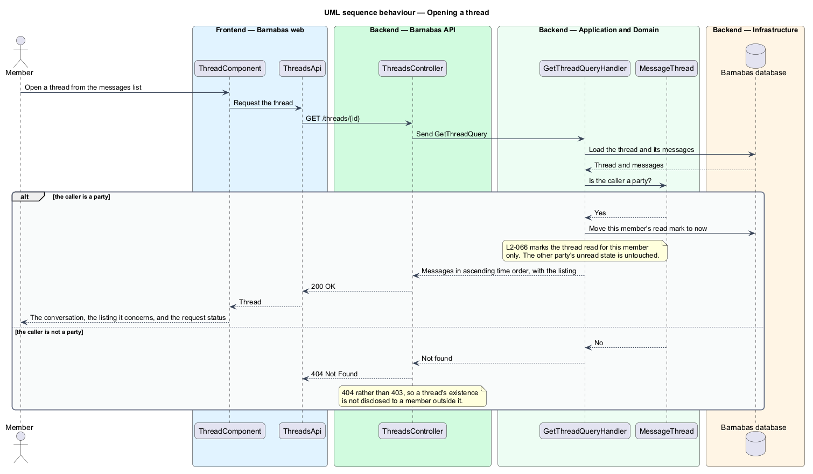
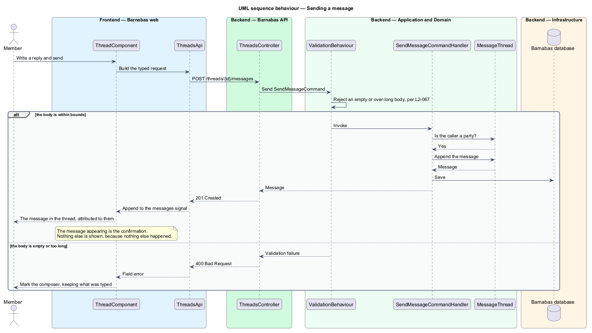

# Read and reply

## Overview

Once a request is accepted, the two members have something to arrange: when the ladder is
collected, where the car will be, whether an Allen key is needed. This feature is where that
happens.

**party** — one of the two members a thread is between, being the listing's owner and the
member whose request was accepted

A thread is read and appended to by its two parties and by nobody else. A member who is not
a party receives 404 rather than 403, so a thread's existence is not disclosed to someone
outside it — the same reasoning that governs cross-congregation access.

Messages are the members' own words, and are presented as such: set in the serif face the
interface reserves for things members wrote, rather than the face the board speaks in.

Sending a message is confirmed by the message appearing in the thread. There is no toast and
no banner, because nothing happened beyond the thing the member can see.

## Description

One query and one command, both gated on party membership.

- **`ThreadComponent`** — the Angular screen: the listing context card, the request status,
  the messages, and the composer. Template, styles, and class in separate files; the message
  list is held in a signal.
- **`IThreadsApi`** and **`ThreadsApi`** — the interface the component depends on and its
  typed client.
- **`ThreadsController`** — exposes `GET /threads/{id}` and `POST /threads/{id}/messages`.
- **`GetThreadQuery`** and its handler — load the thread, confirm the caller is a party,
  move that member's read mark, and return the messages in ascending time order.
- **`SendMessageCommand`** and its handler — confirm party membership and append.
- **`MessageThread.IsParty`** and **`Append`** — the entity answers who may see it and owns
  the appending, so both handlers ask rather than each deciding.
- **`Message`** — one message, its sender, and when it was sent.
- **`ThreadReadMark`** — per-member record of how far a member has read. Unread is a
  property of the reader, so opening a thread marks it read for that member alone.
- **`ThreadDetailDto`** — read model carrying the messages, the listing, the other member,
  and the status of the request the thread came from.

Party membership is checked in the handler rather than declared through
`IRequireOwnership`, because a thread has two rightful actors rather than one owner. The
ownership behaviour answers "did this member create it"; the question here is "is this
member one of the two", which the entity answers.

Message bounds are enforced by the validation behaviour described in
`platform/validate-and-bound-input`. This feature declares the bounds; it does not run them.

## Requirements

The feature realizes the following level-2 (L2) requirements. Each L2
requirement refines a level-1 (L1) requirement, cited by identifier. The
**Slice** column marks the requirements implemented by feature slice 1; the
remainder are designed here and implemented in a later slice.

| L2 ID | Refines (L1) | Slice | Requirement |
|-------|--------------|-------|-------------|
| `L2-066` | `L1-010` | 1 | Opening a thread shall show its messages in order, attribute each to its sender, and mark the thread read. |
| `L2-067` | `L1-010` | 1 | A party to a thread shall be able to append a message. An empty or over-long message shall be rejected and nothing appended. |
| `L2-068` | `L1-010` | &mdash; | A thread shall lead to the listing it concerns and to the other member's profile. |
| `L2-069` | `L1-010` | &mdash; | There shall be no route by which one member starts a conversation with another without an accepted request on a listing. |

## Diagrams

### Components

Both the read and the write ask the entity whether the caller is a party. Neither handler
decides for itself.

### Class structure

`ThreadReadMark` is per member, which is what lets two parties disagree about whether a
thread is unread.

### Behaviour — opening a thread

The read mark moves for the opening member only, per `L2-066`. A member who is not a party
receives 404, so the thread's existence stays private to its two parties.

### Behaviour — sending a message

Bounds are enforced before the handler, and the message appearing in the thread is the whole
of the confirmation `L2-067` needs.

