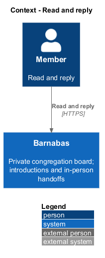
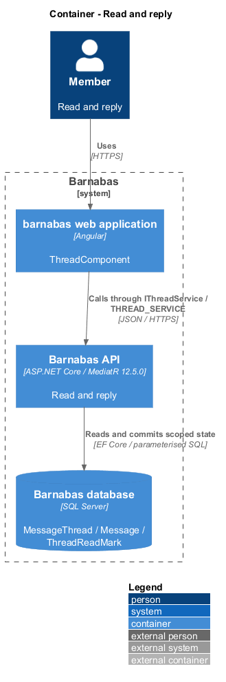
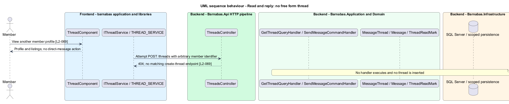

# Read and reply

## Overview

Barnabas is a private board where church congregation members offer goods or time through listings.

A **party** — listing owner or requester named by an accepted request's message thread — can read and append messages in that thread. Messages arrange an in-person handoff within the congregation.

Opening shows the messages in order with their senders and marks the thread read for that reader. The listing and other member's profile remain reachable. The product has no direct-message entry point independent of an accepted request.

## Description

**Implementation boundary: Existing read and send; planned race-safe read positions and bounded messages.**

`ThreadComponent` composes the routed thread screen. `ThreadStore.openThread` and `send` consume `IThreadService` through `THREAD_SERVICE`. `ThreadsController` dispatches `GetThreadQuery` from `GET /threads/{threadId}` and `SendMessageCommand` from `POST /threads/{threadId}/messages`.

`GetThreadQueryHandler` loads the scoped thread, checks `IsParty`, calls `MarkRead`, and returns `ThreadDetailDto`. `SendMessageCommandHandler` calls `MessageThread.Append`. `Message` holds sender, body, and time. `SendMessageCommandValidator` rejects empty messages and bodies longer than 4000 characters with a field-named 400. `NotAPartyException` maps to 404. A message or read mark is never created for a third member.

`ThreadReadMark` is an owned, per-member record. Existing reads mark the wall-clock opening time after loading messages. The target marks only the latest other-party message actually returned, so a concurrent unseen message remains unread. A SQL upsert or checked update makes the read position monotonic when two tabs open together. Message order uses `SentAt` with an identifier tie-breaker; the current handler orders only by time. The collection design adds bounded message pages without marking undisplayed newer pages as read.

After a successful send, `ThreadStore` appends the returned message to its signal. A failed send retains the draft and explains the failure; an ambiguous lost response prompts a reload before resending. No automatic POST retry duplicates messages. The target extracts message rows and composer regions into `domain`; pages supply listing and profile destinations. `IThreadService` has no create-thread method, and an unsupported thread-creation request returns 404. New-message notifications are added transactionally by their owning design.

**Source anchors.** [GetThreadQueryHandler.cs](../../../../backend/src/Barnabas.Application/Messaging/GetThread/GetThreadQueryHandler.cs), [MessageThread.cs](../../../../backend/src/Barnabas.Domain/Messaging/MessageThread.cs), [thread.store.ts](../../../../frontend/projects/domain/src/lib/messaging/thread.store.ts).

**Acceptance verification.** [L2-066](../../../specs/L2.md#l2-066-read-a-thread): API AC 1, 2, 3. [L2-067](../../../specs/L2.md#l2-067-send-a-message-in-a-thread): API AC 1, 2, 3; E2E AC 4. [L2-068](../../../specs/L2.md#l2-068-reach-the-listing-from-a-thread): E2E AC 1, 2. [L2-069](../../../specs/L2.md#l2-069-do-not-offer-free-form-messaging): API AC 1; E2E AC 2. The linked criteria retain their Given–When–Then wording. API acceptance uses SQL Server; E2E acceptance uses one page object per screen. New behaviour begins with its failing criterion. Design coverage does not assert an acceptance test pass.

## Requirements

The requirement text and identifiers are reproduced from [L2](../../../specs/L2.md). Each row names its [L1 parent](../../../specs/L1.md).

| L2 ID | Refines (L1) | Requirement |
|-------|--------------|-------------|
| `L2-066` | `L1-010` | Opening a thread shall show its messages in order, attribute each to its sender, and mark the thread read. |
| `L2-067` | `L1-010` | A party to a thread shall be able to append a message. An empty or over-long message shall be rejected and nothing appended. |
| `L2-068` | `L1-010` | A thread shall lead to the listing it concerns and to the other member's profile. |
| `L2-069` | `L1-010` | There shall be no route by which one member starts a conversation with another without an accepted request on a listing. |

## Diagrams

The context identifies the actor and the Barnabas capability. Congregation boundaries also apply to linked resources.

The container view places the Angular client, .NET API, and SQL Server persistence around this capability.

The component view separates screen composition, API dispatch, application behaviour, domain rules, and persistence.

The class view shows the feature types, their data, and typed dependencies. Planned additions are identified in the description.

The target read position advances only over messages returned to this reader. Other members retain independent unread state.

The domain checks party membership and the validator bounds the body. Only a committed message appears as sent.

No service contract or route creates a thread without acceptance. A direct attempted creation returns 404.

