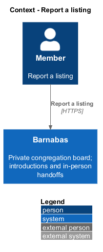
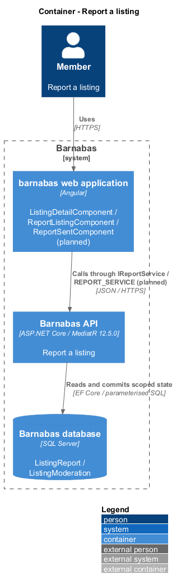
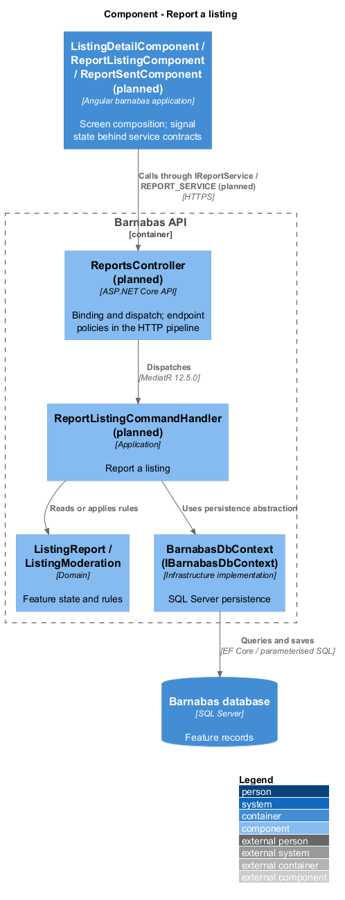
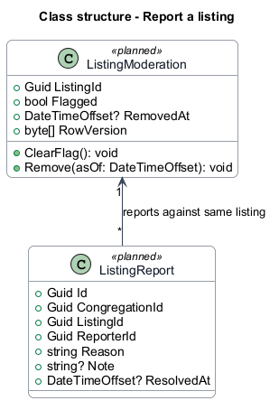
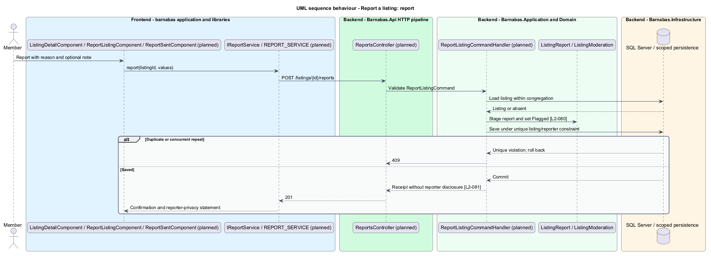

# Report a listing

## Overview

Barnabas is a private board where church congregation members offer goods or time through listings.

A **report** — member-submitted reason for moderator review of a listing — records a concern inside the congregation. A **flag** — moderation marker independent of listing lifecycle status — places that concern in the moderator queue.

Submission confirms receipt and explains that the listing owner is not told who reported it. Reporting alone does not remove the listing from the board.

## Description

**Implementation boundary: Planned.**

Planned `ReportListingComponent` is a `domain` region composed by the listing detail page. `ReportSentComponent` is a confirmation route in `barnabas`. A report state service owns draft and submission signals and injects `IReportService` through `REPORT_SERVICE`; the host binds `ReportService`.

`ReportsController` dispatches `ReportListingCommand` for `POST /listings/{listingId}/reports`. The handler loads the scoped listing, takes reporter identity from the session, requires a reason, and accepts an optional bounded note. It inserts `ListingReport` and sets `ListingModeration.Flagged` in one transaction. A unique `(ListingId, ReporterId)` constraint turns repeat and concurrent duplicate reports into 409. Missing and foreign listings return 404. Reason vocabulary and note bounds remain `<TO SUPPLY>`.

Reporter identity never enters member-facing listing or notification projections. Moderator DTOs expose the reason and reporter only to authorised moderators. If the listing owner also holds Moderator, the target suppresses reporter identity on that owner's listing and moderation responses. Other moderators review the concern. This interpretation preserves the absolute owner-privacy requirement; the dual-role case remains explicit in [open decisions](../../open-decisions.md).

Notes render as untrusted text. A failed save rolls back both report and flag. Invalid fields preserve the form for correction; success alone opens the receipt screen. The unique constraint currently models one report per member per listing for its lifetime; reopening a report after moderation is `<TO SUPPLY>` because no criterion settles it.

**Acceptance verification.** [L2-080](../../../specs/L2.md#l2-080-report-a-listing): API AC 1, 2; E2E AC 3. [L2-081](../../../specs/L2.md#l2-081-keep-a-reporters-identity-from-the-reported-member): API AC 1, 2; E2E AC 3. The linked criteria retain their Given–When–Then wording. API acceptance uses SQL Server; E2E acceptance uses one page object per screen. New behaviour begins with its failing criterion. Design coverage does not assert an acceptance test pass.

## Requirements

The requirement text and identifiers are reproduced from [L2](../../../specs/L2.md). Each row names its [L1 parent](../../../specs/L1.md).

| L2 ID | Refines (L1) | Requirement |
|-------|--------------|-------------|
| `L2-080` | `L1-013` | A member shall be able to report a listing with a reason and an optional note, and be told the report was received. |
| `L2-081` | `L1-013` | A reporter's identity shall be disclosed to moderators only, and never to the member whose listing was reported. |

## Diagrams

The context identifies the actor and the Barnabas capability. Congregation boundaries also apply to linked resources.

The container view places the Angular client, .NET API, and SQL Server persistence around this capability.

The component view separates screen composition, API dispatch, application behaviour, domain rules, and persistence.

The class view shows the feature types, their data, and typed dependencies. Planned additions are identified in the description.

The report and flag commit together. Public responses never disclose the reporter.

