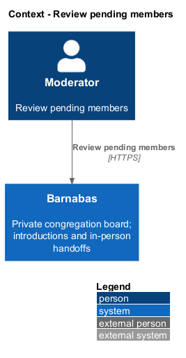
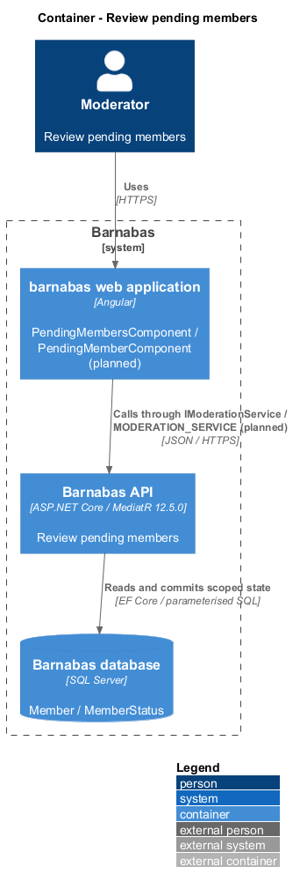
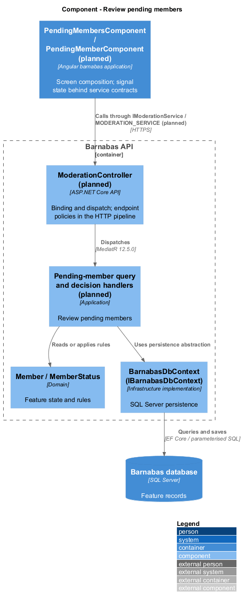
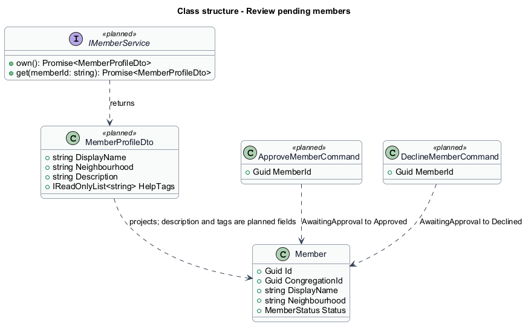
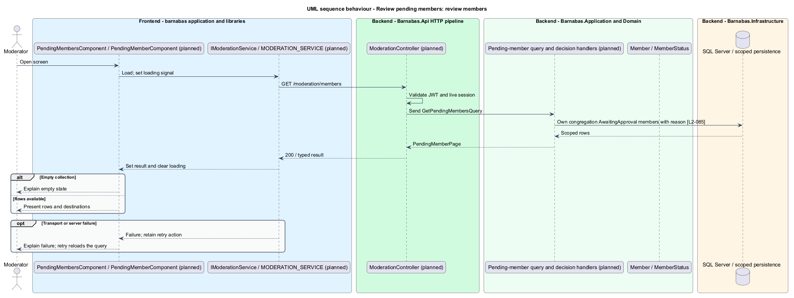
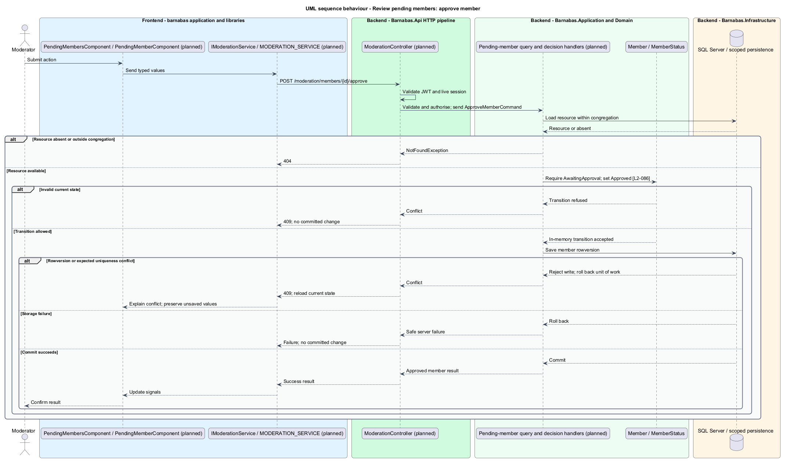
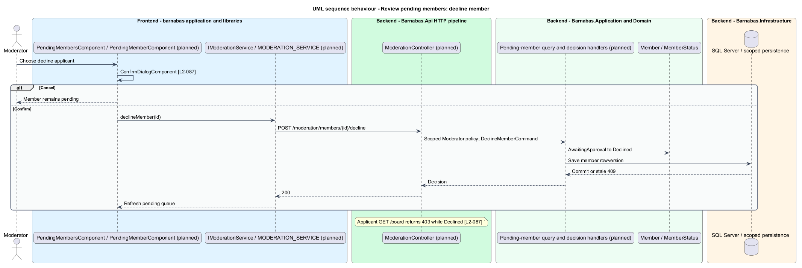

# Review pending members

## Overview

Barnabas is a private board where church congregation members offer goods or time through listings.

A **pending member** — prospective congregation member awaiting profile approval — remains outside the board. A moderator reviews their name, neighbourhood, and joining reason before approving or declining.

Approval grants board access on the member's next visit. Declining requires confirmation and leaves the applicant unable to reach the board.

## Description

**Implementation boundary: Planned; existing member status enumeration.**

Planned `PendingMembersComponent` is a moderator route in `barnabas`, composing `PendingMemberComponent` rows in `domain`. The moderation state service consumes `IModerationService` through `MODERATION_SERVICE`. Row destinations open a moderator-only profile route, preserving the approved-only public profile boundary.

`GET /moderation/members`, `GET /moderation/members/{id}`, `POST /moderation/members/{id}/approve`, and `POST /moderation/members/{id}/decline` dispatch through `ModerationController`. All require Moderator and scope to the granting congregation. `GetPendingMembersQueryHandler` projects `MemberStatus.AwaitingApproval`, with name, neighbourhood, and reason. Joining requirements do not collect that reason, which remains `<TO SUPPLY>`.

Planned `ApproveMemberCommandHandler` and `DeclineMemberCommandHandler` apply entity transitions from AwaitingApproval to Approved or Declined. Member rowversion makes simultaneous decisions commit once, with a stale 409. Already-decided members return 409 and trigger a row refresh. Ordinary members receive 403 and foreign or missing targets return 404. Persistence failure leaves the applicant pending.

The applicant's session stays valid for status/account access. The approved-member policy reads current status for every business request, refusing Declined with 403 and allowing Approved. The route guard refreshes status before choosing the board, so approval takes effect without another email. The shared confirmation dialog precedes decline; cancellation sends no command. No unspecified approval email or decline-reason requirement is introduced.

**Source anchors.** [MemberStatus.cs](../../../../backend/src/Barnabas.Domain/Members/MemberStatus.cs).

**Acceptance verification.** [L2-085](../../../specs/L2.md#l2-085-present-the-queue-of-members-awaiting-approval): API AC 1; E2E AC 2. [L2-086](../../../specs/L2.md#l2-086-approve-a-member): API AC 1, 2; E2E AC 3. [L2-087](../../../specs/L2.md#l2-087-decline-a-member): API AC 1; E2E AC 2. The linked criteria retain their Given–When–Then wording. API acceptance uses SQL Server; E2E acceptance uses one page object per screen. New behaviour begins with its failing criterion. Design coverage does not assert an acceptance test pass.

## Requirements

The requirement text and identifiers are reproduced from [L2](../../../specs/L2.md). Each row names its [L1 parent](../../../specs/L1.md).

| L2 ID | Refines (L1) | Requirement |
|-------|--------------|-------------|
| `L2-085` | `L1-013` | A moderator shall be able to see every member of their congregation awaiting approval, with the reason each gave for joining. |
| `L2-086` | `L1-013` | A moderator shall be able to approve a pending member, after which that member can see the board. |
| `L2-087` | `L1-013` | Declining shall require confirmation and shall leave the applicant unable to reach the board. |

## Diagrams

The context identifies the actor and the Barnabas capability. Congregation boundaries also apply to linked resources.

The container view places the Angular client, .NET API, and SQL Server persistence around this capability.

The component view separates screen composition, API dispatch, application behaviour, domain rules, and persistence.

The class view shows the feature types, their data, and typed dependencies. Planned additions are identified in the description.

The queue is congregation-scoped and pending-only. Joining-reason capture remains a requirements decision.

Approval changes the record checked by the applicant’s next board request.

Decline requires confirmation and retains a 403 board response for the applicant.

