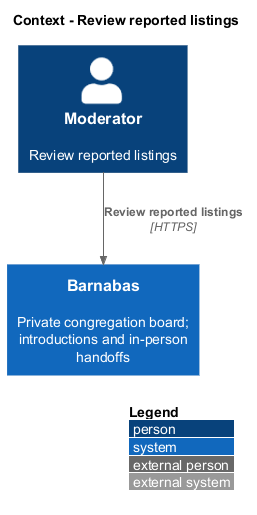
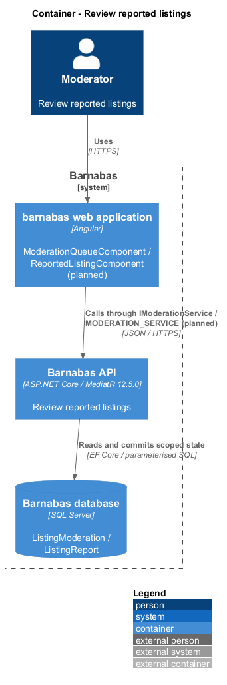
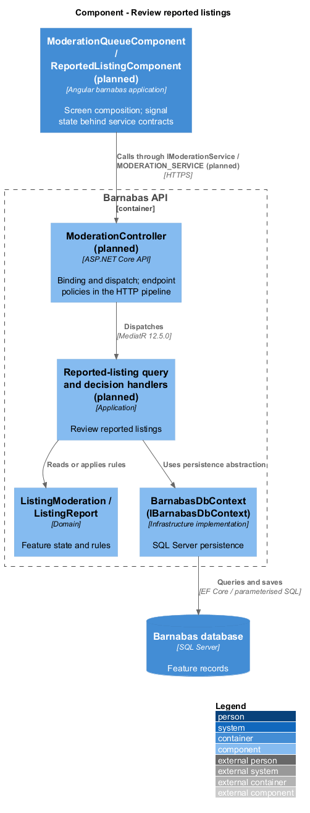
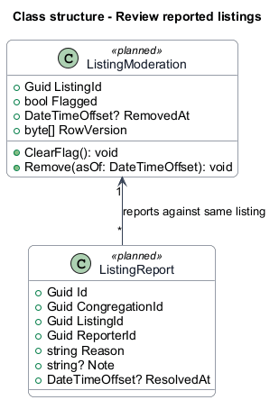
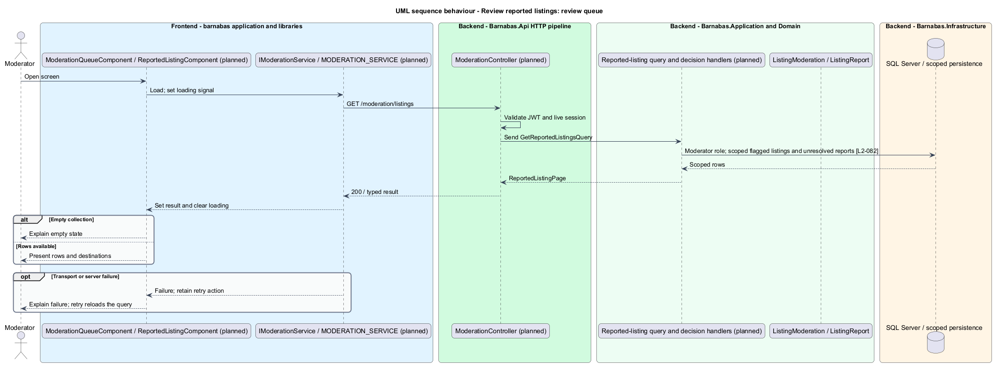
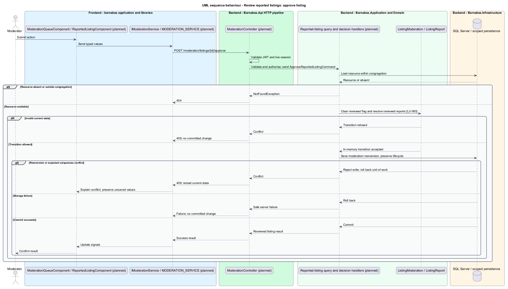
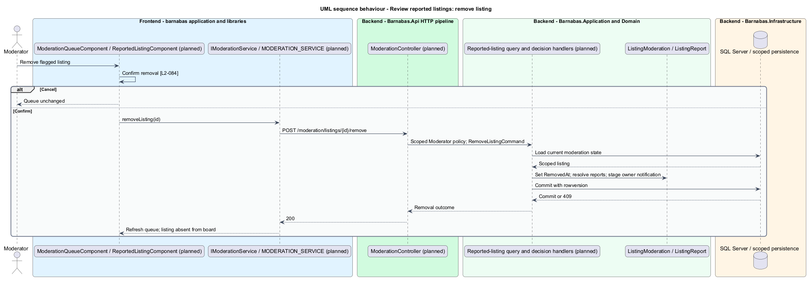

# Review reported listings

## Overview

Barnabas is a private board where church congregation members offer goods or time through listings.

The **reported-listing queue** — flagged congregation listings awaiting moderator review — presents each reason and listing owner. Approval clears the flag while an active listing remains on the board. Removal takes the listing off the board after confirmation.

Moderation authority belongs to the granting congregation. Removal is a dedicated moderation capability, separate from ordinary owner editing.

## Description

**Implementation boundary: Planned.**

Planned `ModerationQueueComponent` is routed in `barnabas`; `ReportedListingComponent` is a `domain` row receiving listing and profile destinations from the page. A moderation state service consumes `IModerationService` through `MODERATION_SERVICE`. Confirmation uses `ConfirmDialogComponent`.

`ModerationController` dispatches `GetReportedListingsQuery` from `GET /moderation/listings`, `ApproveReportedListingCommand` from `POST /moderation/listings/{id}/approve`, and `RemoveListingCommand` from `POST /moderation/listings/{id}/remove`. All require Moderator and scoped lookup. Ordinary members receive 403; foreign listings receive 404.

The query groups unresolved reports per flagged listing and projects reasons, owner, and authorised reporter data. `ListingModeration` keeps flag state separate from lifecycle. Approval clears the reviewed flag and resolves reviewed reports under a rowversion check. It does not restore an archived or closed listing. A concurrent new report is included in the checked review or leaves the flag present; it cannot be silently cleared.

Removal sets `RemovedAt`, removes the queue entry, and stages an owner notification through `INotificationWriter` in one transaction. Board, search, and public-profile listing queries exclude removed records. Owner restore checks moderation state and cannot republish a removed listing. A retained outcome remains visible to owner and moderators so the notification has an authorised destination, without reporter identity. A stale decision returns 409 and reloads the queue. Cancellation sends no command. Whether moderator-action notifications can be disabled remains `<TO SUPPLY>`.

**Acceptance verification.** [L2-082](../../../specs/L2.md#l2-082-present-the-moderation-queue-of-reported-listings): API AC 1, 2; E2E AC 3. [L2-083](../../../specs/L2.md#l2-083-approve-a-reported-listing): API AC 1; E2E AC 2. [L2-084](../../../specs/L2.md#l2-084-remove-a-listing-as-a-moderator): API AC 1, 2; E2E AC 3. The linked criteria retain their Given–When–Then wording. API acceptance uses SQL Server; E2E acceptance uses one page object per screen. New behaviour begins with its failing criterion. Design coverage does not assert an acceptance test pass.

## Requirements

The requirement text and identifiers are reproduced from [L2](../../../specs/L2.md). Each row names its [L1 parent](../../../specs/L1.md).

| L2 ID | Refines (L1) | Requirement |
|-------|--------------|-------------|
| `L2-082` | `L1-013` | A moderator shall be able to see every flagged listing in their congregation, with its report reason and the member who posted it. |
| `L2-083` | `L1-013` | A moderator shall be able to clear a listing's flag, after which the listing remains on the board. |
| `L2-084` | `L1-013` | Removal shall require confirmation and shall take the listing off the board. |

## Diagrams

The context identifies the actor and the Barnabas capability. Congregation boundaries also apply to linked resources.

The container view places the Angular client, .NET API, and SQL Server persistence around this capability.

The component view separates screen composition, API dispatch, application behaviour, domain rules, and persistence.

The class view shows the feature types, their data, and typed dependencies. Planned additions are identified in the description.

The moderator receives only their congregation’s flagged listings, with reason and owner destinations.

A version check prevents approval from losing a concurrent new report.

Confirmed removal and its owner notification commit together.

