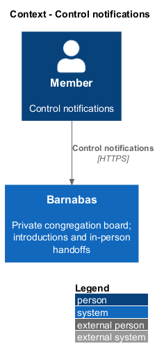
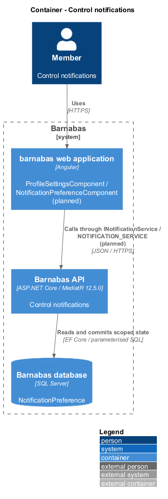
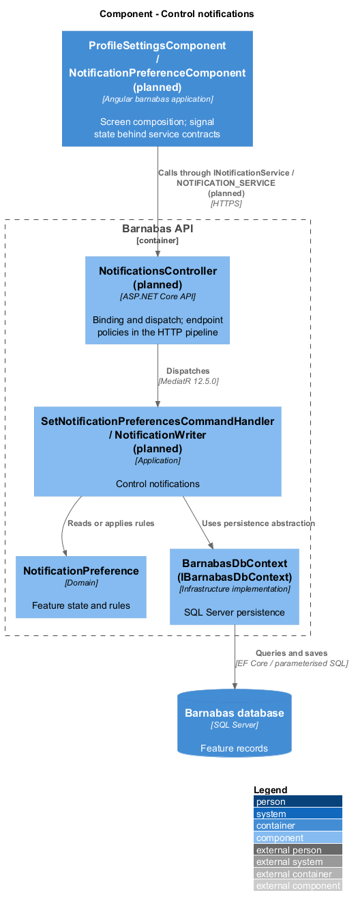
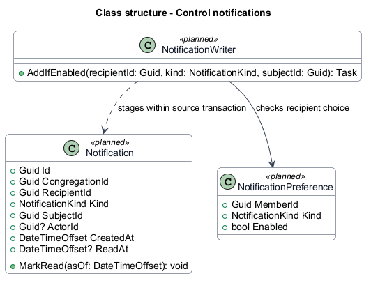
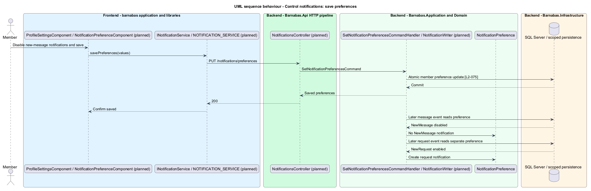

# Control notifications

## Overview

Barnabas is a private board where church congregation members offer goods or time through listings.

A **notification preference** — member choice enabling or disabling one kind of notification — controls which attention records are created. Disabling new-message notifications leaves request and decision notifications independent.

Preferences are edited in profile and settings. Confirmation follows a successful save.

## Description

**Implementation boundary: Planned.**

Planned `NotificationPreferenceComponent` is a `domain` region composed by `ProfileSettingsComponent` in `barnabas`. Its state service consumes `INotificationService` through `NOTIFICATION_SERVICE`. Plain toggle controls come from `components`.

`GET /notifications/preferences` dispatches `GetNotificationPreferencesQuery`; `PUT /notifications/preferences` dispatches `SetNotificationPreferencesCommand`. The handlers take member identity from the session and use unique `(CongregationId, MemberId, Kind)` records. Validation rejects unknown kind values or malformed booleans with field-named errors. Save updates the preference set atomically with a version check; a stale 409 preserves local choices.

The target default enables requests, decisions, and messages because their event requirements create notifications unless disabled. Missing preference rows follow that same default. Whether moderator notifications are configurable remains `<TO SUPPLY>`; the removal criterion requires the owner to be notified.

`NotificationWriter` reads the recipient setting before staging a record. Preference update and creation serialise on that state. A disable suppresses subsequent events of that kind without deleting earlier notifications or suppressing another kind. Save confirmation remains on settings and reload returns the chosen values. Failure preserves edits and offers retry without claiming persistence.

**Acceptance verification.** [L2-075](../../../specs/L2.md#l2-075-control-which-notifications-are-received): API AC 1, 2; E2E AC 3. The linked criteria retain their Given–When–Then wording. API acceptance uses SQL Server; E2E acceptance uses one page object per screen. New behaviour begins with its failing criterion. Design coverage does not assert an acceptance test pass.

## Requirements

The requirement text and identifiers are reproduced from [L2](../../../specs/L2.md). Each row names its [L1 parent](../../../specs/L1.md).

| L2 ID | Refines (L1) | Requirement |
|-------|--------------|-------------|
| `L2-075` | `L1-011` | A member shall be able to choose which kinds of notification they receive. A kind they have disabled shall not be created for them, and other kinds shall continue. |

## Diagrams

The context identifies the actor and the Barnabas capability. Congregation boundaries also apply to linked resources.

The container view places the Angular client, .NET API, and SQL Server persistence around this capability.

The component view separates screen composition, API dispatch, application behaviour, domain rules, and persistence.

The class view shows the feature types, their data, and typed dependencies. Planned additions are identified in the description.

Disabling new messages leaves enabled request notifications independent.

