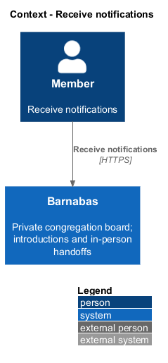
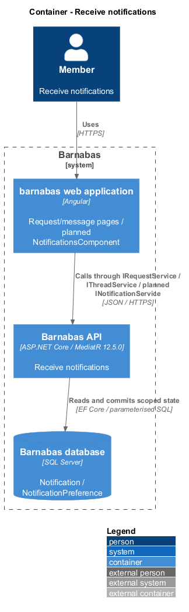
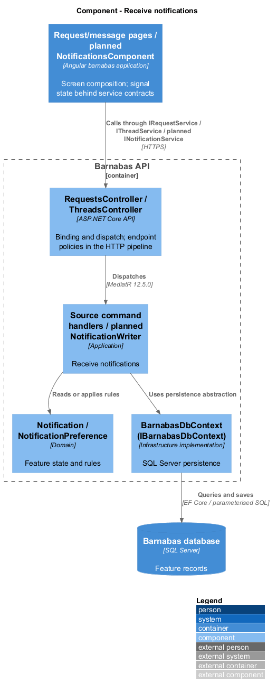
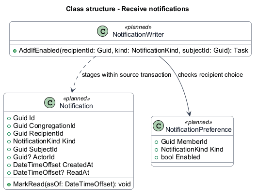
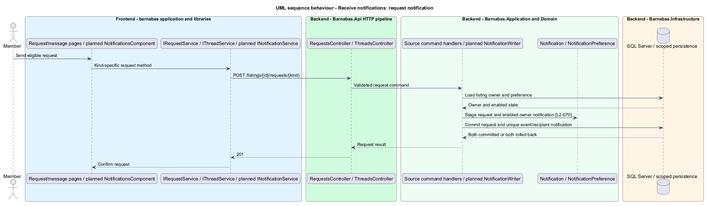
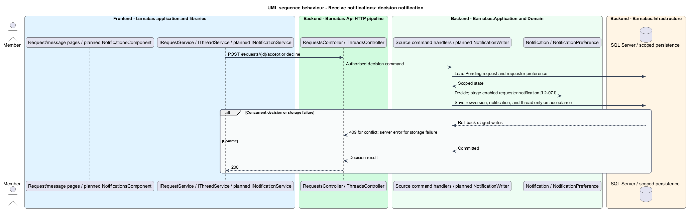
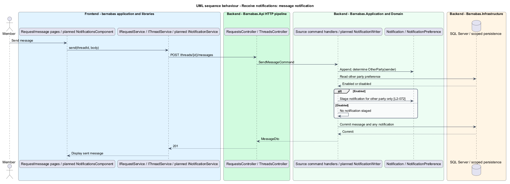

# Receive notifications

## Overview

Barnabas is a private board where church congregation members offer goods or time through listings.

A **notification** — recipient-specific record of an event requiring attention — leads a congregation member to a request, decision, or message. Owners receive new-request notifications. Requesters receive accepted or declined decisions. The other party receives new-message notifications.

A sender receives no notification for their own message. Disabled kinds are not created.

## Description

**Implementation boundary: Planned.**

Notifications are planned; existing request and message handlers create none. `Notification` implements `ITenantOwned` and stores recipient, kind, subject, actor, and timestamps. A typed subject identifies the destination without accepting arbitrary URLs. A unique event key, recipient, and kind prevent duplicate records for one committed event.

Application service `NotificationWriter`, behind `INotificationWriter`, runs before the source handler's `SaveChangesAsync`. It checks the recipient's `NotificationPreference`, stages an enabled record, and leaves commit to the source handler. Request, decision, or message and notification share one SQL transaction. Failed source writes create no notification; failed notification writes roll back the source event. New-message recipient is `MessageThread.OtherParty(sender)`.

Event keys use the request identifier for creation, request identifier plus decision for a decision, and message identifier for a message. Preference writes and event creation serialise on recipient preference state. Missing preference rows use the default described in [control notifications](../control-notifications/README.md).

`NotificationsComponent` and its state service consume `INotificationService` through `NOTIFICATION_SERVICE`, bound to `NotificationService` only at the host. Incoming-request destinations are `/inbox/requests`, decision destinations `/inbox/my-requests`, and message destinations `/threads/:threadId`. Authorised projections supply names and listing titles. Moderator-removal notifications reuse the writer. No email, push, or realtime transport is required by these L2s.

**Acceptance verification.** [L2-070](../../../specs/L2.md#l2-070-notify-a-member-of-a-request-on-their-listing): API AC 1; E2E AC 2. [L2-071](../../../specs/L2.md#l2-071-notify-a-requester-of-a-decision): API AC 1, 2; E2E AC 3. [L2-072](../../../specs/L2.md#l2-072-notify-a-member-of-a-new-message): API AC 1; E2E AC 2. The linked criteria retain their Given–When–Then wording. API acceptance uses SQL Server; E2E acceptance uses one page object per screen. New behaviour begins with its failing criterion. Design coverage does not assert an acceptance test pass.

## Requirements

The requirement text and identifiers are reproduced from [L2](../../../specs/L2.md). Each row names its [L1 parent](../../../specs/L1.md).

| L2 ID | Refines (L1) | Requirement |
|-------|--------------|-------------|
| `L2-070` | `L1-011` | A request on a member's listing shall create a notification for that listing's owner, naming the requester and the listing. |
| `L2-071` | `L1-011` | A decision on a request shall create a notification for the requester stating whether it was accepted or declined. |
| `L2-072` | `L1-011` | A message shall create a notification for the other party to the thread, and not for its sender. |

## Diagrams

The context identifies the actor and the Barnabas capability. Congregation boundaries also apply to linked resources.

The container view places the Angular client, .NET API, and SQL Server persistence around this capability.

The component view separates screen composition, API dispatch, application behaviour, domain rules, and persistence.

The class view shows the feature types, their data, and typed dependencies. Planned additions are identified in the description.

The new request and enabled owner notification commit together.

A concurrency loser creates no decision notification. Acceptance also commits its thread.

Only the other party receives an enabled new-message notification.

