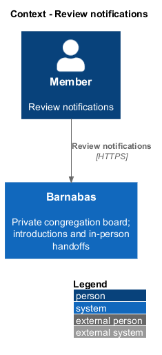
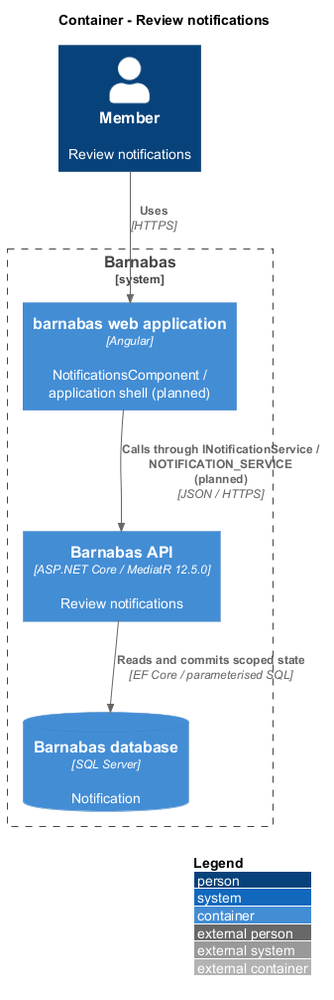
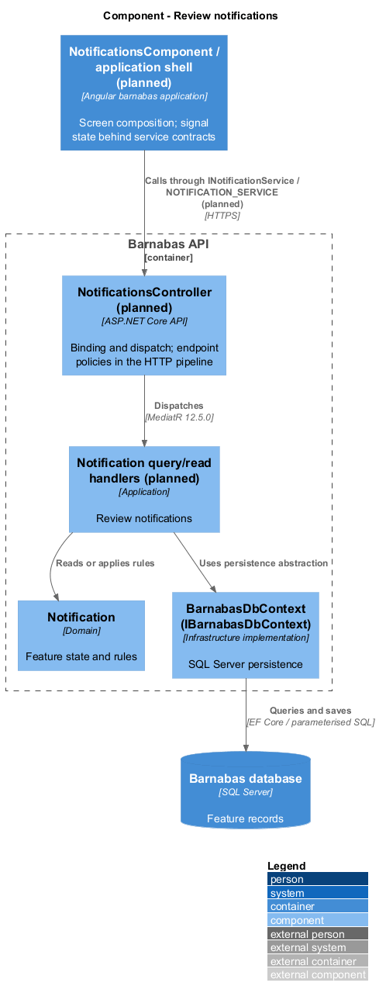
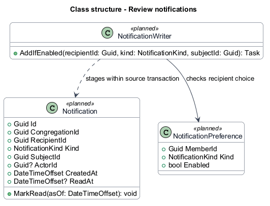
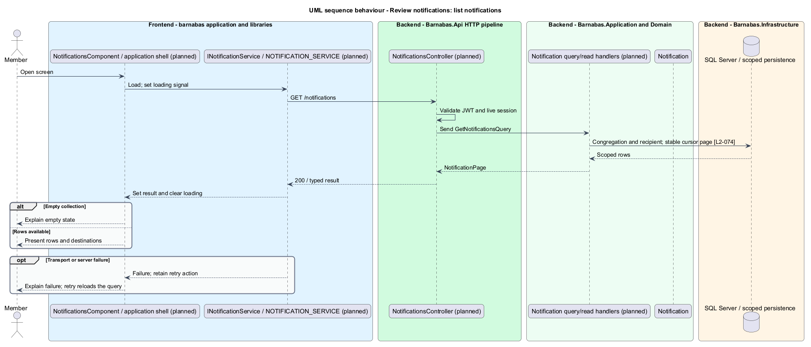
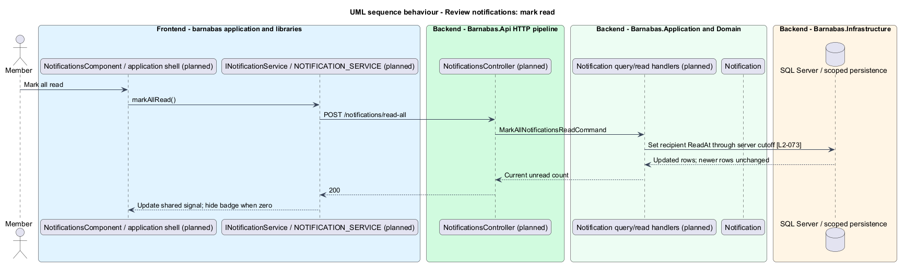

# Review notifications

## Overview

Barnabas is a private board where church congregation members offer goods or time through listings.

An **unread count** — number of the member's notifications without a read timestamp — signals waiting congregation activity. Each notification opens its subject and, when it names another member, that member's profile.

Reading updates only the recipient's state. A zero unread count removes the badge.

## Description

**Implementation boundary: Planned; current notification route is a placeholder.**

The notification route is currently a placeholder. Planned `NotificationsComponent` belongs in `barnabas`, `NotificationRowComponent` in `domain`, and count/navigation chrome in the application shell. `NotificationStore` owns collection, cursor, count, loading, and failure signals and injects `INotificationService` through `NOTIFICATION_SERVICE`.

Planned `NotificationsController` dispatches `GetNotificationsQuery`, `GetUnreadNotificationCountQuery`, `MarkNotificationReadCommand`, and `MarkAllNotificationsReadCommand`. Routes are `GET /notifications`, `GET /notifications/unread-count`, `POST /notifications/{id}/read`, and `POST /notifications/read-all`. Reads and updates scope by congregation and recipient; another member's notification returns 404. Read timestamps are set idempotently.

The list projects subject kind and identifier; the page maps those to known routes. Decisions target own requests, new requests target incoming requests, messages target threads, and moderator removal targets an authorised retained listing outcome. Named actors have a separate profile identifier. Opening any destination repeats its authorisation checks. Lifecycle handlers remove notifications whose subjects are deleted, or retain an authorised outcome destination, preventing dangling links.

Mark-all uses a server-side cutoff, preserving a concurrent newer notification as unread. Count refresh follows committed reads and route activation. Failed counts show recoverable failure rather than false zero. Authenticated screens share the count at all viewport bands. Its scope on signed-out screens remains `<TO SUPPLY>` in [open decisions](../../open-decisions.md). No unspecified refresh interval or realtime SLA is invented.

**Source anchors.** [app.routes.ts](../../../../frontend/projects/barnabas/src/app/app.routes.ts).

**Acceptance verification.** [L2-073](../../../specs/L2.md#l2-073-show-an-unread-notification-count): API AC 1; E2E AC 2, 3. [L2-074](../../../specs/L2.md#l2-074-lead-every-notification-to-its-subject): E2E AC 1, 2. The linked criteria retain their Given–When–Then wording. API acceptance uses SQL Server; E2E acceptance uses one page object per screen. New behaviour begins with its failing criterion. Design coverage does not assert an acceptance test pass.

## Requirements

The requirement text and identifiers are reproduced from [L2](../../../specs/L2.md). Each row names its [L1 parent](../../../specs/L1.md).

| L2 ID | Refines (L1) | Requirement |
|-------|--------------|-------------|
| `L2-073` | `L1-011` | The count of unread notifications shall be visible from every screen at every viewport size. |
| `L2-074` | `L1-011` | Every notification shall resolve to its subject. None shall terminate without a destination. |

## Diagrams

The context identifies the actor and the Barnabas capability. Congregation boundaries also apply to linked resources.

The container view places the Angular client, .NET API, and SQL Server persistence around this capability.

The component view separates screen composition, API dispatch, application behaviour, domain rules, and persistence.

The class view shows the feature types, their data, and typed dependencies. Planned additions are identified in the description.

Recipient-only notifications carry typed subject and actor-profile destinations.

A cutoff preserves newer notifications during mark-all and returns the current count.

