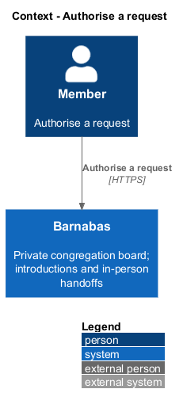
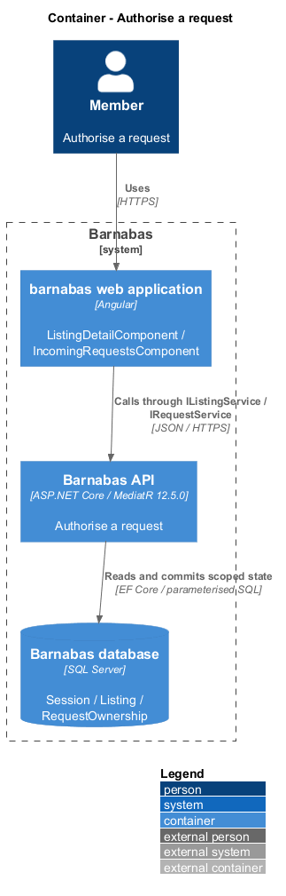

# Authorise a request

## Overview

Barnabas is a private board where church congregation members offer goods or time through listings.

**Authentication** — verification of an issued token and its live session — identifies the member making an HTTP request. **Authorisation** — decision that the identified member has the role or ownership needed for an action — controls access to the requested capability.

Protected endpoints reject invalid credentials with 401. A same-congregation member lacking ownership or a required role receives 403. Foreign resource identifiers remain indistinguishable from absent identifiers.

## Description

**Implementation boundary: Existing JWT and ownership; planned current-status policy and administrative surfaces.**

`Program.cs` configures JWT bearer authentication, issuer, audience, signature, lifetime, zero clock skew, and an authenticated fallback policy. `SessionValidator.ValidateAsync` checks a valid `sid` and a live `Session` after cryptographic validation. It currently does not compare all token claims with session/member records. The target validates `sub` and congregation against the session and loads current member status and role, so approval and role changes take effect without waiting for JWT expiry.

`AuthorisationBehaviour<TRequest,TResponse>` runs after `ValidationBehaviour`. Commands declare `IRequireRole` or `IRequireOwnership<TResource>`. `IOwnerLookup<TResource>` implementations load through congregation filters. A wrong owner raises `ForbiddenException`; an absent resource reaches the handler's 404 path. Requests use `RequestOwnershipLookup` to authorise the listing owner. Thread party checks belong to `MessageThread`, which has two authorised members rather than one owner. Controllers bind, dispatch, and return.

The target introduces an approved-member policy for board and business endpoints. Pending and declined members retain only their permitted status/account capabilities and receive 403 from the board. Public exceptions currently include sign-in, refresh-by-cookie, and `/health`, with development endpoints removed outside Development. Joining adds public invite redemption and a restricted signed joining capability for profile submission. `L2-093` and `L2-116` disagree about anonymous health; the explicit conflict is recorded in [open decisions](../../open-decisions.md). No undocumented public business route is introduced.

Role authority remains congregation-scoped even when the token names Moderator. Planned administrative endpoints require Administrator; moderator removal has a separate role-based command and does not bypass ownership for ordinary edits. Forged role or congregation claims fail signature validation before policy evaluation. Source tests demonstrate existing authentication and ownership paths; unimplemented administrative routes remain planned.

**Source anchors.** [Program.cs](../../../../backend/src/Barnabas.Api/Program.cs), [SessionValidator.cs](../../../../backend/src/Barnabas.Api/Security/SessionValidator.cs), [AuthorisationBehaviour.cs](../../../../backend/src/Barnabas.Application/Common/Behaviours/AuthorisationBehaviour.cs).

**Acceptance verification.** [L2-093](../../../specs/L2.md#l2-093-authenticate-every-non-public-endpoint): API AC 1, 2, 3. [L2-094](../../../specs/L2.md#l2-094-authorise-by-ownership): API AC 1, 2. [L2-095](../../../specs/L2.md#l2-095-authorise-by-role): API AC 1, 2, 3. The linked criteria retain their Given–When–Then wording. API acceptance uses SQL Server; E2E acceptance uses one page object per screen. New behaviour begins with its failing criterion. Design coverage does not assert an acceptance test pass.

## Requirements

The requirement text and identifiers are reproduced from [L2](../../../specs/L2.md). Each row names its [L1 parent](../../../specs/L1.md).

| L2 ID | Refines (L1) | Requirement |
|-------|--------------|-------------|
| `L2-093` | `L1-015` | Every endpoint other than the public landing, invite redemption, and sign-in shall require a valid token. |
| `L2-094` | `L1-015` | A resource shall be modifiable only by the member who owns it. |
| `L2-095` | `L1-015` | An endpoint reserved to a role shall reject a caller who does not hold that role. |

## Diagrams

The context identifies the actor and the Barnabas capability. Congregation boundaries also apply to linked resources.

The container view places the Angular client, .NET API, and SQL Server persistence around this capability.

The component view separates screen composition, API dispatch, application behaviour, domain rules, and persistence.

The class view shows the feature types, their data, and typed dependencies. Planned additions are identified in the description.

JWT verification and session lookup precede protected feature dispatch.

Ownership is checked on a scoped resource. A moderator still needs the explicitly granted moderation capability.

