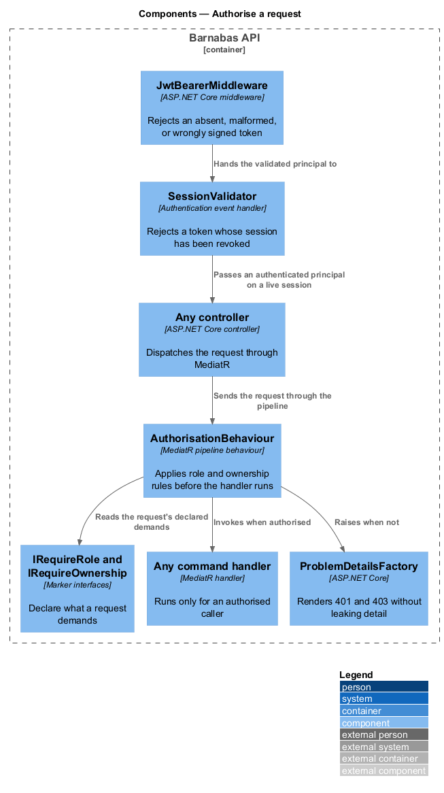
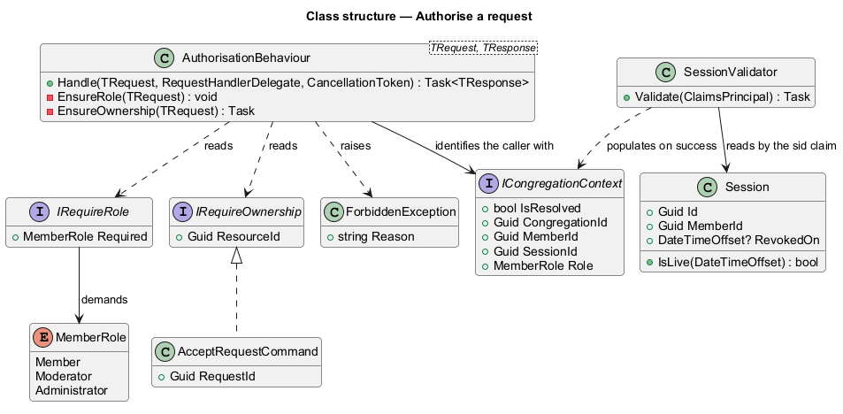
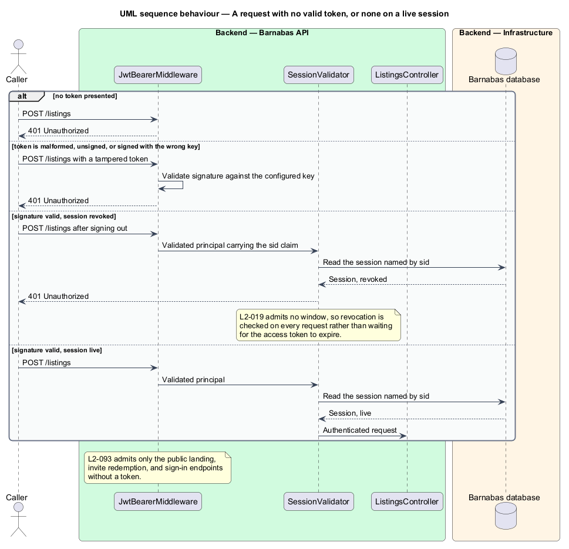
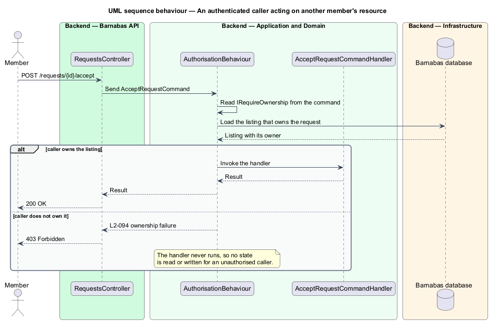

# Authorise a request

## Overview

Every action in Barnabas is taken by an identified member, and most act on something a
particular member owns. Authorisation answers two questions in order: whether the caller is
who they claim, and whether this caller may do this to this resource.

**ownership** — the relation between a member and a resource that member created, which
determines who may modify or decide it

The questions are answered in different places, deliberately. Authentication is a property
of the request and belongs at the edge, where an unauthenticated call is rejected before any
application code runs. Ownership is a property of the domain and belongs in the pipeline,
where the resource can be loaded and compared against the caller.

Authentication itself has two halves. A signature proves the token was issued by this system
and has not been altered; it cannot prove the session behind it still stands. Revocation is
state, so it is read as state — once per authenticated request, by key.

Placing ownership in a pipeline behaviour rather than in each handler means a handler
cannot forget it, and a handler that is reached has already been authorised. Failure is
reported before any state is read or written.

## Description

Authorisation runs in two stages either side of the controller.

- **`JwtBearerMiddleware`** — rejects an absent, malformed, expired, or wrongly signed
  token with 401 before routing. Only the public landing, invite redemption, and sign-in
  endpoints are exempt.
- **`SessionValidator`** — runs on the validated principal and rejects a token whose
  session has been revoked. It reads the session named by the token's `sid` claim, by
  primary key, once per authenticated request. That read is the price of `L2-019`, which
  requires a signed-out member's tokens to stop being accepted and admits no window; a
  signature alone cannot express revocation. A single keyed read sits comfortably inside
  the 300 ms `L2-103` allows at the scale of a congregation.
- **`ICongregationContext`** — carries the caller's member identifier and role alongside
  the congregation, all read from signed claims.
- **`IRequireRole`** — marker interface a request implements to declare the role it demands.
  A moderation command declares `Moderator`; a provisioning command declares
  `Administrator`.
- **`IRequireOwnership`** — marker interface a request implements to declare the resource
  whose owner may issue it, exposing the identifier to check.
- **`AuthorisationBehaviour<TRequest, TResponse>`** — MediatR pipeline behaviour. It reads
  whichever markers the request implements, checks role against the context, loads the
  resource and compares its owner, then either invokes the handler or raises.
- **`ForbiddenException`** — raised on failure and mapped to 403 by the API's exception
  handler, carrying no detail about the resource.

The behaviour runs after validation and before the handler, so a request that is both
invalid and unauthorised is reported as invalid. That ordering leaks nothing: a caller who
cannot act on a resource learns only that their input was malformed.

Role and ownership are separate markers rather than one policy, because they are
independent. A moderator removing a flagged listing demands a role and no ownership; a
member accepting a request demands ownership and no particular role.

## Requirements

The feature realizes the following level-2 (L2) requirements. Each L2
requirement refines a level-1 (L1) requirement, cited by identifier. The
**Slice** column marks the requirements implemented by feature slice 1; the
remainder are designed here and implemented in a later slice.

| L2 ID | Refines (L1) | Slice | Requirement |
|-------|--------------|-------|-------------|
| `L2-093` | `L1-015` | 1 | Every endpoint other than the public landing, invite redemption, and sign-in shall require a valid token. |
| `L2-094` | `L1-015` | 1 | A resource shall be modifiable only by the member who owns it. |
| `L2-095` | `L1-015` | &mdash; | An endpoint reserved to a role shall reject a caller who does not hold that role. |

## Diagrams

### Components

Authentication sits at the edge in two stages, signature then session; ownership sits in the
pipeline. A handler is reached only by a caller who has passed all three.

### Class structure

A request declares what it demands by implementing `IRequireRole`, `IRequireOwnership`, or
neither. `AuthorisationBehaviour` reads those declarations rather than knowing about
individual commands. `SessionValidator` sits earlier, turning the token's `sid` claim into a
liveness check.

### Behaviour — a request with no valid token, or none on a live session

The first three failures — absent, tampered, and wrongly signed — return 401 from the
middleware, satisfying `L2-093` before any application code runs. The fourth is the one a
signature cannot catch: a token that is genuine but belongs to a session the member has
ended. `L2-019` admits no window, so that is read rather than waited out.

### Behaviour — an authenticated caller acting on another member's resource

The behaviour loads the owning resource and compares it against the caller. On failure the
handler is never invoked, so `L2-094` holds without each handler restating it.

