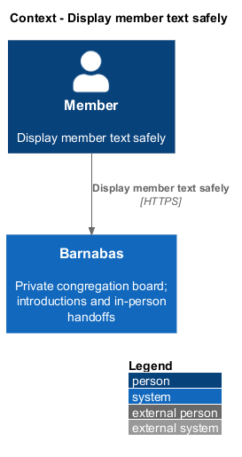
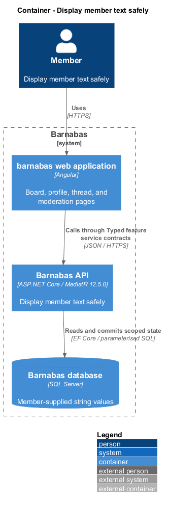
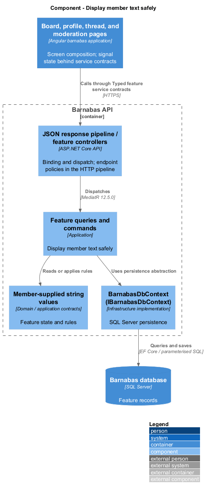
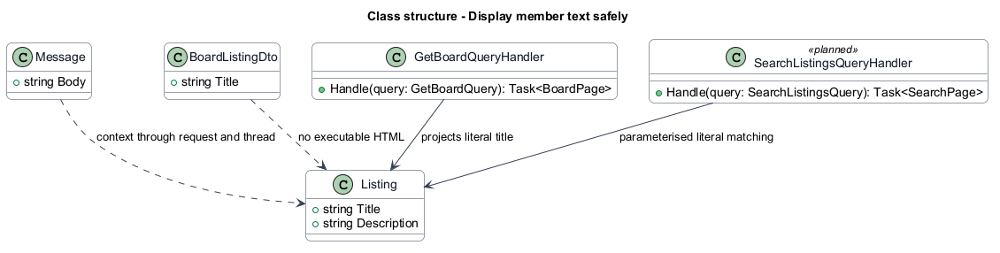
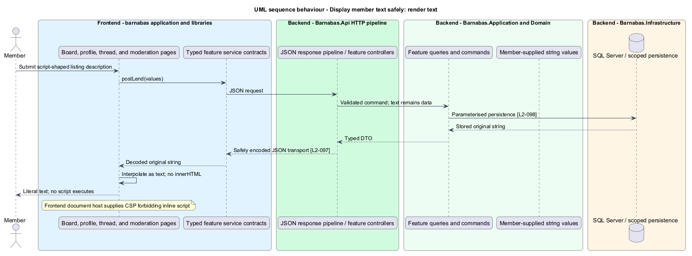
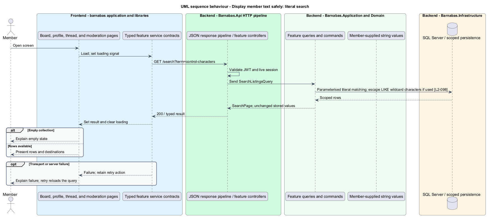

# Display member text safely

## Overview

Barnabas is a private board where church congregation members offer goods or time through listings.

**Member text** — titles, descriptions, profile words, report notes, and messages entered by congregation members — remains literal data when stored, queried, and displayed. Text that resembles code is shown as text and does not execute.

The same principle protects search: SQL-looking input cannot change the query's meaning beyond the literal term searched.

## Description

**Implementation boundary: Existing encoding and parameters; planned hosted CSP and full-surface verification.**

Existing handlers use EF LINQ and parameterised `ExecuteSqlInterpolatedAsync`. The API uses the default System.Text.Json encoder, and Angular templates use text interpolation. The target keeps original text in storage and JSON data rather than storing HTML entities or sanitised replacements that corrupt the member's wording. Escaped JSON transport does not turn data into executable markup.

The planned search handler treats wildcard and SQL control characters literally; a LIKE implementation escapes its wildcard characters and parameterises the value. It never concatenates input into a SQL statement. Explicit DTOs pass text to template interpolation or `textContent`. No member field reaches `innerHTML`, script source, event-handler attributes, or an Angular trust-bypass function.

The frontend hosting layer adds Content-Security-Policy forbidding inline script. This header belongs on document responses, including error pages; an API-only header cannot protect the Angular page. The precise script/style policy and host configuration remain `<TO SUPPLY>` until the deployment host is chosen. Policy tests inspect actual served headers and execute script-shaped listing text through Playwright page objects.

`L2-097` calls returned text encoded while `L2-098` requires unchanged round trips. The design interprets encoding as safe JSON transport and text rendering, preserving the decoded value. That interpretation is recorded in [open decisions](../../open-decisions.md), rather than changing requirement text. Tests inspect both raw JSON escaping and decoded equality, then confirm no script executes on board, detail, profile, message, and moderation screens.

**Source anchors.** [Program.cs](../../../../backend/src/Barnabas.Api/Program.cs), [AuthenticationStore.cs](../../../../backend/src/Barnabas.Infrastructure/Persistence/AuthenticationStore.cs).

**Acceptance verification.** [L2-097](../../../specs/L2.md#l2-097-prevent-cross-site-scripting): API AC 1; E2E AC 2, 3. [L2-098](../../../specs/L2.md#l2-098-prevent-injection): API AC 1, 2. The linked criteria retain their Given–When–Then wording. API acceptance uses SQL Server; E2E acceptance uses one page object per screen. New behaviour begins with its failing criterion. Design coverage does not assert an acceptance test pass.

## Requirements

The requirement text and identifiers are reproduced from [L2](../../../specs/L2.md). Each row names its [L1 parent](../../../specs/L1.md).

| L2 ID | Refines (L1) | Requirement |
|-------|--------------|-------------|
| `L2-097` | `L1-015` | Member-supplied text is displayed to other members and shall never execute. |
| `L2-098` | `L1-015` | Member-supplied text shall be treated as literal data by every query, and shall be returned unchanged. |

## Diagrams

The context identifies the actor and the Barnabas capability. Congregation boundaries also apply to linked resources.

The container view places the Angular client, .NET API, and SQL Server persistence around this capability.

The component view separates screen composition, API dispatch, application behaviour, domain rules, and persistence.

The class view shows the feature types, their data, and typed dependencies. Planned additions are identified in the description.

The stored value stays unchanged while JSON encoding and Angular text binding prevent execution.

SQL control and wildcard characters remain literal search values.

