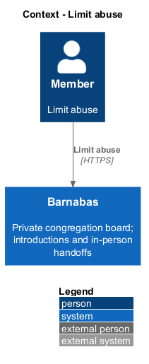
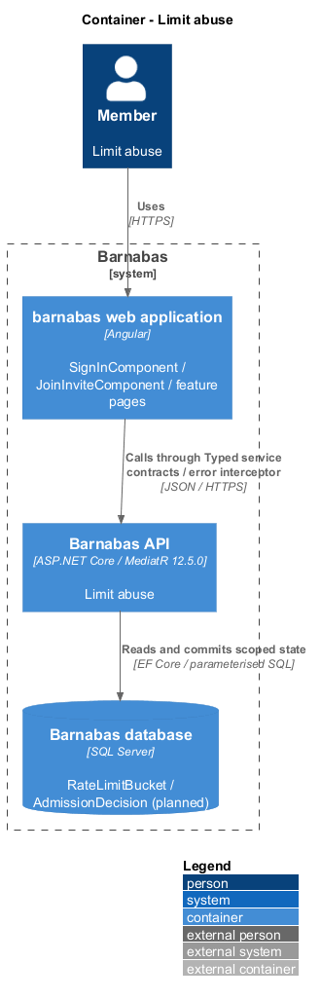
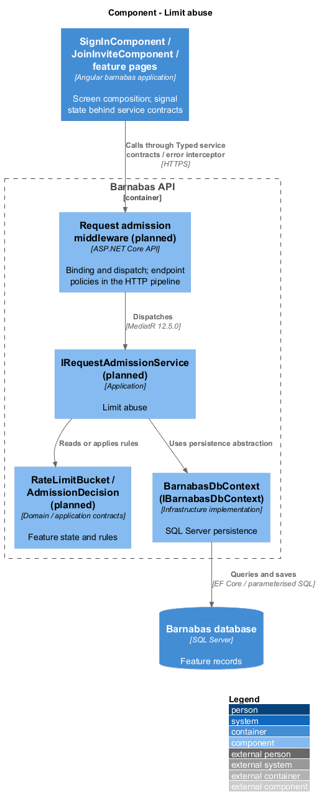
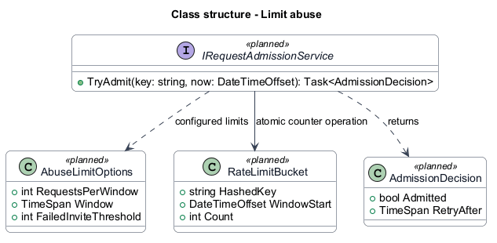
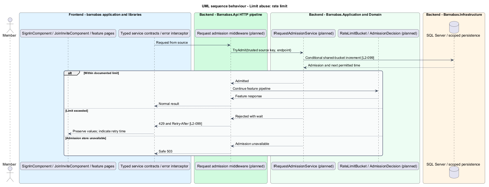
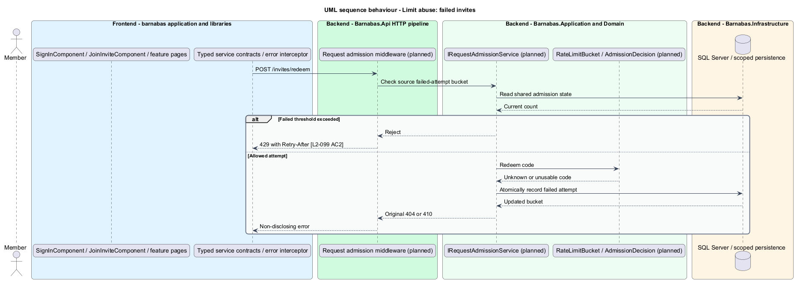

# Limit abuse

## Overview

Barnabas is a private board where church congregation members offer goods or time through listings.

A **rate limit** — bound on requests admitted from a source or for an operation during an interval — reduces abuse of the congregation service. A rejected caller receives 429 with a Retry-After header.

Failed invite attempts and sign-in requests have dedicated limits. Ordinary authenticated work also remains subject to source limits.

## Description

**Implementation boundary: Planned.**

Rate limiting is planned; `Program.cs` currently registers no limiter. The target adds admission middleware before expensive endpoint work, configured through `AbuseLimitOptions` with Microsoft.Extensions Options and Configuration. Source identity uses the direct connection address unless a specifically trusted proxy supplies forwarded headers. Arbitrary caller-supplied forwarding headers cannot select a new bucket.

An Application `IRequestAdmissionService` contract encapsulates the admission decision; Infrastructure implements shared counters in SQL Server for the proposed multi-instance deployment. Parameterised conditional updates or serialised bucket transactions increment a hashed source/operation key and return remaining wait. Raw addresses and email addresses do not become telemetry tags. Cleanup removes expired buckets without erasing a currently enforced limit.

The sign-in endpoint additionally uses a normalised-address key and admits five requests in 15 minutes per `L2-017`. Both registered and unknown addresses pass through the same limiting path. Failed invite redemption records its failed-attempt outcome against the source. General source rate, failed-invite threshold, source sign-in rate, window algorithm, and overload admission limits remain `<TO SUPPLY>`; acceptance requires these to be documented before tests can assert the threshold.

A limit rejection returns 429 with a computed Retry-After and stages no email or business write. The client presents a wait-and-retry state and preserves form values. Counters shared by API instances prevent round-robin bypass. If the admission store is unavailable, the target refuses affected public admission paths with a safe 503 instead of granting unbounded attempts; dependency health reports the failure. The global source gate and bounded worker queues protect the counter store from unlimited downstream work, with deployment capacity established by load verification.

**Acceptance verification.** [L2-099](../../../specs/L2.md#l2-099-rate-limit-and-resist-abuse): API AC 1, 2. The linked criteria retain their Given–When–Then wording. API acceptance uses SQL Server; E2E acceptance uses one page object per screen. New behaviour begins with its failing criterion. Design coverage does not assert an acceptance test pass.

## Requirements

The requirement text and identifiers are reproduced from [L2](../../../specs/L2.md). Each row names its [L1 parent](../../../specs/L1.md).

| L2 ID | Refines (L1) | Requirement |
|-------|--------------|-------------|
| `L2-099` | `L1-015` | Requests shall be rate-limited per source, and a limited caller shall be told when to retry. |

## Diagrams

The context identifies the actor and the Barnabas capability. Congregation boundaries also apply to linked resources.

The container view places the Angular client, .NET API, and SQL Server persistence around this capability.

The component view separates screen composition, API dispatch, application behaviour, domain rules, and persistence.

The class view shows the feature types, their data, and typed dependencies. Planned additions are identified in the description.

A shared source bucket decides admission before the feature runs. Rejection includes Retry-After.

Failed redemption attempts contribute to the source-specific threshold.

