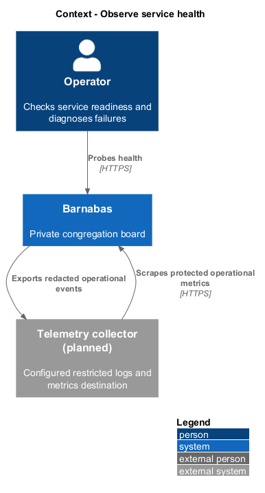
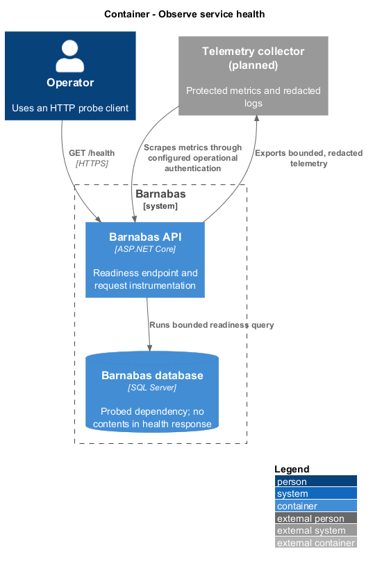
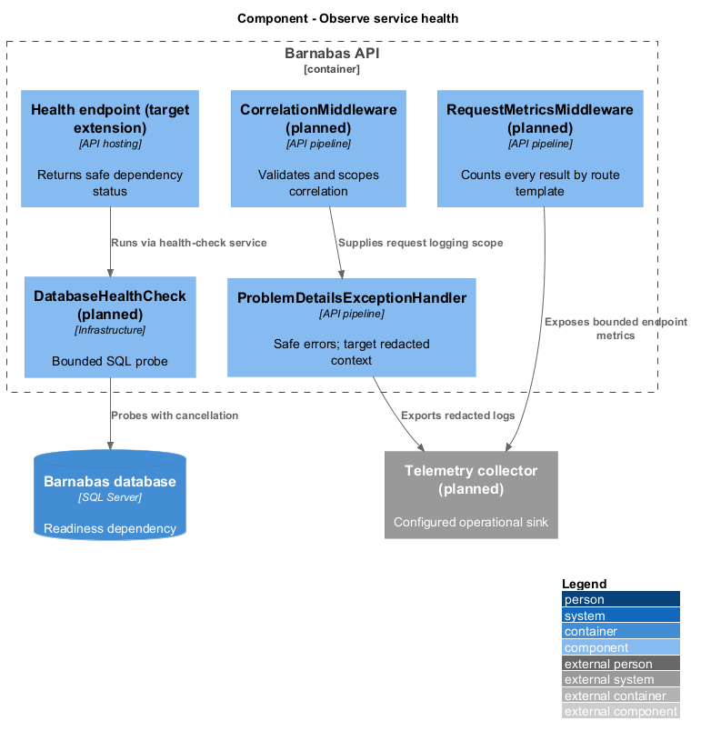
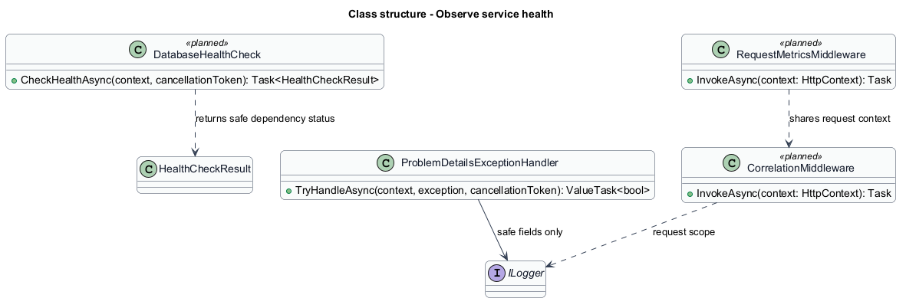
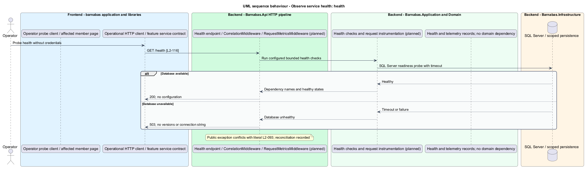
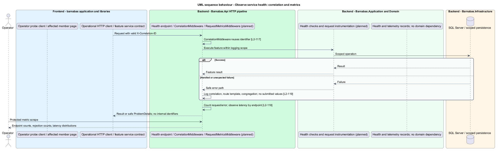

# Observe service health

## Overview

Barnabas is a private board where church congregation members offer goods or time through listings.

A **health check** — bounded dependency probe reporting availability — distinguishes a ready service from one that cannot serve congregation requests. A **correlation identifier** — safe request identifier shared by related log entries — connects evidence about one request.

Operators inspect dependency health, request counts, errors, and latency without receiving member content or sensitive configuration.

## Description

**Implementation boundary: Existing shallow health and handled-error logging; planned operational checks.**

`Program.cs` currently exposes anonymous `GET /health` returning only `{status: ok}`. It does not probe SQL Server. `ProblemDetailsExceptionHandler` logs handled failures but does not establish a complete correlation or metrics pipeline. The target uses Microsoft.Extensions health checks, logging scopes, Options, and hosting patterns without moving operational dependencies into Domain.

Planned `DatabaseHealthCheck` tests SQL Server with a bounded cancellation timeout. Configured delivery and image dependencies receive appropriate probes; the target image store is SQL Server, so it is not misrepresented as an independent object service. The anonymous response names dependency health and returns 200 or 503, omitting versions, connection strings, exception text, and configuration. Anonymous health conflicts with `L2-093`; [open decisions](../../open-decisions.md) records the explicit exception needed by `L2-116`.

`CorrelationMiddleware` starts an ILogger scope before other request logging. It reuses a syntactically valid, length-bounded `X-Correlation-ID`, or generates one when absent. Malformed caller identifiers receive a field/header-named 400 without echoing their value; the allowed format/length remains `<TO SUPPLY>`. The target scope includes verified congregation identifier where resolved and endpoint route template, never raw token-bearing paths. Handled failures retain correlation, endpoint, and congregation. Unresolved public requests carry no invented congregation.

`RequestMetricsMiddleware` records count, error count, and latency histogram by bounded route template, method, and status class, including rate-limited responses. A protected scrape endpoint or private operational listener exposes the metrics; authentication and collector topology remain `<TO SUPPLY>`. Raw member, congregation, message, and request identifiers are excluded from metric dimensions. Logs never include email, message body, description, tokens, cookie values, or validation values.

The target error handler also maps unexpected failures to safe client ProblemDetails without stack traces or internal identifiers. Framework request logging, hosting access logs, email adapter logs, and background-job logs follow the same suppression rules. Operation identifiers needed for diagnosis stay in restricted server telemetry only when permitted by the correlation criteria. Telemetry export failure does not change a committed member operation; bounded buffering drops safely and reports exporter health without recursive logging.

**Source anchors.** [Program.cs](../../../../backend/src/Barnabas.Api/Program.cs), [ProblemDetailsExceptionHandler.cs](../../../../backend/src/Barnabas.Api/Errors/ProblemDetailsExceptionHandler.cs).

**Acceptance verification.** [L2-116](../../../specs/L2.md#l2-116-expose-a-health-endpoint): API AC 1, 2, 3. [L2-117](../../../specs/L2.md#l2-117-log-with-correlation): API AC 1, 2, 3. [L2-118](../../../specs/L2.md#l2-118-emit-operational-metrics): API AC 1, 2. [L2-119](../../../specs/L2.md#l2-119-keep-personal-data-out-of-telemetry): API AC 1, 2, 3. The linked criteria retain their Given–When–Then wording. API acceptance uses SQL Server; E2E acceptance uses one page object per screen. New behaviour begins with its failing criterion. Design coverage does not assert an acceptance test pass.

## Requirements

The requirement text and identifiers are reproduced from [L2](../../../specs/L2.md). Each row names its [L1 parent](../../../specs/L1.md).

| L2 ID | Refines (L1) | Requirement |
|-------|--------------|-------------|
| `L2-116` | `L1-018` | The system shall expose a health endpoint reporting the state of each dependency, without disclosing configuration. |
| `L2-117` | `L1-018` | Every log entry arising from a request shall carry a correlation identifier, reusing one supplied by the caller. |
| `L2-118` | `L1-018` | The system shall expose request, error, and latency metrics for each endpoint. |
| `L2-119` | `L1-018` | Telemetry shall carry no personal data, no message content, and no internal detail. |

## Diagrams

The operator probes Barnabas and the configured collector receives operational evidence. Member-facing screens are not an operations console.

Operational HTTP clients reach the API directly. The readiness probe checks SQL Server and the collector uses a protected metrics surface.

Health checks and request instrumentation live in hosting and Infrastructure. Domain has no telemetry or health-check dependency.

The class view shows the feature types, their data, and typed dependencies. Planned additions are identified in the description.

The target health response reports dependency state without configuration. Database failure produces 503.

Correlation scopes and bounded endpoint metrics cover successful, rejected, and failed requests while excluding member content.

