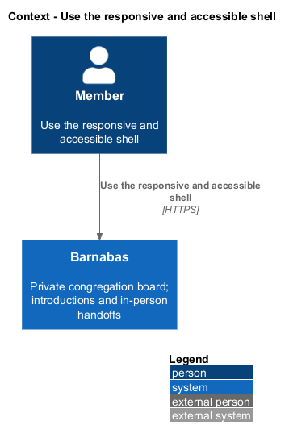
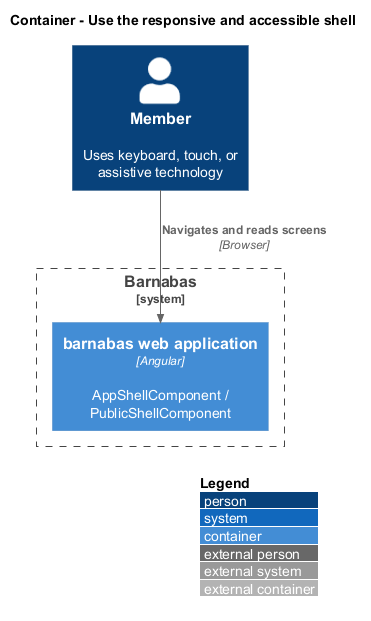

# Use the responsive and accessible shell

## Overview

Barnabas is a private board where church congregation members offer goods or time through listings.

A **shell** — shared page frame containing navigation and the routed content — keeps congregation screens usable across viewport widths. A **viewport band** — width range beginning at 576, 768, 992, or 1200 CSS pixels, plus widths below 576 — defines the five layouts under acceptance.

Keyboard, touch, and assistive-technology access apply to every screen and its content. The shell provides common navigation and focus behaviour; each page retains responsibility for correct forms, headings, and descriptions.

## Description

**Implementation boundary: Existing shell and primitives; planned full-screen conformance and notification count.**

`AppShellComponent` and `PublicShellComponent` belong to `barnabas`, along with `PrimaryNavComponent`, `BottomNavComponent`, and `InboxChipsComponent`. The authenticated navigation uses `NAV_DESTINATIONS` in the order `Board`, `Search`, `Post`, `Inbox`, `You`. `SkipLinkComponent`, `ConfirmDialogComponent`, and `NavIconComponent` belong to `components` and import no Barnabas library or router. `PlacardComponent` belongs to `domain`. Routed pages and navigation stay in the application even when they need no API data.

`ViewportService` exposes `Band` through a signal. The existing implementation is a concrete service; the target introduces its interface and token in a colocated contract, consumed by token and bound only at the host. Component templates, styles, and classes remain separate files. Page and domain behaviour moves into services; components wire signal state and inputs/outputs to templates.

The shared styles preserve visible focus on white, cream, stone, and indigo surfaces. Acceptance measures focus contrast of at least 3:1, body text 4.5:1, and large text or boundaries 3:1. Touch targets meet 44 by 44 CSS pixels or equivalent spacing. Reduced-motion media queries remove entrance animations and nonessential transitions. A dialog traps focus, closes on Escape, and returns focus to its invoker; the skip link moves focus to the single main landmark.

Each routed screen has one first-level heading, labelled form controls, associated errors, meaningful image descriptions, and current-page navigation state. Tests inspect the five specified widths and complete keyboard paths through page objects. Notifications extend the shell with a real unread count; the current shell cannot prove that requirement while notifications are unimplemented. `L2-109` describes all five destinations on any screen, while the current public shell intentionally omits authenticated navigation. Its literal scope remains `<TO SUPPLY>` in [open decisions](../../open-decisions.md).

The existing shell renders both navigation forms and uses `inert` and `aria-hidden` on the inactive one. Exactly one primary navigation remains reachable by keyboard and assistive technology. `Band` is a TypeScript string union, represented with enumerated literals in the class view.

**Source anchors.** [app.routes.ts](../../../../frontend/projects/barnabas/src/app/app.routes.ts), [nav-destinations.ts](../../../../frontend/projects/barnabas/src/app/shell/nav-destinations.ts), [confirm-dialog.component.ts](../../../../frontend/projects/components/src/lib/confirm-dialog/confirm-dialog.component.ts).

**Acceptance verification.** [L2-108](../../../specs/L2.md#l2-108-lay-out-correctly-across-every-viewport-band): E2E AC 1, 2, 3, 4. [L2-109](../../../specs/L2.md#l2-109-keep-primary-navigation-reachable-at-every-band): E2E AC 1, 2, 3. [L2-110](../../../specs/L2.md#l2-110-meet-touch-target-sizes): E2E AC 1. [L2-111](../../../specs/L2.md#l2-111-operate-every-screen-by-keyboard): E2E AC 1, 2, 3. [L2-112](../../../specs/L2.md#l2-112-show-focus-visibly-on-every-surface): E2E AC 1, 2. [L2-113](../../../specs/L2.md#l2-113-meet-contrast-requirements): E2E AC 1, 2, 3. [L2-114](../../../specs/L2.md#l2-114-respect-reduced-motion): E2E AC 1, 2. [L2-115](../../../specs/L2.md#l2-115-expose-correct-semantics-to-assistive-technology): E2E AC 1, 2, 3, 4. The linked criteria retain their Given–When–Then wording. API acceptance uses SQL Server; E2E acceptance uses one page object per screen. New behaviour begins with its failing criterion. Design coverage does not assert an acceptance test pass.

## Requirements

The requirement text and identifiers are reproduced from [L2](../../../specs/L2.md). Each row names its [L1 parent](../../../specs/L1.md).

| L2 ID | Refines (L1) | Requirement |
|-------|--------------|-------------|
| `L2-108` | `L1-017` | Every screen shall be correct at extra small (under 576px), small (576px and above), medium (768px and above), large (992px and above), and extra large (1200px and above). |
| `L2-109` | `L1-017` | All five primary destinations shall be reachable at every viewport width. A destination shall not exist only above a breakpoint. |
| `L2-110` | `L1-017` | Every interactive control shall present a touch target of at least 44 by 44 CSS pixels, or equivalent separating space. |
| `L2-111` | `L1-017` | Every screen shall be fully operable by keyboard in a logical order, shall offer a skip link, and shall trap focus inside an open dialog. |
| `L2-112` | `L1-017` | Controls appear on white, cream, stone, and indigo fields; a focus indicator shall be visible on all of them. |
| `L2-113` | `L1-017` | Text and interface components shall meet the WCAG 2.2 AA contrast minimums against their backgrounds. |
| `L2-114` | `L1-017` | A client requesting reduced motion shall receive no entrance animation and no non- essential transition. |
| `L2-115` | `L1-017` | Every screen shall expose correct landmarks, headings, image descriptions, form labels, and current-page state to assistive technology. |

## Diagrams

The member operates the shared interface using a browser and assistive technology.

The shell renders inside the Angular application. Layout and keyboard behaviours issue no API call.

The application owns navigation and routes. Domain content composes congregation-agnostic primitives.

The class view shows the feature types, their data, and typed dependencies. Planned additions are identified in the description.

The browser changes layout without changing destination order. Layout and motion handling require no backend call.

The skip link, focus indicator, and modal focus loop support the full keyboard path. Semantic checks also apply to page content.

