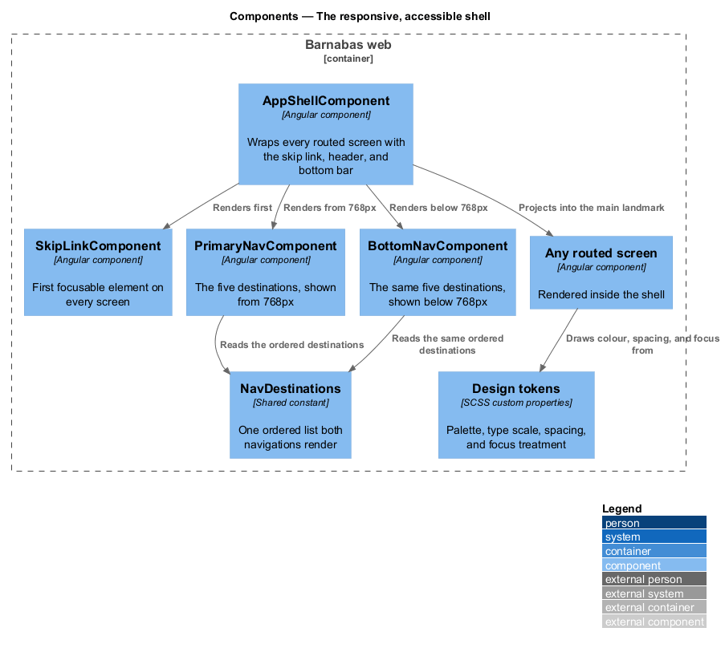
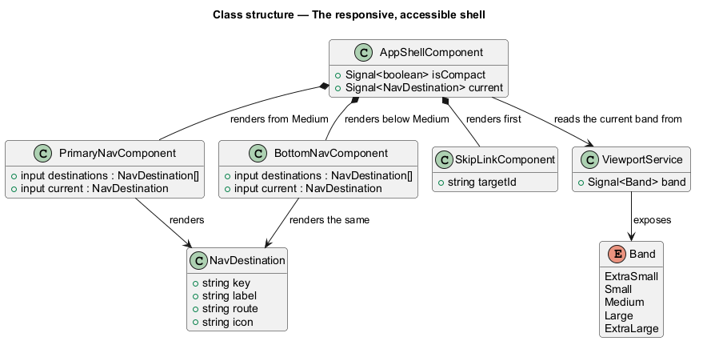
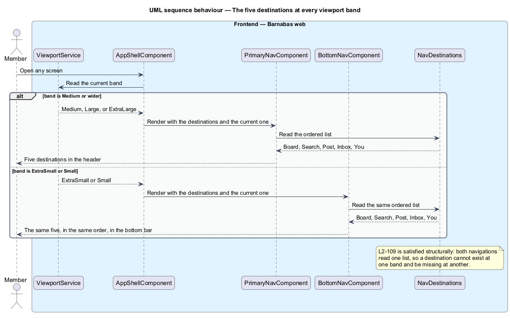
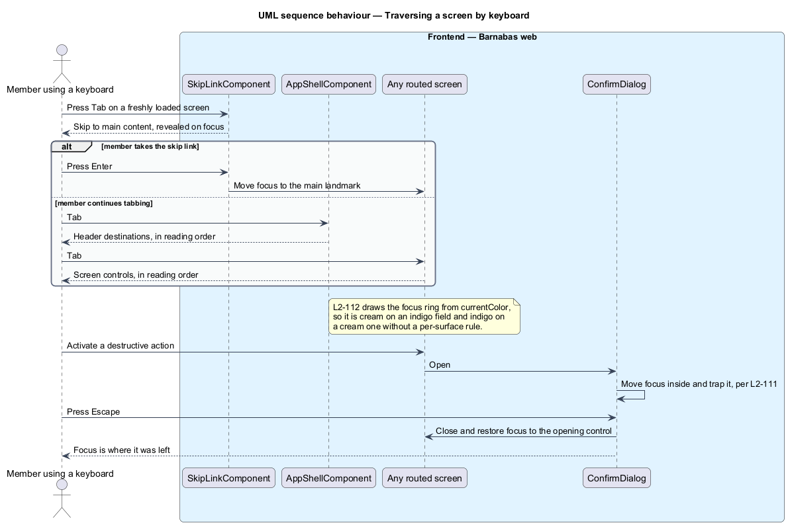

# The responsive, accessible shell

## Overview

Every screen in Barnabas is rendered inside one shell: a skip link, a header carrying the
five primary destinations, the screen itself, and on narrow viewports a bottom bar carrying
those same five. The shell is where the product's responsive and accessibility obligations
are met, because it is the part every screen shares.

**band** — one of the five viewport widths the interface is required to be correct at:
extra small below 576px, small from 576px, medium from 768px, large from 992px, extra large
from 1200px

The congregation this serves runs to eighty, and its own help tags include tech support for
phones and printers. That is the reason the shell is designed rather than assembled per
screen: a destination that exists on a desktop header and vanishes on a phone is not a
layout quirk, it is a member who cannot reach their listings.

The five destinations are therefore rendered from a single ordered list by both
navigations. Keeping them identical is a structural property rather than a discipline
anyone has to maintain.

## Description

The shell is a small set of Angular components with no business logic. Template, styles,
and class occupy separate files, and state is held in signals.

- **`AppShellComponent`** — wraps every routed screen. It renders the skip link first, then
  the header, then projects the screen into the `main` landmark, then the bottom bar on
  narrow viewports.
- **`SkipLinkComponent`** — the first focusable element on every screen, positioned off
  canvas and revealed on focus.
- **`NavDestinations`** — one ordered constant naming the five destinations: `Board`,
  `Search`, `Post`, `Inbox`, `You`. Both navigations read it.
- **`PrimaryNavComponent`** — renders the destinations in the header from the medium band
  upward, marking the current one.
- **`BottomNavComponent`** — renders the same destinations, in the same order, below the
  medium band.
- **`ViewportService`** — exposes the current `Band` as a signal, so components react to
  width without each subscribing to a media query.
- **Design tokens** — SCSS custom properties carrying the palette, type scale, spacing, and
  focus treatment.

The focus indicator is drawn from `currentColor` rather than a fixed colour. Controls appear
on white, cream, stone, and indigo fields, and `currentColor` resolves to the ink of
whichever field a control sits on — cream on indigo, indigo on cream. One rule covers four
surfaces, and a new field colour inherits it.

Motion is confined to one orchestrated reveal on the board and to state changes. Everything
is suppressed under `prefers-reduced-motion`, declared once in the shell's stylesheet rather
than per animation.

## Requirements

The feature realizes the following level-2 (L2) requirements. Each L2
requirement refines a level-1 (L1) requirement, cited by identifier. The
**Slice** column marks the requirements implemented by feature slice 1; the
remainder are designed here and implemented in a later slice.

| L2 ID | Refines (L1) | Slice | Requirement |
|-------|--------------|-------|-------------|
| `L2-108` | `L1-017` | 1 | Every screen shall be correct at extra small (under 576px), small (576px and above), medium (768px and above), large (992px and above), and extra large (1200px and above). |
| `L2-109` | `L1-017` | 1 | All five primary destinations shall be reachable at every viewport width. A destination shall not exist only above a breakpoint. |
| `L2-110` | `L1-017` | &mdash; | Every interactive control shall present a touch target of at least 44 by 44 CSS pixels, or equivalent separating space. |
| `L2-111` | `L1-017` | 1 | Every screen shall be fully operable by keyboard in a logical order, shall offer a skip link, and shall trap focus inside an open dialog. |
| `L2-112` | `L1-017` | 1 | Controls appear on white, cream, stone, and indigo fields; a focus indicator shall be visible on all of them. |
| `L2-113` | `L1-017` | &mdash; | Text and interface components shall meet the WCAG 2.2 AA contrast minimums against their backgrounds. |
| `L2-114` | `L1-017` | &mdash; | A client requesting reduced motion shall receive no entrance animation and no non- essential transition. |
| `L2-115` | `L1-017` | &mdash; | Every screen shall expose correct landmarks, headings, image descriptions, form labels, and current-page state to assistive technology. |

## Diagrams

### Components

Both navigations read one ordered list of destinations. The shell chooses which to render
from the current band; neither knows anything the other does not.

### Class structure

`AppShellComponent` composes the skip link and the two navigations, and reads the band from
`ViewportService` as a signal.

### Behaviour — the five destinations at every band

Above and below the medium band the shell renders a different component, but both read the
same list. `L2-109` is met structurally rather than by remembering to keep two lists in
step.

### Behaviour — traversing a screen by keyboard

The skip link is the first stop, focus order follows reading order, and a dialog traps focus
and returns it to the control that opened it. `L2-112` is satisfied by taking the focus ring
from `currentColor`, which resolves correctly on all four field colours.

