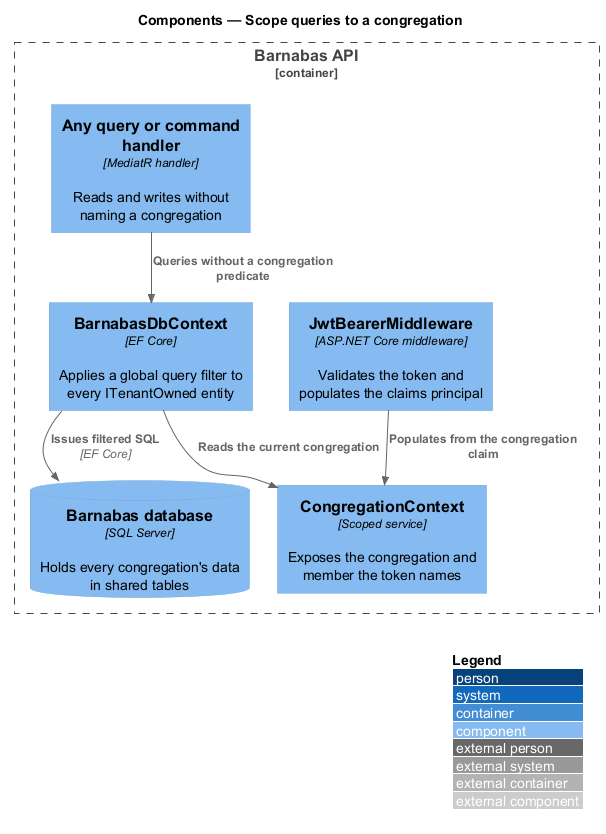
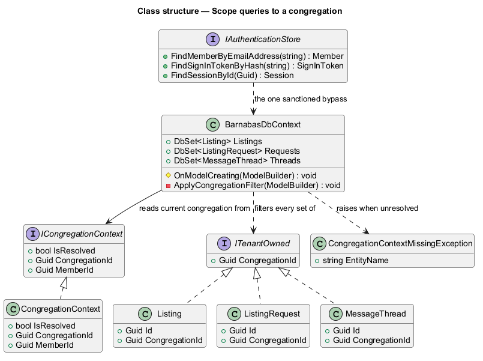
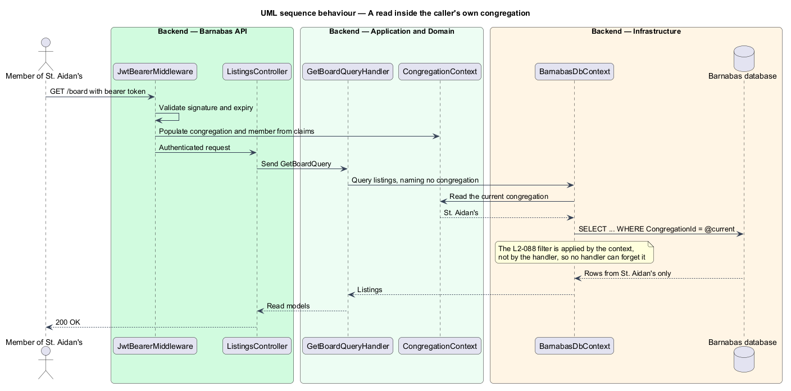
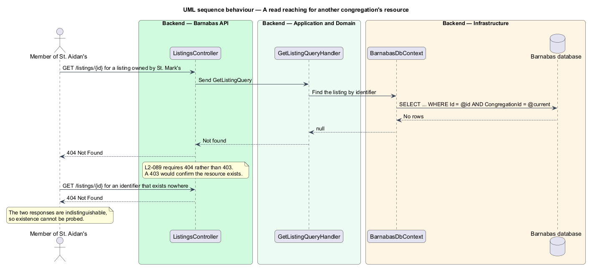
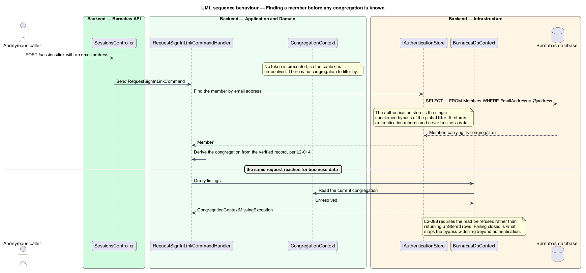

# Scope queries to a congregation

## Overview

Barnabas serves many congregations from one deployment. A congregation is a parish whose
members lend, give, sell, and offer help to one another; nothing it holds is visible to
another congregation.

**tenant** — one congregation, and the boundary around everything its members can reach

Every listing, request, thread, notification, and member belongs to exactly one tenant.
Enforcing that on each query individually would work until the first handler forgot, and a
handler that forgets leaks one parish's data into another's board. This feature places the
boundary underneath every query instead, so a handler cannot opt out of it.

Two behaviours follow. A read inside the caller's own congregation succeeds without the
handler ever naming a congregation. A read reaching for another congregation's resource
returns 404, not 403 — a 403 would confirm the resource exists, which is itself a
disclosure.

## Description

The mechanism spans the request pipeline and the persistence layer.

- **`JwtBearerMiddleware`** — ASP.NET Core authentication middleware. It validates the
  token and places its claims on the principal. The congregation identifier is a signed
  claim, so a caller cannot alter it without invalidating the signature.
- **`ICongregationContext`** — the abstraction the persistence layer depends on. It exposes
  the congregation and member the current token names.
- **`CongregationContext`** — scoped implementation reading those values from the claims
  principal, registered per request.
- **`ITenantOwned`** — marker interface carrying `CongregationId`, implemented by every
  entity that belongs to a congregation.
- **`BarnabasDbContext`** — applies an EF Core global query filter to every `ITenantOwned`
  entity in `OnModelCreating`, comparing `CongregationId` against `ICongregationContext`.
  The filter is added by reflection over the model rather than entity by entity, so a new
  entity is covered the moment it implements the interface.

A handler writes `Listings.Where(l => l.Status == Active)` and receives only its own
congregation's rows. There is no `WithCongregation()` call for a handler to omit, which is
the point: the safe path is the only path.

On write, `SaveChanges` stamps `CongregationId` from the same context, so a caller cannot
create a row in another congregation by supplying an identifier.

**Before a congregation is known.** Signing in is anonymous: a member is found by email
address, and only the resulting record says which congregation they belong to. A filter
keyed on a token that does not yet exist cannot serve that lookup, so two rules make the
gap explicit rather than incidental.

- **`IAuthenticationStore`** — a deliberately narrow repository exposing lookup by email
  address, by sign-in token hash, and by session identifier. It is the single sanctioned
  bypass of the global filter, and it returns authentication records rather than business
  data. Keeping it narrow is what stops the bypass widening: there is no method on it that
  returns a listing, a request, or a thread.
- **An unresolved context fails closed.** `ICongregationContext` exposes `IsResolved`, and
  `BarnabasDbContext` raises `CongregationContextMissingException` rather than querying an
  `ITenantOwned` set when no congregation is in scope. The alternative — treating an absent
  congregation as "no filter" — would turn every anonymous endpoint into a cross-tenant
  read.

The congregation is taken from the verified member record and never from anything the
caller supplied, so possession of a mailbox determines both who the member is and which
congregation they may see.

## Requirements

The feature realizes the following level-2 (L2) requirements. Each L2
requirement refines a level-1 (L1) requirement, cited by identifier. The
**Slice** column marks the requirements implemented by feature slice 1; the
remainder are designed here and implemented in a later slice.

| L2 ID | Refines (L1) | Slice | Requirement |
|-------|--------------|-------|-------------|
| `L2-088` | `L1-014` | 1 | Every query for listings, members, requests, threads, notifications, and directory entries shall be constrained to the congregation carried in the actor's token. |
| `L2-089` | `L1-014` | 1 | A member requesting a resource belonging to another congregation shall receive 404, never 403, so that the resource's existence is not disclosed. |
| `L2-091` | `L1-014` | &mdash; | Every write shall be constrained to the congregation carried in the actor's token. |
| `L2-092` | `L1-014` | &mdash; | A moderator's authority shall extend only to the congregation that granted the role. |

## Diagrams

### Components

The congregation travels from a signed token claim into a scoped context, and the database
context reads it when building every query. No handler participates in the decision.

### Class structure

`BarnabasDbContext` depends on `ICongregationContext` and filters every entity implementing
`ITenantOwned`. Adding an entity to the model is enough to bring it under the filter.
`IAuthenticationStore` sits beside it as the one sanctioned bypass, narrow enough that no
business data can be reached through it.

### Behaviour — a read inside the caller's own congregation

The handler queries without naming a congregation. The filter supplies the predicate,
satisfying `L2-088` in a place no handler can bypass.

### Behaviour — a read reaching for another congregation

The filter removes the row before the handler sees it, so the handler's own not-found path
produces the 404 that `L2-089` requires. The response is identical to one for an identifier
that exists nowhere, which is what makes existence unprobeable.

### Behaviour — finding a member before any congregation is known

Signing in has no token and therefore no congregation, so the member lookup goes through
`IAuthenticationStore` rather than the filtered context. The second half shows the same
request refused when it reaches for business data, which is what `L2-088` requires of an
unresolved context.

