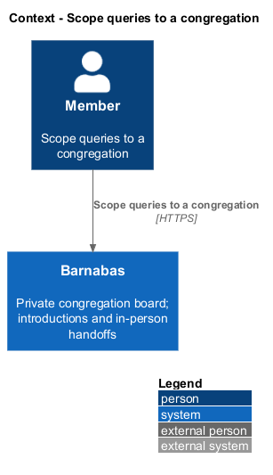
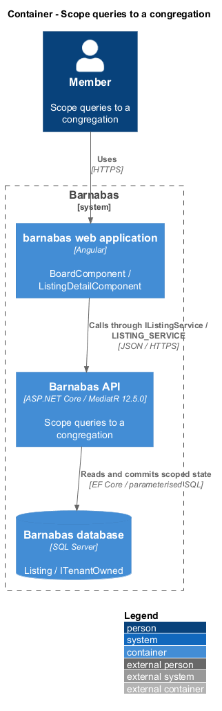

# Scope queries to a congregation

## Overview

Barnabas is a private board where church congregation members offer goods or time through listings.

A **congregation** — church community whose members share one private board — defines the data boundary. A member of one congregation cannot read or change another congregation's listings, requests, messages, or members.

A foreign resource and an absent resource both return 404. The same boundary applies when an owner or moderator writes, and before a collection is searched or paged.

## Description

**Implementation boundary: Existing filtered accessors; planned write guards and new-feature scoping.**

`CongregationContext` implements `ICongregationContext` using verified JWT claims. `BarnabasDbContext` guards its scoped set accessors with `IsResolved`; an absent context raises `CongregationContextMissingException`. Its model-building pass applies global filters to non-owned entities with a `CongregationId` property. Existing domain entities express tenant ownership with `ITenantOwned`. Owned message and read-mark rows are reached through their parent thread.

The filter compares a context-instance property, avoiding a congregation value frozen into the shared EF model. `SaveChangesAsync` overwrites the congregation on added rows when context is resolved. It does not check modified/deleted rows or stamp owners. Handlers currently load filtered entities before updates, and creation handlers assign the owner from the session. The target additionally checks tracked original/current congregation values on update/delete and refuses unresolved business writes. Bulk SQL operations supply explicit predicates because query filters and stamping do not cover raw SQL.

`IAuthenticationStore` is an existing narrow, deliberately unfiltered authentication path. It returns member, token, and session records, not listings, requests, or threads. The planned `IInvitationStore` similarly supports anonymous code redemption and a server-bound joining capability; it does not accept caller-selected congregation identifiers. Provisioning operates through an explicitly administrator-scoped handler. `Congregations` itself is currently unfiltered, so member-facing configuration queries filter its identifier explicitly.

The handler's ordinary not-found path handles a foreign identifier before ownership checks can disclose it. Moderator operations validate the requested congregation against the current member's granting congregation. Planned notifications, reports, exports, directories, image reads, and search retain the same scoping. Feature stores remain separate from deployment-wide administration. The target data model uses scoped foreign keys or equivalent transactional relationship checks for new tenant-owned references; a globally unique identifier alone does not establish tenant ownership.

**Source anchors.** [BarnabasDbContext.cs](../../../../backend/src/Barnabas.Infrastructure/Persistence/BarnabasDbContext.cs), [AuthenticationStore.cs](../../../../backend/src/Barnabas.Infrastructure/Persistence/AuthenticationStore.cs).

**Acceptance verification.** [L2-088](../../../specs/L2.md#l2-088-scope-every-read-to-the-actors-congregation): API AC 1, 2, 3, 4. [L2-089](../../../specs/L2.md#l2-089-return-not-found-for-cross-congregation-access): API AC 1, 2, 3. [L2-091](../../../specs/L2.md#l2-091-scope-writes-to-the-actors-congregation): API AC 1, 2. [L2-092](../../../specs/L2.md#l2-092-scope-moderator-authority-to-the-granting-congregation): API AC 1, 2. The linked criteria retain their Given–When–Then wording. API acceptance uses SQL Server; E2E acceptance uses one page object per screen. New behaviour begins with its failing criterion. Design coverage does not assert an acceptance test pass.

## Requirements

The requirement text and identifiers are reproduced from [L2](../../../specs/L2.md). Each row names its [L1 parent](../../../specs/L1.md).

| L2 ID | Refines (L1) | Requirement |
|-------|--------------|-------------|
| `L2-088` | `L1-014` | Every query for listings, members, requests, threads, notifications, and directory entries shall be constrained to the congregation carried in the actor's token. |
| `L2-089` | `L1-014` | A member requesting a resource belonging to another congregation shall receive 404, never 403, so that the resource's existence is not disclosed. |
| `L2-091` | `L1-014` | Every write shall be constrained to the congregation carried in the actor's token. |
| `L2-092` | `L1-014` | A moderator's authority shall extend only to the congregation that granted the role. |

## Diagrams

The context identifies the actor and the Barnabas capability. Congregation boundaries also apply to linked resources.

The container view places the Angular client, .NET API, and SQL Server persistence around this capability.

The component view separates screen composition, API dispatch, application behaviour, domain rules, and persistence.

The class view shows the feature types, their data, and typed dependencies. Planned additions are identified in the description.

An ordinary query receives a congregation predicate from the persistence context.

Filtered absence produces the same 404 for foreign and nonexistent resources.

Anonymous authentication uses a narrow store. An unresolved business-data query fails closed.

