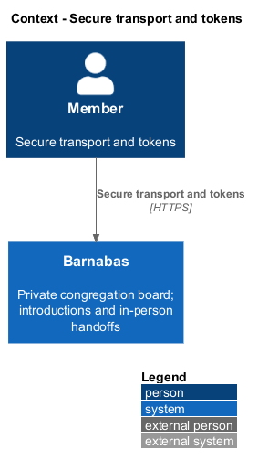
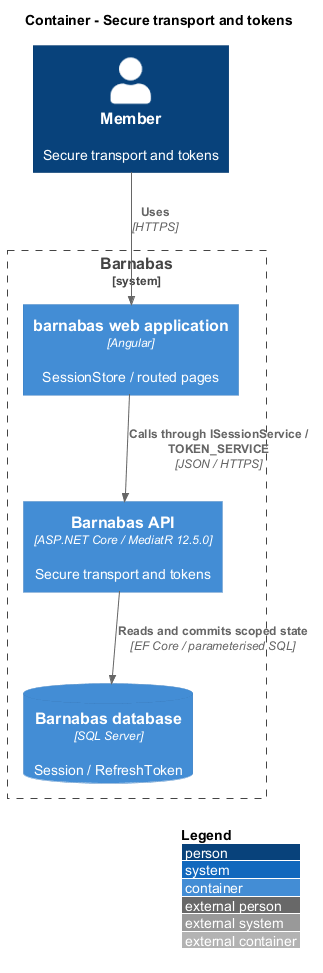
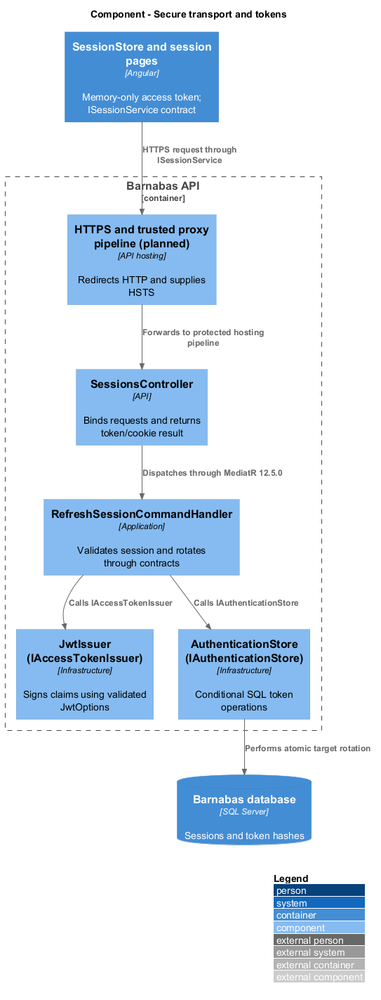
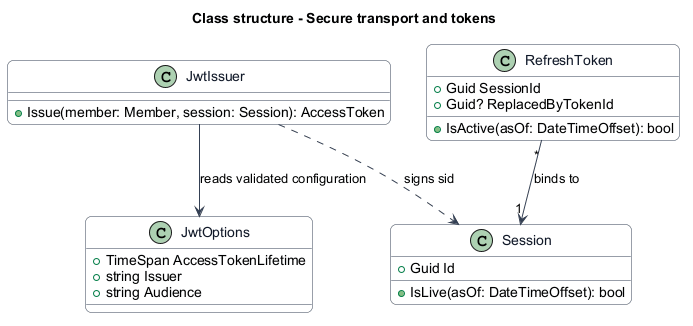
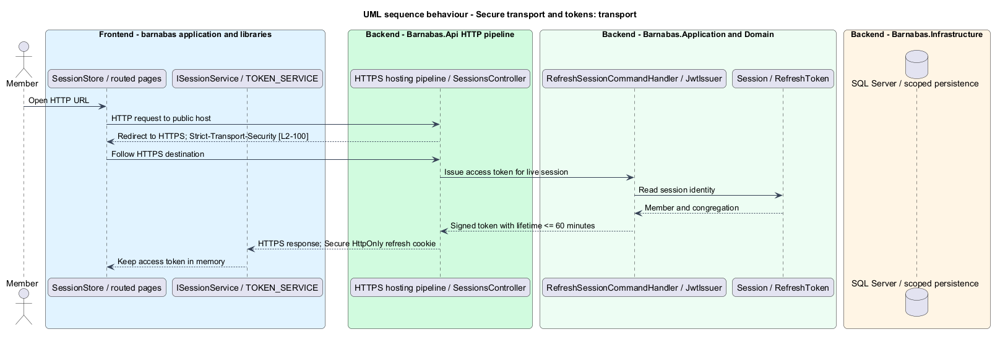
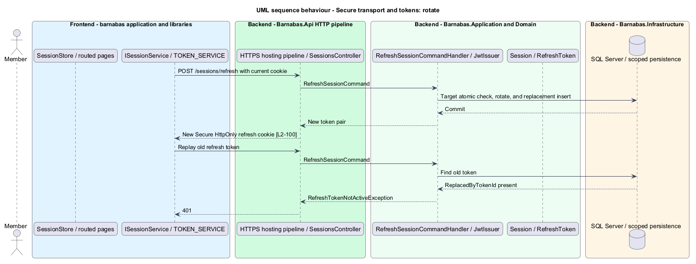

# Secure transport and tokens

## Overview

Barnabas is a private board where church congregation members offer goods or time through listings.

**Secure transport** — HTTPS for browser and API traffic — protects congregation data in transit. An **access token** — short-lived signed JWT identifying a member, congregation, role, and session — authorises protected requests while the session remains live.

Refresh tokens rotate on use. A replaced token cannot renew the session again.

## Description

**Implementation boundary: Existing JWT/cookies; planned production HTTPS and Options validation.**

`JwtOptions.AccessTokenLifetime` currently defaults to 15 minutes. `JwtIssuer` signs member, congregation, role, and session claims; `SessionValidator` checks the referenced session on each request. `SessionsController` returns access-token data and sets an HttpOnly, SameSite Strict refresh cookie. `SessionStore` keeps access tokens in a signal rather than browser persistent storage. Secure cookie configuration is already available, but startup validation of an upper lifetime bound is planned.

The target rejects startup configuration with an access-token lifetime over 60 minutes or a nonpositive lifetime. It validates signing configuration through Options and loads production keys through deployment configuration without writing them into source or telemetry. The secret source and key-rotation procedure remain `<TO SUPPLY>`.

`Program.cs` currently has neither HTTPS redirection nor HSTS middleware. The target places trusted forwarded-header handling before HTTPS evaluation when a configured reverse proxy terminates TLS. The host redirects HTTP to HTTPS and supplies Strict-Transport-Security on secure responses; the acceptance criterion also inspects the HTTP redirect response, so the host includes the header there while browsers enforce HSTS only on HTTPS. Proxy trust, public host, and HSTS policy remain `<TO SUPPLY>`.

Production cookie settings require Secure and a constrained same-site host arrangement. Sign-in and refresh endpoints avoid unsafe automatic retries; the refresh interceptor shares one in-flight rotation. The [session design](../../access/end-a-session/README.md) specifies atomic rotation, old-token rejection, and session revocation. Transport acceptance runs against the actual hosting boundary, rather than treating an in-memory HTTP test server as proof of TLS deployment.

**Source anchors.** [Program.cs](../../../../backend/src/Barnabas.Api/Program.cs), [JwtOptions.cs](../../../../backend/src/Barnabas.Infrastructure/Security/JwtOptions.cs), [SessionsController.cs](../../../../backend/src/Barnabas.Api/Controllers/SessionsController.cs).

**Acceptance verification.** [L2-100](../../../specs/L2.md#l2-100-secure-transport-and-tokens): API AC 1, 2, 3. The linked criteria retain their Given–When–Then wording. API acceptance uses SQL Server; E2E acceptance uses one page object per screen. New behaviour begins with its failing criterion. Design coverage does not assert an acceptance test pass.

## Requirements

The requirement text and identifiers are reproduced from [L2](../../../specs/L2.md). Each row names its [L1 parent](../../../specs/L1.md).

| L2 ID | Refines (L1) | Requirement |
|-------|--------------|-------------|
| `L2-100` | `L1-015` | Traffic shall be carried over HTTPS, access tokens shall be short-lived, and refresh tokens shall be rotated on use. |

## Diagrams

The context identifies the actor and the Barnabas capability. Congregation boundaries also apply to linked resources.

The container view places the Angular client, .NET API, and SQL Server persistence around this capability.

The component view separates screen composition, API dispatch, application behaviour, domain rules, and persistence.

The class view shows the feature types, their data, and typed dependencies. Planned additions are identified in the description.

The deployment host redirects HTTP and enforces a bounded access lifetime.

Conditional rotation accepts a refresh token once and rejects the previous value on reuse.

