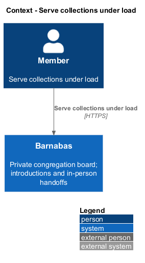
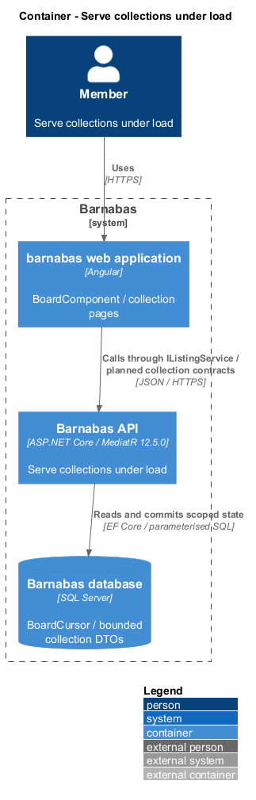
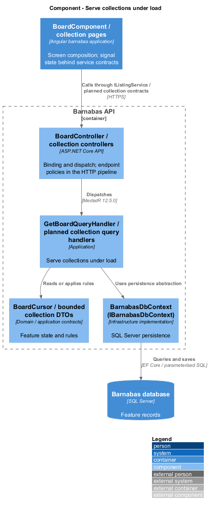
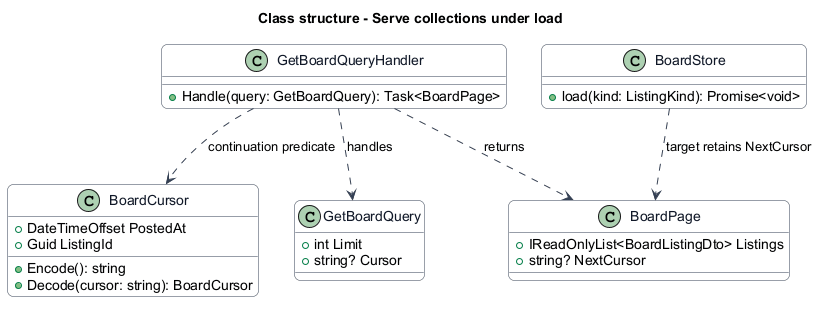
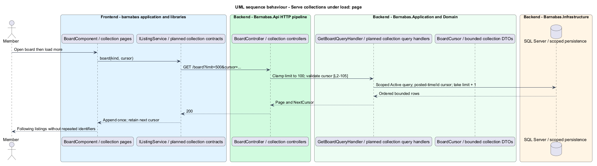
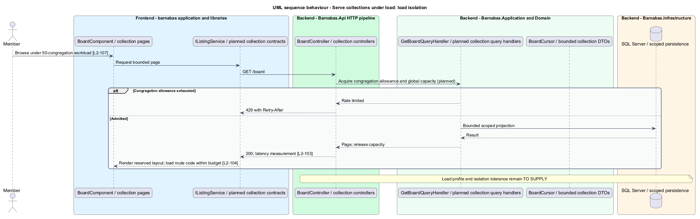

# Serve collections under load

## Overview

Barnabas is a private board where church congregation members offer goods or time through listings.

A **cursor page** — bounded segment of a collection continued from a stable ordering key — keeps boards, search, directories, requests, notifications, and threads usable as congregations grow. A **95th-percentile response time** — duration below which 95 percent of measured requests complete — expresses the API performance targets.

The member sees responsive pages without duplicate continuation rows. Work from one congregation is bounded so other congregations remain responsive.

## Description

**Implementation boundary: Existing board cursor; planned full paging, budgets, and measured isolation.**

`BoardController` currently defaults to 24 rows. `GetBoardQueryHandler` orders by descending `PostedAt` and listing identifier, fetches one extra row, and returns `BoardPage.NextCursor`. `BoardCursor` encodes timestamp and identifier. `GetBoardQueryValidator` currently rejects limits above 100, which conflicts with `L2-105` requiring clamping. `BoardStore` currently discards continuation. Requests and threads are unbounded, and route components are eagerly imported.

The target keeps the default 24 and documents 100 as the maximum. Oversized requested limits clamp before validation; nonpositive limits return 400. The cursor parser validates base64, timestamp range, and identifier and returns a field-named 400 for malformed tokens. It never trusts a cursor to select a congregation. New collection cursors also bind the sort/filter shape, and clients reset them when filters change. Stable descending keys yield no repeats during ordinary paging or intervening new inserts; this does not claim snapshot completeness during concurrent deletion.

`IListingService.board` already accepts a cursor. The target `BoardStore` retains `NextCursor`, appends only the requested next page, prevents concurrent duplicate continuation, and ignores superseded responses. The same bounded contract extends search, directory, own listings, requests, notifications, and thread messages. Message read positions advance only through returned content. SQL projections select needed fields and latest-message summaries; candidate indexes lead with congregation and predicate/order columns. SQL Server query plans and measured workloads determine the final indexes, not an assumed latency benefit.

At 500 listings, API p95 targets are under 300 ms for the board and under 500 ms for search and writes. The same targets apply across 50 active congregations. The target uses bounded per-congregation request admission and a shared global cap, cancellable queries, bounded SQL connection use, and no unbounded in-process task queues. Aggregate capacity is reserved across tenants so one congregation cannot occupy every slot. Limits and the meaning of unaffected latency under heavy load remain `<TO SUPPLY>` until the load profile is specified.

The client lazy-loads routes, budgets compressed initial JavaScript below 300 KB on every screen, reserves image dimensions, and avoids loading all collection rows. Board acceptance measures LCP within 2.5 seconds on simulated 4G and CLS below 0.1. Fixtures use SQL Server and representative cold/warm runs. Nominal load, concurrency, duration, hardware, cache state, and cross-congregation tolerance remain explicit [open decisions](../../open-decisions.md). No benchmark pass is claimed by this document.

**Source anchors.** [BoardCursor.cs](../../../../backend/src/Barnabas.Application/Board/GetBoard/BoardCursor.cs), [GetBoardQueryValidator.cs](../../../../backend/src/Barnabas.Application/Board/GetBoard/GetBoardQueryValidator.cs), [board.store.ts](../../../../frontend/projects/domain/src/lib/board/board.store.ts), [app.routes.ts](../../../../frontend/projects/barnabas/src/app/app.routes.ts).

**Acceptance verification.** [L2-103](../../../specs/L2.md#l2-103-meet-api-response-time-targets): API AC 1, 2, 3. [L2-104](../../../specs/L2.md#l2-104-meet-page-weight-and-paint-targets): E2E AC 1, 2, 3. [L2-105](../../../specs/L2.md#l2-105-paginate-long-collections): API AC 1, 2, 3. [L2-107](../../../specs/L2.md#l2-107-sustain-many-congregations-concurrently): API AC 1, 2. The linked criteria retain their Given–When–Then wording. API acceptance uses SQL Server; E2E acceptance uses one page object per screen. New behaviour begins with its failing criterion. Design coverage does not assert an acceptance test pass.

## Requirements

The requirement text and identifiers are reproduced from [L2](../../../specs/L2.md). Each row names its [L1 parent](../../../specs/L1.md).

| L2 ID | Refines (L1) | Requirement |
|-------|--------------|-------------|
| `L2-103` | `L1-016` | The API shall meet stated 95th-percentile response times at the scale of a congregation. |
| `L2-104` | `L1-016` | The web client shall meet stated paint, layout-stability, and transfer-size targets. |
| `L2-105` | `L1-016` | A long collection shall be returned in bounded pages, each carrying a cursor for the next. |
| `L2-107` | `L1-016` | Response time targets shall continue to hold with many congregations active, and load in one congregation shall not degrade another. |

## Diagrams

The context identifies the actor and the Barnabas capability. Congregation boundaries also apply to linked resources.

The container view places the Angular client, .NET API, and SQL Server persistence around this capability.

The component view separates screen composition, API dispatch, application behaviour, domain rules, and persistence.

The class view shows the feature types, their data, and typed dependencies. Planned additions are identified in the description.

The target clamps oversized limits and carries a stable cursor to the next bounded result.

Bounded admission keeps one congregation from consuming all request capacity. Performance remains a measured property.

