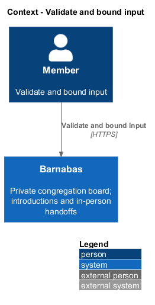
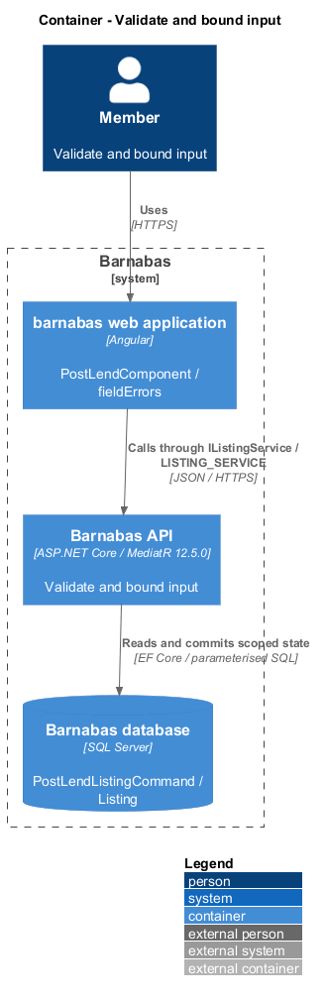

# Validate and bound input

## Overview

Barnabas is a private board where church congregation members offer goods or time through listings.

A **validation bound** — permitted type, length, or range for an input field — prevents malformed data from reaching a feature handler. Errors identify fields without repeating their submitted values.

An unknown field is ignored. A forbidden field is explicitly rejected, such as a price on a Lend listing. This distinction preserves the separate listing kinds.

## Description

**Implementation boundary: Existing validation pipeline; planned streaming and full binding-error hardening.**

`RequestBodyLimitMiddleware` and Kestrel currently cap bodies at `1024 * 1024` bytes. `ForbiddenFieldInspector` is an API resource filter running before model binding. It discovers static `IForbidFields.ForbiddenFields` on bound action-parameter types and inspects the buffered JSON object using case-insensitive names. If a controller binds a request DTO and constructs a command, the bound DTO also declares the forbidden fields.

`ValidationBehaviour<TRequest,TResponse>` resolves FluentValidation validators in `Application` and runs them before `AuthorisationBehaviour` and the handler. `PostLendListingCommandValidator` and `MakeLoanRequestCommandValidator` are existing examples. Domain invariants remain on entities; listing title and description constants already live on `Listing` and validators reference them. `ProblemDetailsExceptionHandler` maps validation exceptions to field-keyed 400 responses. The client maps errors through `problemDetailsInterceptor` and `fieldErrors`.

The target covers malformed JSON, field type conversion, null and nested values, unknown names, and forbidden names consistently without echoing payload values. The existing raw-field filter skips a body with unknown content length; the target streaming inspection closes that path and enforces actual bytes for chunked bodies. Syntax failure never enters the handler. Database limits remain aligned with application bounds, while SQL errors are not presented as member input values.

`L2-032` accepts a 2 MB image while `L2-096` rejects bodies above 1 MB. The intended multipart image exception and its bound remain `<TO SUPPLY>` pending specification reconciliation in [open decisions](../../open-decisions.md). The design does not present an upload route as already compatible with the global limit.

**Source anchors.** [ForbiddenFieldInspector.cs](../../../../backend/src/Barnabas.Api/Filters/ForbiddenFieldInspector.cs), [RequestBodyLimitMiddleware.cs](../../../../backend/src/Barnabas.Api/Middleware/RequestBodyLimitMiddleware.cs), [ValidationBehaviour.cs](../../../../backend/src/Barnabas.Application/Common/Behaviours/ValidationBehaviour.cs).

**Acceptance verification.** [L2-096](../../../specs/L2.md#l2-096-validate-and-bound-all-input): API AC 1, 2, 3, 4, 5. The linked criteria retain their Given–When–Then wording. API acceptance uses SQL Server; E2E acceptance uses one page object per screen. New behaviour begins with its failing criterion. Design coverage does not assert an acceptance test pass.

## Requirements

The requirement text and identifiers are reproduced from [L2](../../../specs/L2.md). Each row names its [L1 parent](../../../specs/L1.md).

| L2 ID | Refines (L1) | Requirement |
|-------|--------------|-------------|
| `L2-096` | `L1-015` | Every field accepted by the API shall be validated for type, length, and range, and rejected with a message naming the field rather than echoing the value. A field a command explicitly forbids shall be rejected rather than ignored; a field the command merely does not recognise shall be ignored. |

## Diagrams

The context identifies the actor and the Barnabas capability. Congregation boundaries also apply to linked resources.

The container view places the Angular client, .NET API, and SQL Server persistence around this capability.

The component view separates screen composition, API dispatch, application behaviour, domain rules, and persistence.

The class view shows the feature types, their data, and typed dependencies. Planned additions are identified in the description.

The validator stops a bounded-field failure before a handler can persist it.

Raw-field inspection rejects a declared prohibition before binding can discard it. Unknown fields remain ignored.

