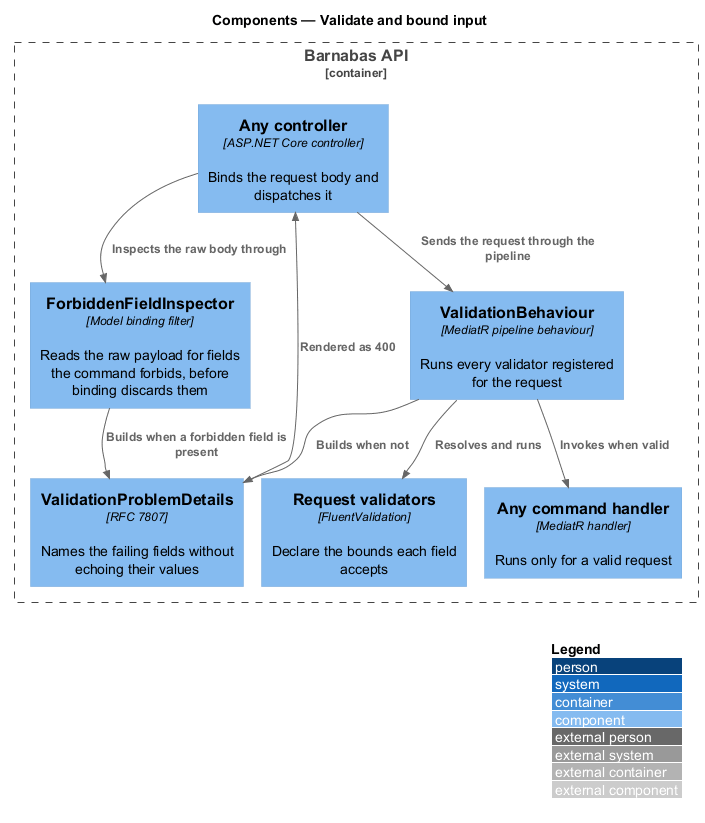
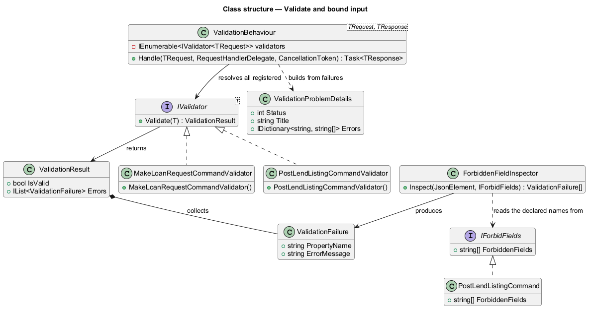
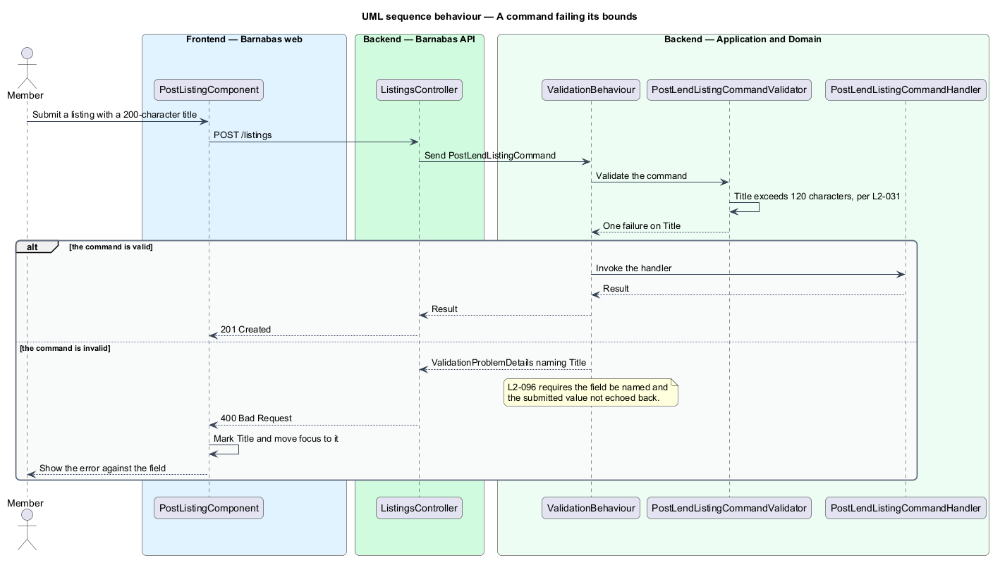
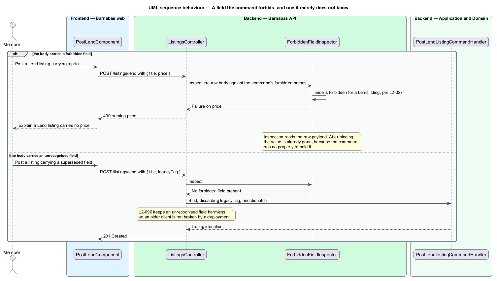

# Validate and bound input

## Overview

Every field the API accepts arrives from outside and is untrusted until checked. Validation
establishes that a request is well formed before any handler acts on it, and reports what
was wrong in terms the member can act on.

**bound** — the range, length, or shape a field accepts, stated once and enforced in one place

Validation runs as a pipeline stage rather than at the top of each handler. A handler that
validates its own input is a handler that can forget to, and the failure mode is silent:
malformed data reaches the domain and either throws somewhere less helpful or persists.
Running validation ahead of the handler means a handler that is reached has already been
given a well-formed request, and can be written as though its input is sound.

Errors name the field at fault and never echo the submitted value. Echoing is how a
validation message becomes a reflection vector, and the member already knows what they
typed.

## Description

One pipeline stage and one validator per request type.

- **`ValidationBehaviour<TRequest, TResponse>`** — MediatR pipeline behaviour. It resolves
  every `IValidator<TRequest>` registered for the request, runs them, and either invokes
  the handler or builds a failure. It runs before `AuthorisationBehaviour`, so a request
  that is both malformed and unauthorised is reported as malformed; that ordering discloses
  nothing, because a caller learns only about their own input.
- **`IValidator<T>`** and the per-request validators — FluentValidation classes declaring
  the bounds of each field. `PostLendListingCommandValidator` holds the title and
  description limits; `MakeLoanRequestCommandValidator` holds the return-date rule. One
  validator per request type, one file per type.
- **`ValidationFailure`** — a field name and a message, produced per broken rule.
- **`ValidationProblemDetails`** — RFC 7807 payload carrying the failing field names and
  their messages, rendered as 400.

Bounds live in the validator rather than in the domain entity or the database schema,
because a bound is a statement about what the system accepts, and it needs to be reported
to a member rather than raised as an exception. The domain still enforces its own
invariants; the two are not substitutes.

**Unknown and forbidden are not the same thing.** A field the command does not recognise is
ignored, so a client sending a superseded field is not broken by a deployment. A field the
command explicitly *forbids* is rejected with 400 naming it.

The distinction is load-bearing rather than pedantic. `L2-027` requires a Lend listing
submitted with a price to be rejected, and `PostLendListingCommand` has no `Price` property
to bind one to — so if forbidden fields were merely unknown, the price would be silently
dropped and the response would be 201. The requirement would be unimplementable by
construction.

- **`IForbidFields`** — a command declares the field names that are forbidden for its kind.
  `PostLendListingCommand` and `PostGiveListingCommand` forbid `price`;
  `PostHelpListingCommand` forbids `price` and `photo`.
- **`ForbiddenFieldInspector`** — a model-binding filter reading the *raw* payload before
  deserialization discards what does not map. Inspecting after binding would be too late,
  because by then the forbidden value is gone.

Everything else unknown continues to be ignored, which is what `L2-096` asks for.

## Requirements

The feature realizes the following level-2 (L2) requirements. Each L2
requirement refines a level-1 (L1) requirement, cited by identifier. The
**Slice** column marks the requirements implemented by feature slice 1; the
remainder are designed here and implemented in a later slice.

| L2 ID | Refines (L1) | Slice | Requirement |
|-------|--------------|-------|-------------|
| `L2-096` | `L1-015` | 1 | Every field accepted by the API shall be validated for type, length, and range, and rejected with a message naming the field rather than echoing the value. A field a command explicitly forbids shall be rejected rather than ignored; a field the command merely does not recognise shall be ignored. |

## Diagrams

### Components

Two stages. `ForbiddenFieldInspector` reads the raw payload at binding time, while the fields
it rejects are still present; `ValidationBehaviour` then runs the bounds between the
controller and the handler.

### Class structure

One validator per request type, resolved by the behaviour. A command additionally declares
its forbidden field names through `IForbidFields`, which is what lets a kind reject a field
it has no property for.

### Behaviour — a command failing its bounds

The validator names the field, the behaviour stops the request before the handler, and the
screen marks the field and moves focus to it. `L2-096` requires the field be named and the
value not echoed.

### Behaviour — a forbidden field, and an unrecognised one

The two halves are the whole distinction. A price on a Lend listing is rejected by name,
which is what makes `L2-027` implementable; a field the command has never heard of is
discarded, which is what `L2-096` asks for.

