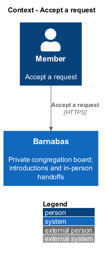
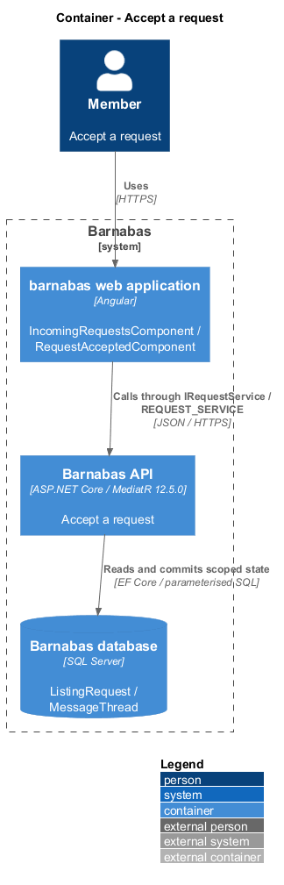
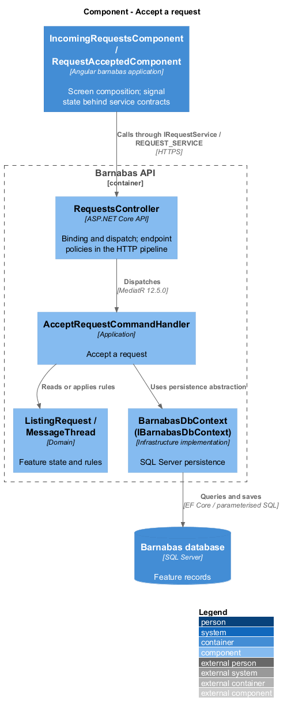
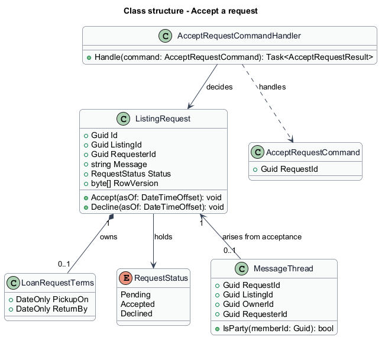
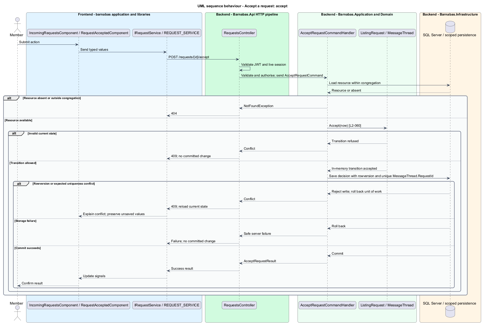

# Accept a request

## Overview

Barnabas is a private board where church congregation members offer goods or time through listings.

A **pending request** — ask awaiting the listing owner's decision — can become Accepted or Declined once. Acceptance opens a message thread for the owner and requester to arrange the handoff.

The decision belongs to the listing owner within the congregation. The confirmation names the requester and offers the new thread.

## Description

**Implementation boundary: Existing decision; planned notification integration.**

`IncomingRequestsComponent` calls `RequestStore.accept`, which consumes `IRequestService` through `REQUEST_SERVICE`. `RequestsController` dispatches `AcceptRequestCommand(RequestId)` from `POST /requests/{requestId}/accept`. The command declares `IRequireOwnership<RequestOwnership>`; `RequestOwnershipLookup` resolves ownership through the listing. Same-congregation non-owners receive 403; missing and foreign identifiers receive 404.

`AcceptRequestCommandHandler` loads `ListingRequest` and calls `Accept(asOf)`. `ListingRequest.RowVersion` is a SQL Server `byte[]` row version. The domain rejects a previously decided request through `RequestAlreadyDecidedException`, and concurrency failures return 409 through `ProblemDetailsExceptionHandler`. Error mapping belongs to that exception handler, not the controller.

The handler also loads the listing, calls `MessageThread.OpenFor`, and adds the thread before a single SaveChangesAsync. The resulting transaction commits the decision and thread together. A unique index on `MessageThread.RequestId` prevents a second thread. Accept racing decline has one successful transition and at most one thread. `AcceptRequestResult` contains `RequestId` and `ThreadId`; `RequestAcceptedComponent` offers the thread with the requester name. Acceptance does not close the listing or settle other requests.

Decision notifications are a planned addition in [receive notifications](../../notifications/receive-notifications/README.md). The target commits an enabled notification with the decision and, on acceptance, the thread. A failed save produces no notification. The current acceptance handler maps all `DbUpdateException` instances to a decision conflict; the target narrows that mapping to the expected uniqueness violation so storage outages remain server failures. Stale decisions refresh the affected inbox row and explain the conflict instead of claiming success.

**Source anchors.** [AcceptRequestCommandHandler.cs](../../../../backend/src/Barnabas.Application/Requests/AcceptRequest/AcceptRequestCommandHandler.cs), [ListingRequestConfiguration.cs](../../../../backend/src/Barnabas.Infrastructure/Persistence/Configurations/ListingRequestConfiguration.cs), [MessageThreadConfiguration.cs](../../../../backend/src/Barnabas.Infrastructure/Persistence/Configurations/MessageThreadConfiguration.cs).

**Acceptance verification.** [L2-060](../../../specs/L2.md#l2-060-accept-a-request): API AC 1, 2, 4; E2E AC 3. The linked criteria retain their Given–When–Then wording. API acceptance uses SQL Server; E2E acceptance uses one page object per screen. New behaviour begins with its failing criterion. Design coverage does not assert an acceptance test pass.

## Requirements

The requirement text and identifiers are reproduced from [L2](../../../specs/L2.md). Each row names its [L1 parent](../../../specs/L1.md).

| L2 ID | Refines (L1) | Requirement |
|-------|--------------|-------------|
| `L2-060` | `L1-009` | Accepting shall set the request to `Accepted`, open a message thread between the two members, and confirm to the owner what to do next. |

## Diagrams

The context identifies the actor and the Barnabas capability. Congregation boundaries also apply to linked resources.

The container view places the Angular client, .NET API, and SQL Server persistence around this capability.

The component view separates screen composition, API dispatch, application behaviour, domain rules, and persistence.

The class view shows the feature types, their data, and typed dependencies. Planned additions are identified in the description.

The decision and its dependent writes commit together. The request row version settles a simultaneous accept and decline.

