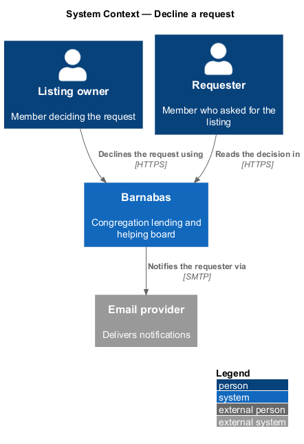
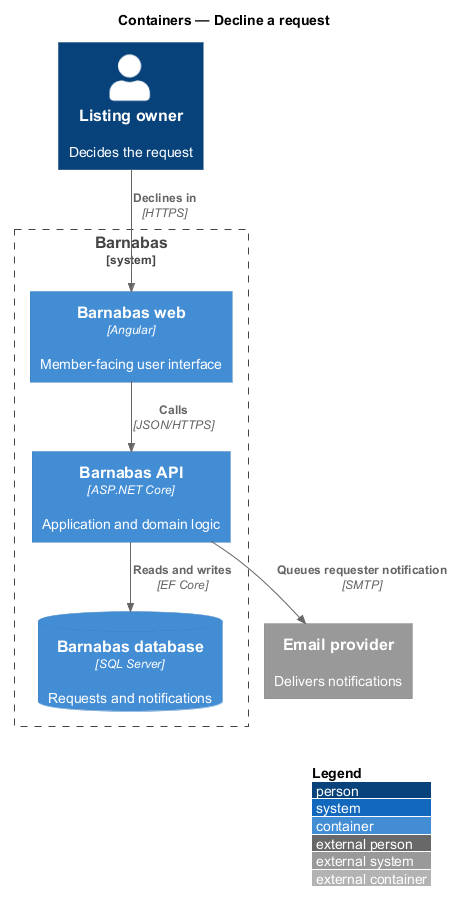
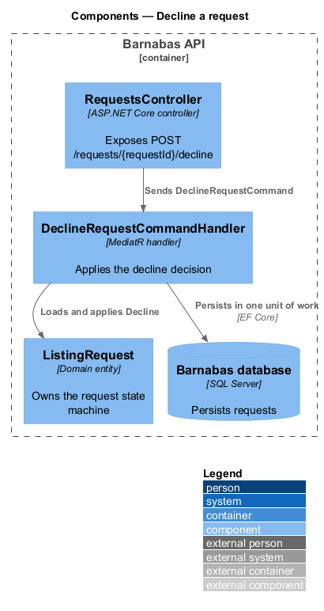
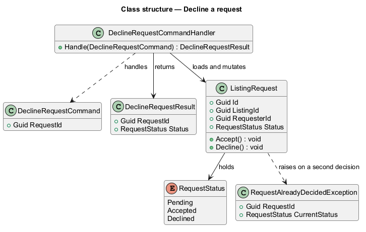
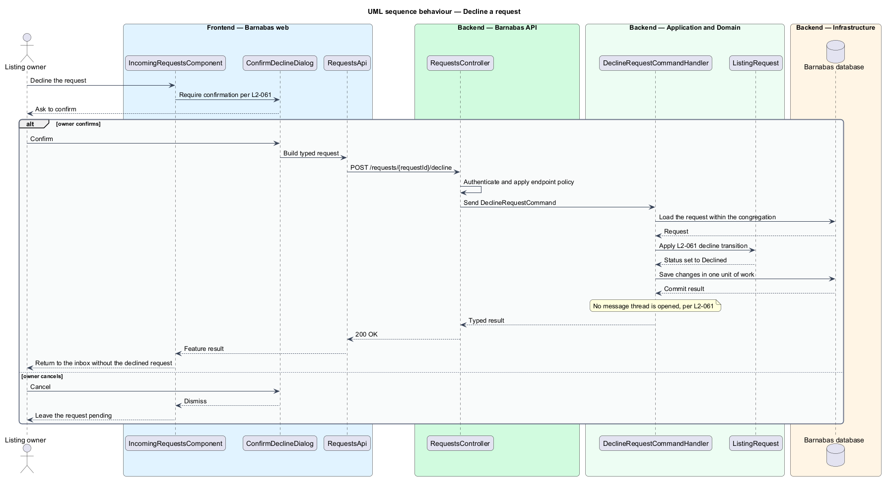

# Decline a request

## Overview

A request against a listing sits in the `Pending` state until the listing's owner decides it. This feature covers the negative decision: the owner cannot or does not wish to fulfil the ask, and records that.

Declining is a deliberate state change rather than a deletion. The request moves to `Declined` and is retained, so the requester can see what became of their ask and so a member is not left waiting on a request that will never be answered. A silently discarded request would be worse than a declined one.

Declining opens no message thread. A thread in Barnabas exists only as the consequence of an accepted request, which is what keeps every conversation attached to a listing both members agreed to discuss. A declined request creates no obligation and no follow-up task, so it needs no place to talk.

The decision requires confirmation before it is sent. A decline cannot be undone by the owner, and the requester is notified of it, so the action is separated from an accidental press.

A request is decided once. A request that already holds a decision accepts no second one.

## Description

The slice runs from the inbox screen to the database.

- **`IncomingRequestsComponent`** — Angular page component offering the decline action on each pending row, described further in the *Review incoming requests* design.
- **`ConfirmDeclineDialog`** — dialog component requiring the owner to confirm before the decision is sent. It is a native `dialog` element, so it stays closed and harmless when scripting is unavailable.
- **`IRequestsApi`** and **`RequestsApi`** — the interface the component depends on and its typed HTTP client implementation.
- **`RequestsController`** — ASP.NET Core controller exposing `POST /requests/{requestId}/decline`. It authenticates the caller, applies the endpoint policy, and dispatches the command.
- **`DeclineRequestCommand`** — request object carrying the target `RequestId`. The deciding member is taken from the session.
- **`DeclineRequestCommandHandler`** — MediatR handler holding the application logic. It loads the request within the caller's congregation, applies the decline, and commits in one unit of work.
- **`DeclineRequestResult`** — result carrying the request identifier and its resulting status.
- **`ListingRequest`** — domain entity owning the request state machine. Its `Decline()` method enforces that only a `Pending` request transitions.
- **`RequestStatus`** — enumeration of the states a request holds: `Pending`, `Accepted`, `Declined`.
- **`RequestAlreadyDecidedException`** — raised by `ListingRequest` when a decision is applied to a request that already holds one. The controller maps it to `409`.

The command carries no reason. A reason would be shown to the requester, and a member declining a neighbour's ask inside their own congregation is better served by a private message than by a recorded justification. Should a reason later prove necessary, it belongs on this command.

## Requirements

The feature realizes the following level-2 (L2) requirements. Each L2
requirement refines a level-1 (L1) requirement, cited by identifier. The
**Slice** column marks the requirements implemented by feature slice 1; the
remainder are designed here and implemented in a later slice.

| L2 ID | Refines (L1) | Slice | Requirement |
|-------|--------------|-------|-------------|
| `L2-061` | `L1-009` | 1 | Declining shall set the request to `Declined`, require confirmation, and shall not create a message thread. |

## Diagrams

### System context

The owner declines a request made by another member of the same congregation. Barnabas notifies the requester of the decision through an external email provider.

### Containers

The decision travels from the Barnabas web application to the Barnabas API, which writes the request state to the Barnabas database and queues the requester's notification.

### Components

`RequestsController` dispatches one command. `DeclineRequestCommandHandler` mutates `ListingRequest` and persists it. No thread component participates.

### Class structure

`ListingRequest` owns the transition and raises `RequestAlreadyDecidedException` on a second decision. The structure is deliberately narrower than the accept path, which also creates a `MessageThread`.

### Behaviour — decline a request

The screen requires the confirmation `L2-061` calls for before any call is made. The handler then applies the decline transition and commits. No thread is opened at any point on this path.

