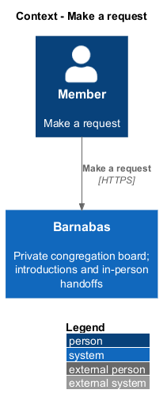
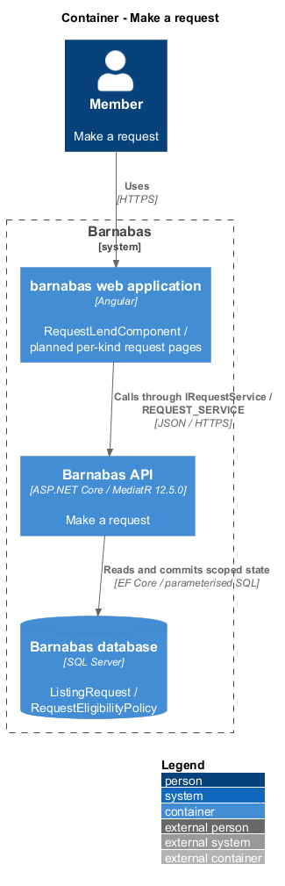
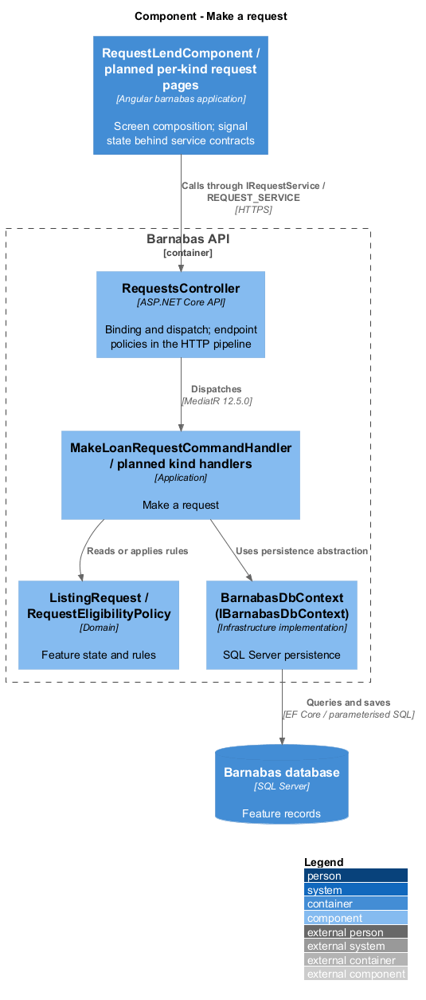
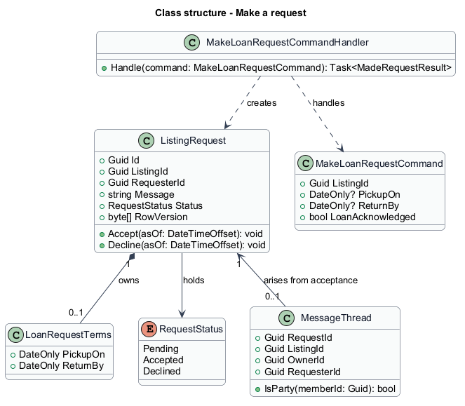
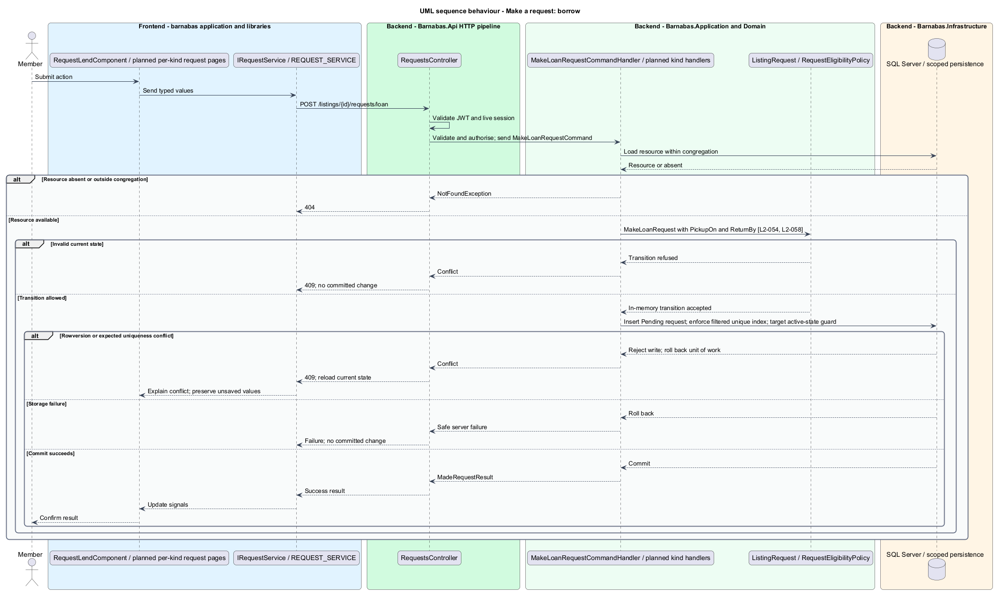
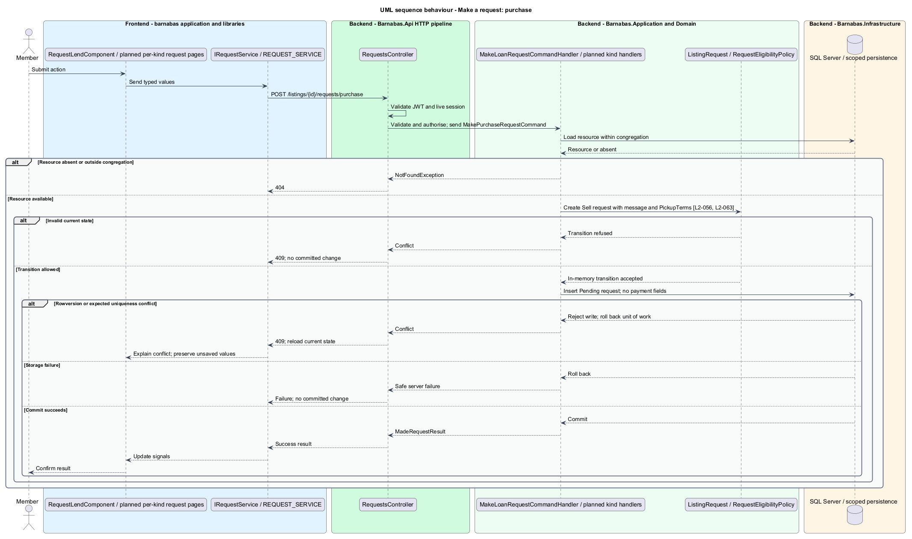
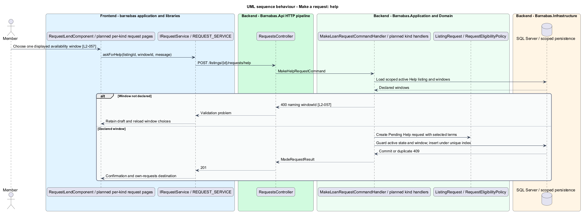
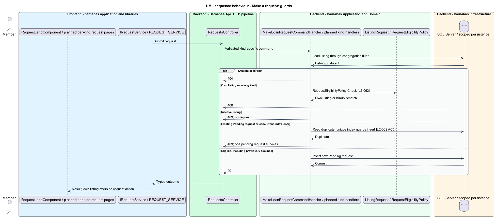

# Make a request

## Overview

A **request** — ask against one listing, carrying a message and kind-specific terms — lets a congregation member contact the listing owner. Lend asks for pickup and return dates with an ownership acknowledgement. Give and Sell ask for pickup time. Help selects a declared availability window.

The listing remains the subject throughout. Sending confirms the owner and next steps. A message thread opens only after acceptance. Barnabas does not accept payment, delivery addresses, or deposits.

## Description

**Implementation boundary: Existing Lend request; planned remaining kinds and active-state race guard.**

`RequestLendComponent` and `RequestSentComponent` exist in `barnabas`. The Lend form consumes `IRequestService` through `REQUEST_SERVICE`. `RequestStore` currently manages incoming and outgoing collections and decisions; it does not own the draft. A planned form service moves draft validation and submission behaviour out of the page class behind a contract.

`RequestsController` binds `MakeLoanRequestRequest` at `POST /listings/{listingId}/requests/loan`. `MakeLoanRequestCommandHandler` reads the scoped listing, checks `RequestEligibilityPolicy`, queries for an existing pending request, and creates `ListingRequest.MakeLoanRequest`. `LoanRequestTerms` carries `PickupOn` and `ReturnBy`; `LoanTerms` belongs to the listing and is a different type. The command validator requires a message of at most 4000 characters, dates, and acknowledgement.

`RequestEligibilityPolicy.Check` covers self-request, active state, and endpoint-kind matching. Duplicate detection belongs to the handler and the SQL Server filtered unique index `(ListingId, RequesterId) WHERE Status = 0`. Open currently means Pending. Self-request and kind mismatch return 400, inactive and duplicate requests return 409, and foreign or absent listings return 404. Two concurrent duplicates produce one row. A declined request permits another attempt. Current broad database-exception mapping is an implementation limitation; the target maps only the expected unique-index violation to duplicate conflict.

Planned `MakeGiftRequestCommand`, `MakePurchaseRequestCommand`, and `MakeHelpRequestCommand` have independent validators and handlers. Routes end in `/gift`, `/purchase`, and `/help`. `PickupTerms` is planned for Give and Sell; the Help request stores the declared window identifier and a snapshot of its terms. The handler validates membership in the listing's windows at write time. Give rejects price and return-date fields. Request DTOs declare no payment instrument, delivery address, or deposit field. The raw-payload forbidden-field contract also applies to bound request DTOs where the controller constructs a command.

The target serialises request creation with listing close-out and Help window editing through a database transaction and a listing lock or checked row version. It rechecks Active and the selected window before insertion. This closes the read-to-write race without changing the pending-request index. Confirmation names the owner and links to `/inbox/my-requests` and `/board`, with the payment/delivery boundary stated.

**Source anchors.** [MakeLoanRequestCommandHandler.cs](../../../../backend/src/Barnabas.Application/Requests/MakeLoanRequest/MakeLoanRequestCommandHandler.cs), [ListingRequestConfiguration.cs](../../../../backend/src/Barnabas.Infrastructure/Persistence/Configurations/ListingRequestConfiguration.cs), [request.store.ts](../../../../frontend/projects/domain/src/lib/requests/request.store.ts).

**Acceptance verification.** [L2-054](../../../specs/L2.md#l2-054-compose-a-request-to-borrow-a-lend-listing): API AC 1, 2; E2E AC 3. [L2-055](../../../specs/L2.md#l2-055-compose-a-request-for-a-give-listing): API AC 1; E2E AC 2. [L2-056](../../../specs/L2.md#l2-056-compose-a-request-to-buy-a-sell-listing): API AC 1, 3; E2E AC 2. [L2-057](../../../specs/L2.md#l2-057-compose-a-request-for-a-help-listing): API AC 1, 2; E2E AC 3. [L2-058](../../../specs/L2.md#l2-058-send-a-request-and-confirm-it): E2E AC 1, 2, 3. [L2-062](../../../specs/L2.md#l2-062-reject-ineligible-requests): API AC 1, 2, 3, 5, 6, 7; E2E AC 4. [L2-063](../../../specs/L2.md#l2-063-do-not-handle-payment-delivery-or-deposits-in-a-request): API AC 1; E2E AC 2. The linked criteria retain their Given–When–Then wording. API acceptance uses SQL Server; E2E acceptance uses one page object per screen. New behaviour begins with its failing criterion. Design coverage does not assert an acceptance test pass.

## Requirements

The requirement text and identifiers are reproduced from [L2](../../../specs/L2.md). Each row names its [L1 parent](../../../specs/L1.md).

| L2 ID | Refines (L1) | Requirement |
|-------|--------------|-------------|
| `L2-054` | `L1-009` | A Lend request shall collect a message, a proposed pickup date, a proposed return date, and an acknowledgement that the item remains the owner's. |
| `L2-055` | `L1-009` | A Give request shall collect a message and a proposed pickup time. It shall not collect a price or a return date. |
| `L2-056` | `L1-009` | A Sell request shall collect a message and a proposed pickup time, and shall restate that payment is settled in person between the members. |
| `L2-057` | `L1-009` | A Help request shall collect a message and require the requester to choose one of the availability windows the offer declared. |
| `L2-058` | `L1-009` | Sending a request shall confirm to the requester that it was sent, name the owner, and say what happens next. |
| `L2-062` | `L1-009` | A member shall not request their own listing, and shall not hold more than one open request against the same listing. A request shall name a listing that is active, and shall be made through the endpoint matching that listing's kind. |
| `L2-063` | `L1-009` | The request flow shall not take payment details, arrange delivery, or record a deposit for any kind of listing. |

## Diagrams

The context identifies the actor and the Barnabas capability. Congregation boundaries also apply to linked resources.

The container view places the Angular client, .NET API, and SQL Server persistence around this capability.

The component view separates screen composition, API dispatch, application behaviour, domain rules, and persistence.

The class view shows the feature types, their data, and typed dependencies. Planned additions are identified in the description.

The Lend request supplies dates and acknowledgement. The target write also guards against a listing closing after the initial read.

The planned Give form carries a pickup time without a return date or price.

The planned Sell request restates the asking price and in-person payment. No payment instrument enters the command.

The planned Help handler accepts only a declared window. A missing or removed selection returns a field-named 400.

Self-requests, duplicate pending requests, inactive listings, and mismatched kinds have distinct outcomes required by L2-062.

