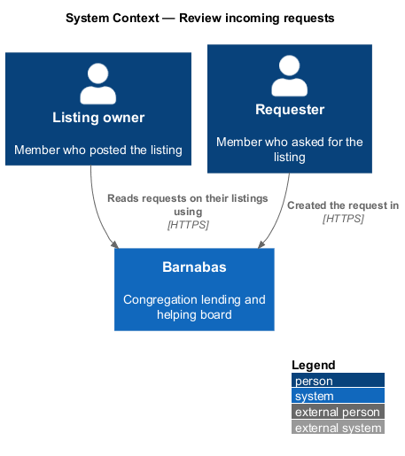
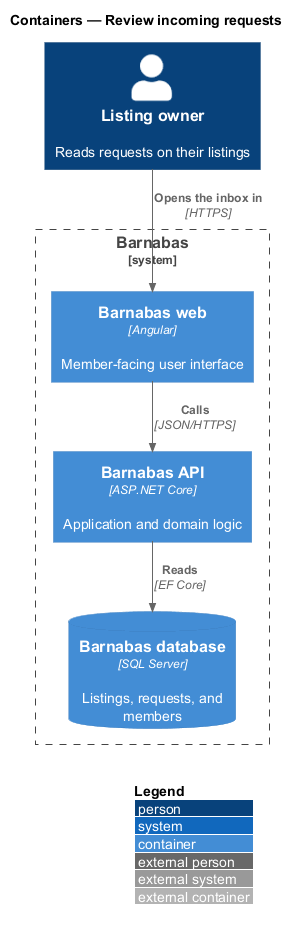
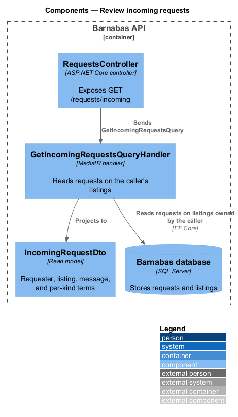
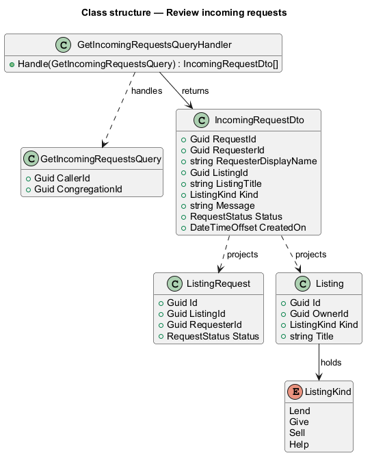
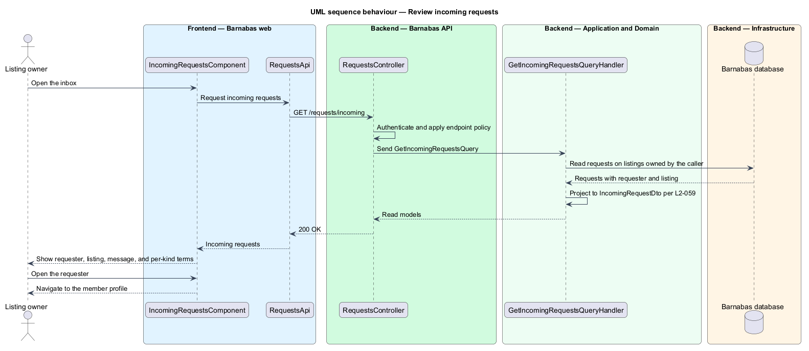

# Review incoming requests

## Overview

When a member of the congregation asks for a listing, that ask arrives as a request against the listing its owner posted. This feature is the owner's side of that arrival: the screen on which the requests made against a member's own listings are read.

**incoming request** — a request another member made against a listing the reader owns

The feature exists because a request carries a message written by one member to another, and that message is the whole basis on which the owner decides. A row that showed only a name and a timestamp would leave the owner deciding blind. Each row therefore carries the requester, the listing asked for, the message, and the terms belonging to that listing's kind — a Lend request shows the proposed return date, a Help request shows the availability window chosen.

The screen is also the junction of the coordination flow. From a row the owner reaches the requester's profile, the listing in its owner view, and the decision actions covered by the sibling features *Accept a request* and *Decline a request*. In the mock set this design replaces, every one of those routes was absent and the screen was terminal.

Incoming requests are scoped to the reader. A member sees requests on listings they own and no others, and only within their own congregation.

## Description

The slice is read-only and runs from the inbox screen to the database.

- **`IncomingRequestsComponent`** — Angular page component in the Barnabas web application. It renders the request rows and the chip row that moves between incoming requests, outgoing requests, and messages. Template, styles, and class occupy separate files, and the row collection is held in a signal.
- **`IRequestsApi`** — the interface the component depends on, supplied by dependency injection.
- **`RequestsApi`** — typed HTTP client implementing `IRequestsApi`.
- **`RequestStore`** — signal-backed store holding the loaded rows and the loading state.
- **`RequestsController`** — ASP.NET Core controller exposing `GET /requests/incoming`. It authenticates the caller, applies the endpoint policy, and dispatches the query.
- **`GetIncomingRequestsQuery`** — request object carrying the caller and congregation identifiers taken from the session, never from the client.
- **`GetIncomingRequestsQueryHandler`** — MediatR handler reading requests against listings the caller owns and projecting them to read models.
- **`IncomingRequestDto`** — read model carrying the requester's display name, the listing title and kind, the message, the status, and the time the request was created.
- **`ListingRequest`**, **`Listing`**, **`ListingKind`** — the domain types the read model projects from.

The handler returns a read model rather than the domain entity. The screen needs the requester's display name and the listing title, which live on other aggregates, and projecting once in the handler avoids the screen assembling them from several calls.

## Requirements

The feature realizes the following level-2 (L2) requirements. Each L2
requirement refines a level-1 (L1) requirement, cited by identifier. The
**Slice** column marks the requirements implemented by feature slice 1; the
remainder are designed here and implemented in a later slice.

| L2 ID | Refines (L1) | Slice | Requirement |
|-------|--------------|-------|-------------|
| `L2-059` | `L1-009` | 1 | A listing owner shall be able to see the requests made on their listings, each showing the requester, the listing, the message, and the details that kind of request carries. |

## Diagrams

### System context

The owner reads requests made by other members of the same congregation. No external system participates in the read.

### Containers

The inbox screen in the Barnabas web application calls the Barnabas API, which reads from the Barnabas database.

### Components

`RequestsController` dispatches a single query. `GetIncomingRequestsQueryHandler` reads the requests against listings the caller owns and projects each to an `IncomingRequestDto`.

### Class structure

`IncomingRequestDto` flattens `ListingRequest` and `Listing` into the shape the screen renders, carrying the `ListingKind` that determines which terms a row shows.

### Behaviour — review incoming requests

The controller takes the caller and congregation from the authenticated session, so a member cannot read another member's inbox by altering a parameter. The handler projects to the read model required by `L2-059`, and each row offers the requester's profile as a further destination.

