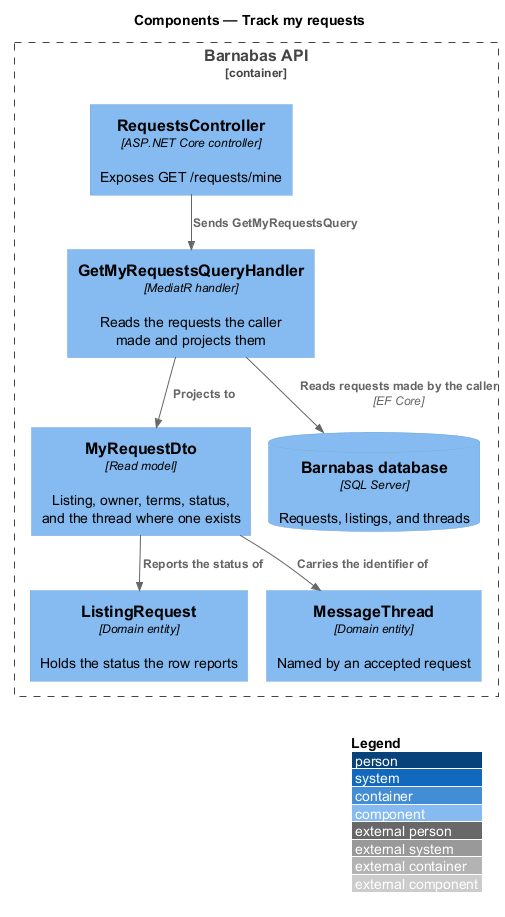
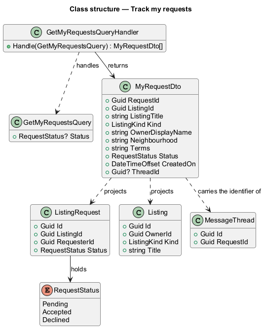
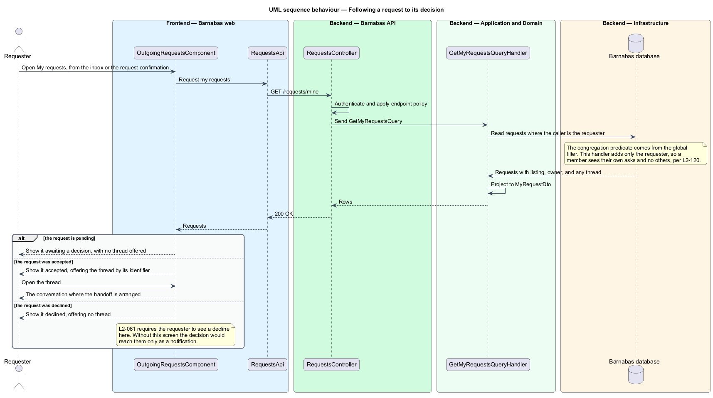

# Track my requests

## Overview

A member who asks for something needs to find out what became of the ask. This feature is
that screen: the requests a member has made, each with its listing, its owner, and its
current standing.

**outgoing request** — a request the reader made against another member's listing, as
distinct from an incoming request made against one of their own

It is the counterpart to *Review incoming requests*, and the two sit beside each other as
chips in the inbox along with messages. The distinction is who owns the listing: incoming
requests are decisions the member owes other people, outgoing requests are decisions the
member is waiting on.

The screen closes a loop that would otherwise be open. Sending a request offers to see the
member's own requests, and a decline is something the requester is meant to discover here —
both stated in the criteria of `L2-058` and `L2-061`. Until this feature those criteria
referred to a screen no requirement mandated and no design described, so the flow ended at a
confirmation and resumed only if a notification happened to be read.

An accepted request carries the identifier of the thread it opened, so the member moves from
the decision to the conversation where the handoff is arranged. A declined request carries
no thread, because declining creates none.

## Description

A read-only slice with one query, mirroring `review-incoming-requests` on the other side of
the relationship.

- **`OutgoingRequestsComponent`** — Angular screen rendering the rows, the second of three
  chips in the inbox. Template, styles, and class in separate files; the rows are held in a
  signal.
- **`IRequestsApi`** and **`RequestsApi`** — the interface the component depends on and its
  typed HTTP client, shared with the sibling request features.
- **`RequestsController`** — exposes `GET /requests/mine`.
- **`GetMyRequestsQuery`** and **`GetMyRequestsQueryHandler`** — read the requests where the
  caller is the requester, with the listing, its owner, and any thread, and project them.
  The requester is taken from the session; the congregation comes from the global filter, so
  the handler adds one predicate rather than three.
- **`MyRequestDto`** — read model carrying the listing title and kind, the owner's display
  name and neighbourhood, the terms as the requester stated them, the status, and the thread
  identifier where the request was accepted.

`ThreadId` is nullable, and its nullability is the design. A pending request has no thread
because no decision has been made; a declined request has none because declining creates
none. Only an accepted request carries one, so the screen decides what to offer from the
data rather than from a second lookup.

The terms are projected as text rather than as the per-kind value types. The requester is
reading a summary of what they asked for, not editing it, and flattening avoids the screen
branching over four shapes to render one line.

## Requirements

The feature realizes the following level-2 (L2) requirements. Each L2
requirement refines a level-1 (L1) requirement, cited by identifier. The
**Slice** column marks the requirements implemented by feature slice 1; the
remainder are designed here and implemented in a later slice.

| L2 ID | Refines (L1) | Slice | Requirement |
|-------|--------------|-------|-------------|
| `L2-120` | `L1-009` | 1 | A member shall be able to see the requests they have made, each showing the listing, its owner, the terms of the request, and its status, with a route to the message thread where a request was accepted. |

## Diagrams

### Components

One controller, one query, one read model. The thread identifier is carried on the row so
that an accepted request leads straight to its conversation.

### Class structure

`MyRequestDto` flattens the request, its listing, and its owner into one row, and carries a
nullable thread identifier that is populated only for an accepted request.

### Behaviour — following a request to its decision

The handler filters on the caller being the requester; the congregation predicate is already
applied underneath. The three branches are the three things a member can find here, and the
declined branch is the one `L2-061` depends on.

