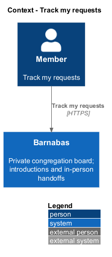
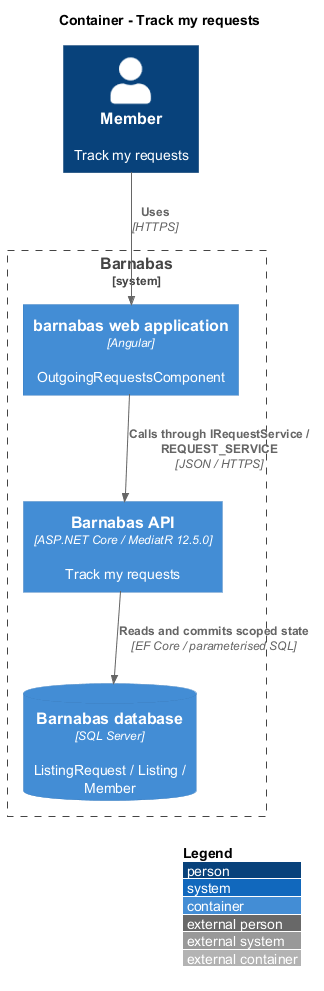

# Track my requests

## Overview

Barnabas keeps requests within the congregation that owns their listing.

An **outgoing request** — ask made by the reader against another member's listing — records the listing, owner, terms, and current decision. Accepted requests carry the message thread opened for their handoff. Pending and declined requests offer no thread.

## Description

**Implementation boundary: Existing Lend projection; planned other-kind terms and bounded collection.**

`OutgoingRequestsComponent` composes the outgoing inbox screen. `RequestStore.loadOutgoing` calls `IRequestService.mine`. `RequestsController` dispatches `GetMyRequestsQuery(Status)` for `GET /requests/mine`. The handler scopes by `RequesterId` from the session, joins listing and owner, and projects `MyRequestDto`. It reads a nullable `ThreadId` from the accepted request relationship. The DTO neighbourhood is the listing's neighbourhood, rather than a separate owner-profile field.

`LoanTermsText` renders the existing Lend terms. Planned Give, Sell, and Help requests extend the same summary projection. A domain request-row region receives route destinations from the page; only a non-null accepted `ThreadId` produces the coordination link. The confirmation after sending a request and decision notifications both reach `/inbox/my-requests`. Loading, empty, and retry state preserve the selected view. This collection currently has no cursor; the planned collection contract bounds it.

**Source anchors.** [GetMyRequestsQueryHandler.cs](../../../../backend/src/Barnabas.Application/Requests/GetMyRequests/GetMyRequestsQueryHandler.cs), [request.store.ts](../../../../frontend/projects/domain/src/lib/requests/request.store.ts).

**Acceptance verification.** [L2-120](../../../specs/L2.md#l2-120-review-my-own-requests): API AC 1, 2, 3; E2E AC 4, 5. The linked criteria retain their Given–When–Then wording. API acceptance uses SQL Server; E2E acceptance uses one page object per screen. New behaviour begins with its failing criterion. Design coverage does not assert an acceptance test pass.

## Requirements

The requirement text and identifiers are reproduced from [L2](../../../specs/L2.md). Each row names its [L1 parent](../../../specs/L1.md).

| L2 ID | Refines (L1) | Requirement |
|-------|--------------|-------------|
| `L2-120` | `L1-009` | A member shall be able to see the requests they have made, each showing the listing, its owner, the terms of the request, and its status, with a route to the message thread where a request was accepted. |

## Diagrams

The context identifies the actor and the Barnabas capability. Congregation boundaries also apply to linked resources.

The container view places the Angular client, .NET API, and SQL Server persistence around this capability.

The component view separates screen composition, API dispatch, application behaviour, domain rules, and persistence.

The class view shows the feature types, their data, and typed dependencies. Planned additions are identified in the description.

The handler constrains the collection to the reader and projects destinations with the request summary.

